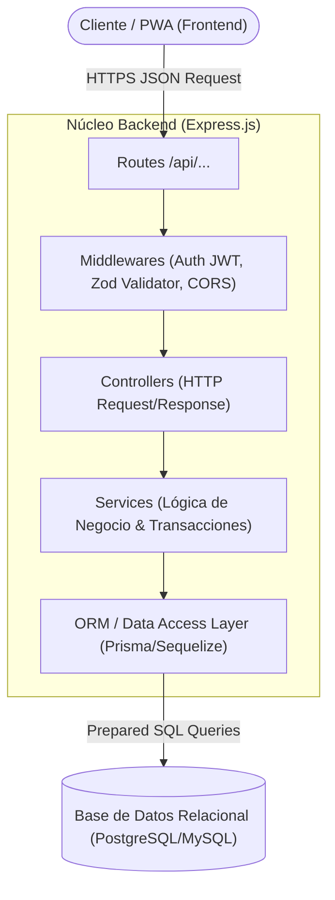
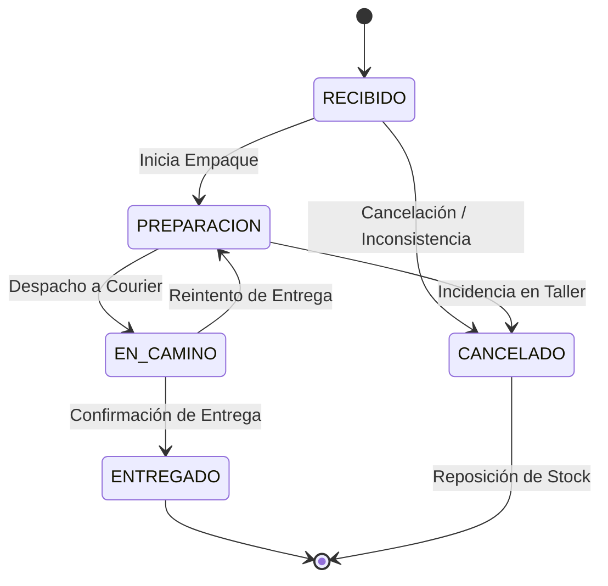

# Módulo Backend - API REST Leofit Solutions

Este directorio contiene la arquitectura, lógica de negocio y servicios del backend para el **Sistema de Gestión de Pedidos de Leofit**.

---

## 1. Tecnologías Seleccionadas

| Componente | Tecnología | Justificación |
|:---|:---|:---|
| **Entorno de Ejecución** | Node.js (v20+ LTS) | Alto rendimiento en operaciones I/O no bloqueantes, amplio ecosistema y rápida curva de desarrollo. |
| **Framework Web** | Express.js / TypeScript | Minimalista, flexible, estándar de la industria y excelente para diseñar APIs REST robustas. |
| **Autenticación** | JSON Web Tokens (`jsonwebtoken`) + `bcrypt` | Autenticación basada en tokens sin estado (stateless) para comunicación segura con el frontend. |
| **ORM / Acceso a Datos** | Prisma ORM / Sequelize | Tipado estático en consultas SQL, migraciones automáticas y garantía de integridad referencial. |
| **Validación de Datos** | `zod` o `express-validator` | Validación estricta de esquemas de entrada para evitar inyecciones o datos corruptos. |
| **Seguridad HTTP** | `cors`, `helmet`, `express-rate-limit` | Protección contra ataques comunes (XSS, Clickjacking, fuerza bruta en login). |

---

## 2. Arquitectura de Software en Capas



```text
backend/
├── src/
│   ├── config/             # Configuración de variables de entorno y base de datos
│   ├── controllers/        # Controladores que reciben peticiones HTTP y retornan JSON
│   ├── middlewares/        # Autenticación JWT, validación de schemas y manejo de errores
│   ├── models/             # Esquemas de datos y definiciones de entidades
│   ├── routes/             # Definición de rutas y endpoints de la API
│   ├── services/           # Lógica de negocio (descuento de stock, cálculo de totales)
│   └── utils/              # Funciones auxiliares y formateadores
├── tests/                  # Pruebas unitarias e integración
└── server.ts               # Punto de entrada de la aplicación
```

---

## 3. Especificación de Endpoints REST Principales

### Autenticación (`/api/auth`)
* `POST /api/auth/login` - Inicia sesión del administrador y retorna el token JWT.
* `GET /api/auth/profile` - Obtiene información del perfil del usuario autenticado.

### Productos e Inventario (`/api/products`)
* `GET /api/products` - Lista todos los productos con filtros por categoría o estado de stock.
* `GET /api/products/:id` - Obtiene el detalle de un producto y sus variantes de talla/color.
* `POST /api/products` - Registra un nuevo producto en el catálogo.
* `PUT /api/products/:id` - Actualiza información o precios del producto.
* `PATCH /api/products/:id/stock` - Actualiza existencias de stock de forma rápida.
* `DELETE /api/products/:id` - Deshabilita (borrado lógico) un producto.

### Gestión de Pedidos (`/api/orders`)
* `GET /api/orders` - Lista los pedidos con paginación y filtros por estado y fechas.
* `GET /api/orders/:id` - Obtiene el detalle completo del pedido, items y datos del cliente.
* `POST /api/orders` - Crea un nuevo pedido, descuenta el stock de las prendas y calcula el total.
* `PATCH /api/orders/:id/status` - Transición de estado (`Recibido` ➔ `En Preparación` ➔ `En Camino` ➔ `Entregado`).
* `DELETE /api/orders/:id` - Cancela el pedido y restaura el stock al almacén.

### Clientes (`/api/clients`)
* `GET /api/clients` - Directorio de clientes para autocompletado en la toma de pedidos.
* `POST /api/clients` - Registro de un nuevo cliente con datos de contacto y entrega.

### Métricas y Dashboard (`/api/dashboard`)
* `GET /api/dashboard/stats` - Retorna los KPIs principales (ventas diarias, pedidos en proceso, alertas de stock).

---

## 4. Reglas de Negocio Clave en el Backend

1. **Atomicidad en el Inventario (Transacciones ACID):**
   Al crear un pedido con múltiples prendas, la inserción del pedido y el descuento de unidades en cada variante de producto se ejecutan dentro de una misma transacción. Si una prenda no tiene stock suficiente, toda la operación se revierte (*rollback*).
2. **Validación de Transición de Estados:**
   Un pedido no puede pasar a `Entregado` sin antes haber transitado por `En Preparación` o `En Camino`.



3. **Manejo Centralizado de Excepciones:**
   Todos los errores HTTP devuelven un formato estructurado y predecible:
   ```json
   {
     "success": false,
     "error": {
       "code": "INSUFFICIENT_STOCK",
       "message": "No hay stock disponible para la talla solicitada."
     }
   }
   ```
