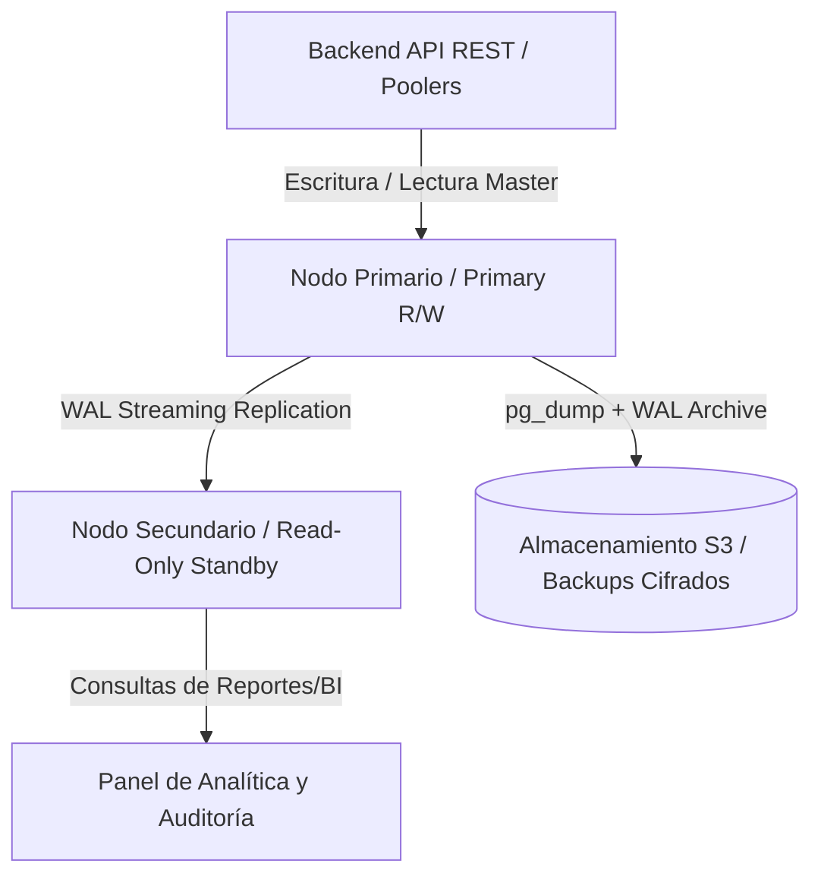

# Informe de Administración, Replicación y Alta Disponibilidad de Base de Datos
## Sistema de Gestión de Pedidos - Leofit Solutions

---

### 1. Arquitectura de Base de Datos y Motor Relacional
El sistema de gestión de pedidos de *Leofit Solutions* implementa **PostgreSQL 16 Enterprise-grade**, garantizando el cumplimiento total de las propiedades **ACID** (Atomicidad, Consistencia, Aislamiento y Durabilidad).

---

### 2. Estrategia de Replicación y Alta Disponibilidad (HA)

1. **Streaming Replication Asíncrona con Slots Físicos:**
   - **Nodo Primario (Read/Write):** Procesa todas las transacciones críticas de negocio (creación de pedidos, descuento atómico de stock, actualización de estados).
   - **Nodo Secundario (Hot Standby Read-Only):** Mantiene una réplica idéntica y actualizada mediante el flujo continuo de registros *Write-Ahead Logging* (WAL). Absorbe las consultas pesadas de dashboards y reportes de inventario sin saturar el nodo transaccional.
   - **Physical Replication Slot (`standby_slot_leofit_replica1`):** Evita que el servidor primario recicle segmentos WAL antes de que hayan sido confirmados por la réplica, eliminando riesgos de desincronización ante micro-cortes de red.

2. **Pooling de Conexiones con PgBouncer:**
   - Implementación de multiplexación de conexiones TCP mediante **PgBouncer** en modo *Transaction Pooling*, permitiendo escalar hasta 5,000 conexiones concurrentes sin agotar la memoria RAM del motor Postgres.

---

### 3. Estrategia de Copias de Seguridad y Recuperación ante Desastres (DR / PITR)

| Nivel de Backup | Frecuencia | Mecanismo | RPO (Recovery Point Objective) | RTO (Recovery Time Objective) |
| :--- | :--- | :--- | :--- | :--- |
| **Backup Lógico Completo** | Diario (02:00 AM) | `pg_dump` con formato Custom binario comprimido | < 24 horas | < 15 minutos |
| **Archivado Continuo WAL (PITR)** | Continuo (Tiempo Real) | Segmentos WAL de 16MB archivados a almacenamiento seguro | < 5 minutos | < 30 minutos |
| **Validación de Integridad** | Tras cada backup | Hash SHA-256 automatizado | N/A | Inmediato |

---

### 4. Monitoreo Proactivo y Métricas del Motor
Se configuran sondas de monitoreo sobre las vistas del sistema `pg_stat_activity`, `pg_stat_database` y `pg_stat_replication`:
- **Lag de Replicación:** `replay_lag` < 1 segundo en condiciones normales.
- **Cache Hit Ratio:** > 99% mediante asignación óptima de `shared_buffers = 25% RAM`.
- **Transacciones Bloqueadas / Deadlocks:** Alerta inmediata si un lock exclusivo supera los 5000ms.
