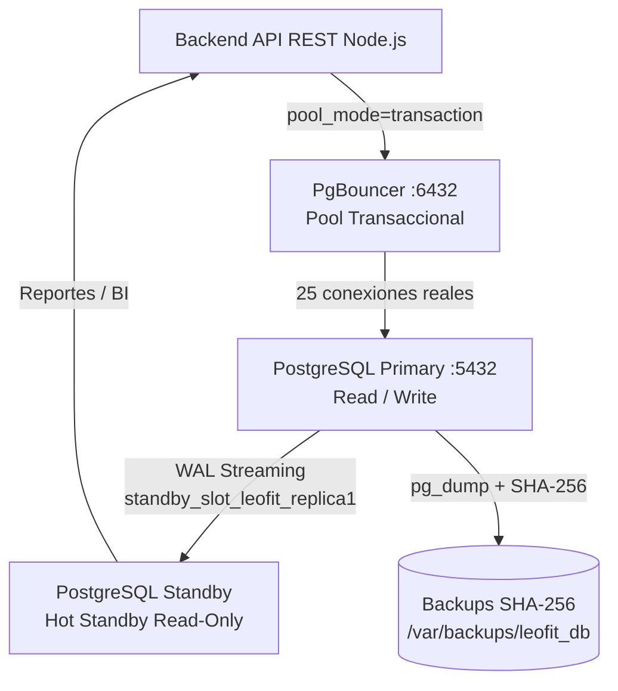

# Informe de Administración, Replicación y Alta Disponibilidad
## Sistema de Gestión de Pedidos — Leofit Solutions

---

## 1. Arquitectura de Base de Datos

El sistema implementa **PostgreSQL 16** con alta disponibilidad, replicación
física y connection pooling mediante PgBouncer.



---

## 2. Replicación Física — Streaming Replication

### Slot activo
```
standby_slot_leofit_replica1   (tipo: physical)
```

### Parámetros del Primary (aplicados vía docker-compose)
| Parámetro | Valor | Descripción |
|---|---|---|
| `wal_level` | `replica` | Mínimo para Streaming Replication |
| `max_wal_senders` | `5` | Conexiones de replicación concurrentes |
| `max_replication_slots` | `5` | Slots activos simultáneos |
| `wal_keep_size` | `512MB` | WAL retenido como fallback |
| `hot_standby` | `on` | Lectura en el Standby |
| `hot_standby_feedback` | `on` | Evita bloat en el Primary |

### Usuario dedicado de replicación
```sql
ROLE replicator_leofit  WITH REPLICATION LOGIN
```

### Inicialización del Standby
```bash
pg_basebackup \
  -h 10.0.0.10 \
  -D /var/lib/postgresql/16/main \
  -U replicator_leofit \
  -P -v -R \
  --slot=standby_slot_leofit_replica1 \
  --wal-method=stream
```
> El flag `-R` genera automáticamente `standby.signal` y `primary_conninfo`.

### Monitoreo del lag de replicación
```sql
-- En el Primary
SELECT slot_name,
       pg_wal_lsn_diff(pg_current_wal_lsn(), restart_lsn) AS lag_bytes,
       active
FROM pg_replication_slots
WHERE slot_name = 'standby_slot_leofit_replica1';

-- Estado de senders
SELECT application_name, state, write_lag, flush_lag, replay_lag
FROM pg_stat_replication;
```

### Failover manual
```bash
# En el servidor Standby — promover a Primary
pg_ctl promote -D /var/lib/postgresql/16/main

# O desde psql (PG16+)
SELECT pg_promote();
```
Después del failover actualizar `primary_conninfo` en PgBouncer y el backend.

---

## 3. Connection Pooling — PgBouncer

### Configuración activa (`pgbouncer/pgbouncer.ini`)
| Parámetro | Valor | Descripción |
|---|---|---|
| `pool_mode` | `transaction` | Conexión liberada tras COMMIT/ROLLBACK |
| `listen_port` | `6432` | Puerto cliente PgBouncer |
| `max_client_conn` | `200` | Conexiones totales de la aplicación |
| `default_pool_size` | `25` | Conexiones reales a PostgreSQL |
| `min_pool_size` | `5` | Conexiones calientes mínimas |
| `reserve_pool_size` | `5` | Conexiones de emergencia |
| `server_idle_timeout` | `600s` | Cierra conexiones inactivas |
| `server_reset_query` | `DISCARD ALL` | Limpia estado entre reusos |
| `auth_type` | `scram-sha-256` | Autenticación PostgreSQL 16 |
| `max_prepared_statements` | `100` | Caché interno PgBouncer 1.21+ |

### Consola de administración
```bash
psql -h 127.0.0.1 -p 6432 -U pgbouncer pgbouncer

# Comandos útiles
SHOW POOLS;    -- estado de cada pool
SHOW STATS;    -- tráfico total de consultas
SHOW CLIENTS;  -- conexiones activas de la aplicación
SHOW SERVERS;  -- conexiones reales a PostgreSQL
RELOAD;        -- recargar configuración sin reiniciar
```

### Instalación en servidor bare-metal
```bash
sudo bash database/pgbouncer/setup_pgbouncer.sh
```
El script instala PgBouncer, crea los roles en PostgreSQL, genera
`userlist.txt` con hashes reales desde `pg_shadow` y levanta el servicio.

---

## 4. Estrategia de Backup y Recuperación

### Tabla de políticas
| Nivel | Frecuencia | Mecanismo | RPO | RTO |
|---|---|---|---|---|
| Backup lógico completo | Diario 02:00 AM | `pg_dump` custom + SHA-256 | < 24 h | < 15 min |
| Archivado WAL (PITR) | Continuo | Segmentos WAL 16 MB | < 5 min | < 30 min |
| Validación integridad | Tras cada backup | `sha256sum --check` | N/A | Inmediato |

### Comandos del script `backup_strategy.sh`
```bash
./backup_strategy.sh full          # Backup completo + firma SHA-256
./backup_strategy.sh incremental   # Archivar segmentos WAL del período
./backup_strategy.sh verify        # Verificar integridad de todos los backups
./backup_strategy.sh restore FILE  # Restaurar (verifica SHA-256 antes)
./backup_strategy.sh purge         # Eliminar backups > 30 días
./backup_strategy.sh status        # Ver listado y espacio utilizado
```

### Cron recomendado
```bash
# Backup completo diario a las 2:00 AM
0 2 * * * /opt/leofit/database/backup_strategy.sh full >> /var/log/leofit_backup.log 2>&1

# Archivado WAL cada hora
0 * * * * /opt/leofit/database/backup_strategy.sh incremental >> /var/log/leofit_backup.log 2>&1
```

### Proceso de restauración
```bash
# 1. Verificar integridad primero
./backup_strategy.sh verify

# 2. Restaurar archivo específico
./backup_strategy.sh restore /var/backups/leofit_db/daily/leofit_full_20260924_020000.dump
```
> El script verifica el SHA-256 del archivo antes de ejecutar `pg_restore`
> y solicita confirmación explícita (`si`) para evitar restauraciones accidentales.

---

## 5. Monitoreo Proactivo

### Vistas del sistema relevantes
```sql
-- Actividad de conexiones actuales
SELECT pid, usename, application_name, state, query_start, query
FROM pg_stat_activity
WHERE state != 'idle'
ORDER BY query_start;

-- Hit ratio del caché (objetivo: > 99%)
SELECT
    sum(blks_hit) * 100.0 / (sum(blks_hit) + sum(blks_read)) AS cache_hit_ratio
FROM pg_stat_database
WHERE datname = 'leofit_db';

-- Transacciones bloqueadas
SELECT pid, wait_event_type, wait_event, query
FROM pg_stat_activity
WHERE wait_event_type = 'Lock';

-- Tamaño de la base de datos
SELECT pg_size_pretty(pg_database_size('leofit_db'));

-- Alertas de stock bajo (vista operativa)
SELECT * FROM vw_low_stock_alert;
```

### Alertas configuradas en `backup_strategy.sh`
- Error de conexión a PostgreSQL → email a `admin@leofit.pe`
- Fallo de integridad SHA-256 → email con detalle del archivo corrupto
- Fin de backup exitoso → email con tamaño y ruta del archivo