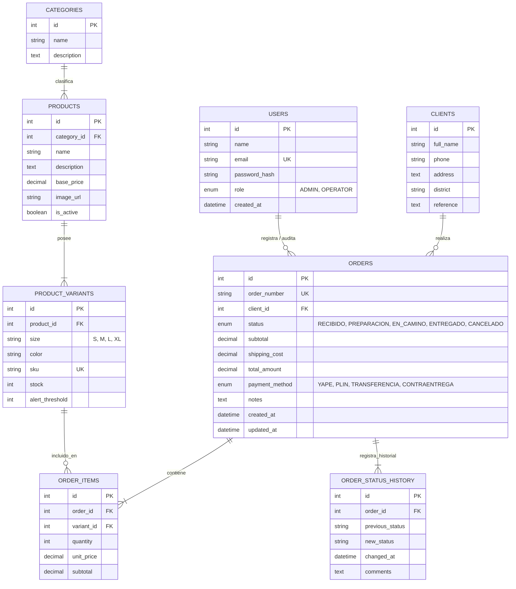

# Módulo de Base de Datos - Leofit Solutions

Este directorio contiene el diseño del modelo de datos, diccionario de tablas, scripts de migración y datos iniciales para el **Sistema de Gestión de Pedidos de Leofit**.

---

## 1. Selección del Motor de Base de Datos

### Motor Elegido: **Base de Datos Relacional (MySQL / PostgreSQL)**

#### Justificación Técnica:
1. **Garantía ACID & Transaccionalidad:** El negocio requiere que la creación de un pedido y el descuento de unidades en el inventario sean operaciones atómicas e indivisibles. Si se produce un error a mitad del registro, no deben quedar datos inconsistentes.
2. **Integridad Referencial Estricta:** Las relaciones entre pedidos, clientes y variantes de producto (talla/color) se aseguran mediante claves foráneas (*Foreign Keys*), evitando pedidos huérfanos o ventas de productos inexistentes.
3. **Reportabilidad y Consultas Agregadas:** Facilidad para generar reportes de ventas, cálculo de ingresos por día/semana y productos más vendidos mediante consultas SQL indexadas.

---

## 2. Diagrama Entidad-Relación Lógico (ERD)

---

## 3. Diccionario de Datos / Esquema de Tablas

### 1. `users` (Usuarios del Sistema)
* `id` (INT, PK, AUTO_INCREMENT): Identificador único del usuario.
* `name` (VARCHAR(100)): Nombre completo del administrador.
* `email` (VARCHAR(150), UNIQUE): Correo de acceso.
* `password_hash` (VARCHAR(255)): Contraseña encriptada con Bcrypt.
* `role` (ENUM('ADMIN', 'OPERATOR')): Rol de acceso al panel.
* `created_at` (TIMESTAMP): Fecha de creación del registro.

### 2. `categories` (Categorías de Ropa Deportiva)
* `id` (INT, PK, AUTO_INCREMENT): Identificador de la categoría.
* `name` (VARCHAR(60)): Nombre (ej. *Camisetas*, *Shorts*, *Joggers*, *Licras*, *Bividis*).
* `description` (TEXT): Descripción general de la línea de producto.

### 3. `products` (Catálogo de Prendas)
* `id` (INT, PK, AUTO_INCREMENT): Identificador único del producto.
* `category_id` (INT, FK -> categories.id): Categoría asociada.
* `name` (VARCHAR(120)): Nombre de la prenda (ej. *Camiseta Oversized Raw Cut*).
* `description` (TEXT): Detalle de confección y materiales (ej. *Algodón 20/1 peinado*).
* `base_price` (DECIMAL(10,2)): Precio de venta al público en Soles (PEN).
* `image_url` (VARCHAR(255)): Enlace a la fotografía del producto.
* `is_active` (BOOLEAN): Estado activo para venta (TRUE / FALSE).

### 4. `product_variants` (Variantes e Inventario por Talla/Color)
* `id` (INT, PK, AUTO_INCREMENT): Identificador de la variante.
* `product_id` (INT, FK -> products.id): Prenda a la que pertenece.
* `size` (VARCHAR(10)): Talla (ej. *S*, *M*, *L*, *XL*).
* `color` (VARCHAR(50)): Color (ej. *Negro Lavado*, *Azul Marino*, *Gris Jaspe*).
* `sku` (VARCHAR(50), UNIQUE): Código único de inventario (ej. *LF-TSH-BLK-M*).
* `stock` (INT): Cantidad de existencias físicas disponibles.
* `alert_threshold` (INT, Default 3): Umbral mínimo para activar alerta de stock bajo.

### 5. `clients` (Clientes del Negocio)
* `id` (INT, PK, AUTO_INCREMENT): Identificador único del cliente.
* `full_name` (VARCHAR(120)): Nombre y apellido del comprador.
* `phone` (VARCHAR(20)): Número de WhatsApp para contacto y confirmaciones.
* `address` (TEXT): Dirección de entrega exacta.
* `district` (VARCHAR(80)): Distrito de entrega (ej. *Lince, San Miguel, Surco*).
* `reference` (TEXT): Referencia para el repartidor (ej. *Frente al parque, Dpto 402*).

### 6. `orders` (Cabecera de Pedidos)
* `id` (INT, PK, AUTO_INCREMENT): Identificador interno.
* `order_number` (VARCHAR(30), UNIQUE): Código visible correlativo (ej. *ORD-2026-001*).
* `client_id` (INT, FK -> clients.id): Cliente que solicita la compra.
* `status` (ENUM('RECIBIDO', 'PREPARACION', 'EN_CAMINO', 'ENTREGADO', 'CANCELADO')): Estado actual.
* `subtotal` (DECIMAL(10,2)): Suma del importe de los productos.
* `shipping_cost` (DECIMAL(10,2)): Costo de envío cobrado.
* `total_amount` (DECIMAL(10,2)): Monto total a pagar por el cliente.
* `payment_method` (ENUM('YAPE', 'PLIN', 'TRANSFERENCIA', 'CONTRAENTREGA')): Método de pago.
* `notes` (TEXT): Indicaciones especiales sobre el pedido.
* `created_at` (TIMESTAMP): Fecha y hora del registro del pedido.
* `updated_at` (TIMESTAMP): Última fecha de modificación.

### 7. `order_items` (Detalle de Prendas por Pedido)
* `id` (INT, PK, AUTO_INCREMENT): Identificador del item.
* `order_id` (INT, FK -> orders.id): Pedido asociado.
* `variant_id` (INT, FK -> product_variants.id): Variante específica comprada.
* `quantity` (INT): Cantidad de unidades solicitadas.
* `unit_price` (DECIMAL(10,2)): Precio unitario pactado al momento de la venta.
* `subtotal` (DECIMAL(10,2)): `quantity * unit_price`.

### 8. `order_status_history` (Trazabilidad y Auditoría de Estados)
* `id` (INT, PK, AUTO_INCREMENT): Identificador del evento.
* `order_id` (INT, FK -> orders.id): Pedido correspondiente.
* `previous_status` (VARCHAR(30)): Estado anterior.
* `new_status` (VARCHAR(30)): Nuevo estado asignado.
* `changed_at` (TIMESTAMP): Momento exacto del cambio.
* `comments` (TEXT): Observaciones operativas del cambio.

---

## 4. Índices para Optimización de Consultas

* `CREATE INDEX idx_orders_status ON orders(status);`
* `CREATE INDEX idx_orders_created_at ON orders(created_at);`
* `CREATE INDEX idx_variants_product ON product_variants(product_id);`
* `CREATE INDEX idx_clients_phone ON clients(phone);`

---

## 5. Proceso Formal de Normalización (1FN, 2FN, 3FN y BCNF)

El esquema relacional fue diseñado siguiendo rigurosamente las reglas de normalización de Edgar F. Codd:

1. **Primera Forma Normal (1FN):** Eliminación de grupos repetitivos y campos multivaluados de pedidos antiguos; atomicidad de atributos y definición de claves primarias únicas.
2. **Segunda Forma Normal (2FN):** Descomposición de dependencias parciales en claves compuestas, separando productos, variantes e items de pedido.
3. **Tercera Forma Normal (3FN):** Eliminación de dependencias transitivas ($X \to Y \to Z$), aislando clientes, categorías y auditoría de pedidos.
4. **Forma Normal de Boyce-Codd (BCNF):** Toda dependencia funcional está determinada por superclaves (`id`, `sku`, `order_number`, `email`).
5. **Desnormalización Controlada de Alto Rendimiento:** Persistencia de `unit_price` inmutable en `order_items` para preservar el histórico contable ante subidas de precios, y persistencia indexada de `total_amount` en `orders` para consultas inmediatas del Dashboard en $O(1)$.

*Para consultar el informe metodológico completo y justificación matemática, revisar [`docs/08_Normalizacion_Base_Datos.md`](file:///c:/Users/Loayza/Downloads/leofit-pedidos-sistema/docs/08_Normalizacion_Base_Datos.md).*
