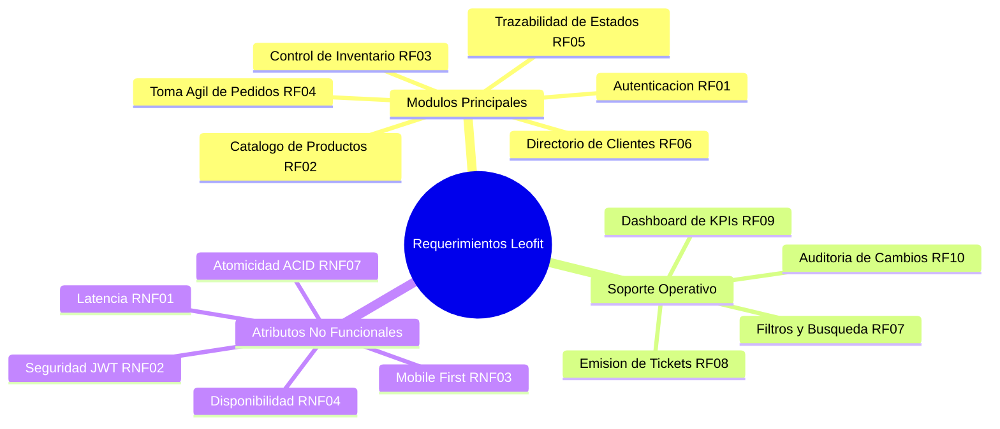

# Especificación de Requerimientos de Software (ERS)
## Sistema de Gestión de Pedidos e Inventario - Leofit

---

## 1. Introducción y Objetivos
El presente documento describe los Requerimientos Funcionales (RF) y No Funcionales (RNF) para el desarrollo del **Sistema de Gestión de Pedidos e Inventario de Leofit**, enfocado en digitalizar, optimizar y automatizar el flujo comercial y operativo del negocio.

### Objetivos Principales:
* Eliminar el registro manual en cuadernos y notas dispersas.
* Proporcionar visibilidad en tiempo real del inventario y existencias por prenda, talla y color.
* Reducir los tiempos de respuesta y preparación de pedidos en al menos un 60%.
* Permitir el seguimiento transparente de los pedidos a través de una máquina de estados clara (`Recibido`, `En Preparación`, `En Camino`, `Entregado`, `Cancelado`).

---

## 2. Requerimientos Funcionales (RF)

| Código | Requerimiento Funcional | Descripción | Prioridad | Actor Principal | Criterio de Aceptación |
|:---|:---|:---|:---:|:---|:---|
| **RF-01** | **Autenticación y Control de Acceso** | El sistema debe permitir el inicio de sesión seguro del Administrador mediante correo y contraseña encriptada (JWT/Bcrypt). | Alta | Administrador | Solo usuarios autenticados pueden acceder al dashboard y modificar datos. |
| **RF-02** | **Gestión de Catálogo de Productos** | Permitir crear, leer, actualizar y deshabilitar (CRUD) productos con atributos: Nombre, Categoría, Talla (S, M, L, XL), Color, Precio Unitario, Costo y Foto. | Alta | Administrador | Los cambios se reflejan inmediatamente en el listado y validan campos obligatorios. |
| **RF-03** | **Control de Stock en Tiempo Real** | El sistema debe registrar las unidades disponibles por variante (talla/color), descontando automáticamente el stock al registrar un pedido y reponiéndolo si se cancela. | Alta | Administrador / Sistema | Alerta visual cuando el stock de un producto sea menor a 3 unidades. |
| **RF-04** | **Registro Ágil de Pedidos** | Formulario rápido para ingresar un pedido: Selección de cliente existente o nuevo, selección de productos, cantidades, costo de envío, método de pago y dirección de entrega. | Alta | Administrador | Asigna un código único correlativo (ej. `#ORD-2026-001`) y calcula subtotal y total. |
| **RF-05** | **Gestión de Estados del Pedido** | Flujo de estados del ciclo de vida del pedido con transiciones válidas: `Recibido` -> `En Preparación` -> `En Camino` -> `Entregado` (o `Cancelado`). | Alta | Administrador | Registro de fecha y hora exacta de cada cambio de estado. |
| **RF-06** | **Directorio y Gestión de Clientes** | Registro de datos clave de clientes: Nombre completo, teléfono WhatsApp, dirección, referencia de entrega y distrito. | Media | Administrador | Búsqueda predictiva por nombre o teléfono durante la creación del pedido. |
| **RF-07** | **Búsqueda y Filtros Avanzados** | Listado de pedidos con filtros combinados por estado, rango de fechas, cliente o código de pedido. | Media | Administrador | Los resultados se actualizan en menos de 1 segundo en la interfaz. |
| **RF-08** | **Generación de Resumen de Pedido (Ticket)** | Capacidad de exportar o previsualizar un resumen digital formateado del pedido para ser compartido por WhatsApp o impreso. | Media | Administrador | Genera un texto o vista limpia con detalle de productos, montos y dirección. |
| **RF-09** | **Dashboard con Métricas Clave (KPIs)** | Panel visual con métricas: Pedidos del día, pedidos pendientes por entregar, total de ventas acumuladas y productos con stock crítico. | Media | Administrador | Gráficos y tarjetas de resumen actualizadas en tiempo real. |
| **RF-10** | **Historial y Auditoría de Modificaciones** | Registro de cambios realizados sobre pedidos (fechas de actualización y observaciones operativas). | Baja | Administrador | Visualización del timeline de eventos por cada pedido. |

---

## 3. Requerimientos No Funcionales (RNF)

| Código | Categoría | Requerimiento No Funcional | Métrica / Estándar |
|:---|:---|:---|:---|
| **RNF-01** | **Rendimiento** | El tiempo de respuesta de las consultas API debe ser menor a 500 ms bajo condiciones normales de red. | Tiempo de respuesta ≤ 500 ms. |
| **RNF-02** | **Seguridad** | Almacenamiento seguro de contraseñas mediante hashing con Salt (`bcrypt`, costo factor 10+) y autenticación por tokens (`JWT`). | OWASP Top 10 compliance. |
| **RNF-03** | **Usabilidad (UX/UI)** | Interfaz moderna, limpia, intuitiva y optimizada para uso rápido en pantallas táctiles móviles y computadoras de escritorio. | Diseñado bajo metodología Mobile-First y heurísticas de Nielsen. |
| **RNF-04** | **Disponibilidad** | El sistema debe ofrecer una disponibilidad del 99% durante el horario operativo comercial (8:00 AM - 10:00 PM). | Uptime en hosting PaaS. |
| **RNF-05** | **Compatibilidad** | Compatible con los principales navegadores modernos: Google Chrome, Safari, Microsoft Edge y Firefox, tanto en móvil como escritorio. | Compatibilidad HTML5/CSS3/ES6+. |
| **RNF-06** | **Mantenibilidad** | Código estructurado en capas (Frontend desacoplado, API REST con patrón MVC/Clean Architecture), con documentación clara. | Modularidad y tipado coherente. |
| **RNF-07** | **Integridad de Datos** | La base de datos debe garantizar integridad referencial y atomicidad en transacciones de actualización de inventario. | Cumplimiento ACID en operaciones de stock. |
| **RNF-08** | **Portabilidad** | Despliegue sencillo mediante contenedores Docker o plataformas en la nube (Vercel, Render, Railway, Supabase). | Configuración parametrizada mediante variables de entorno (`.env`). |

---

## 4. Historias de Usuario Principales (User Stories)

* **HU-01: Registro de un nuevo pedido**
  * *Como* administrador de Leofit,
  * *Quiero* registrar un pedido en menos de 1 minuto ingresando cliente y prendas solicitadas,
  * *Para* evitar escribir en papel y asegurar que el stock se descuente al instante.

* **HU-02: Actualización de estado de entrega**
  * *Como* operador logístico / administrador,
  * *Quiero* cambiar el estado de un pedido a "En Camino" con un solo clic,
  * *Para* tener control exacto de qué paquetes están con el repartidor.

* **HU-03: Consulta de inventario deportivo**
  * *Como* administrador de Leofit,
  * *Quiero* consultar rápidamente cuántas camisetas de talla M quedan disponibles,
  * *Para* responder de inmediato al cliente interesado sin tener que buscar físicamente la prenda.
