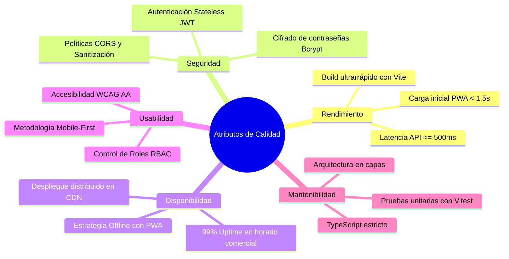
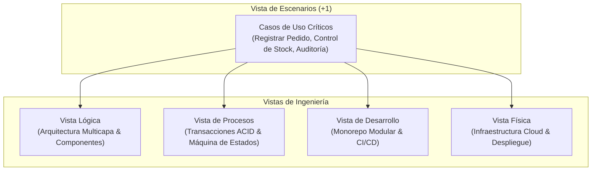
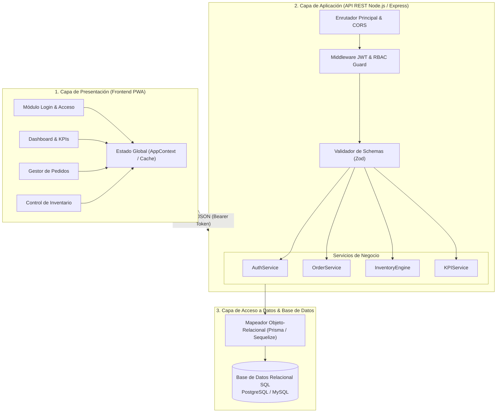
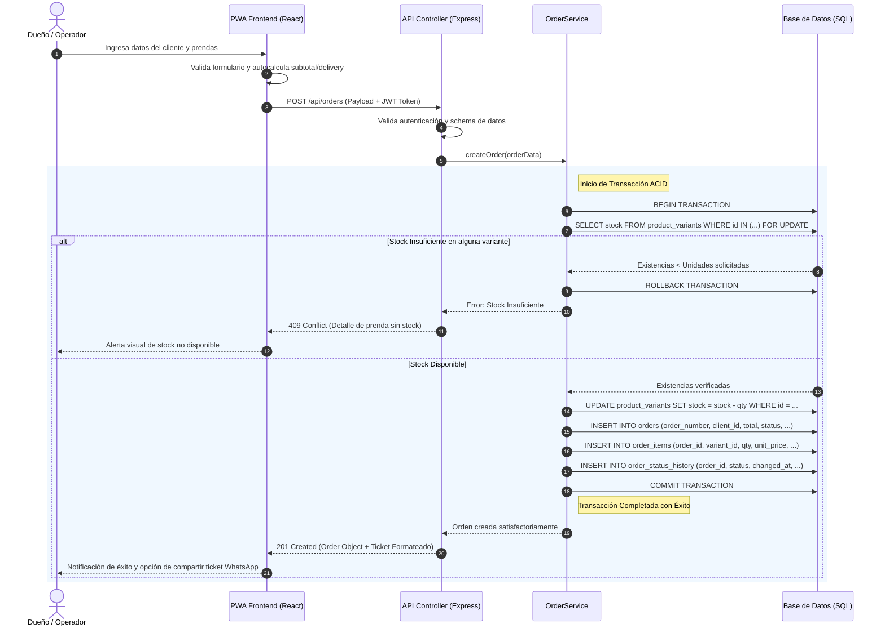
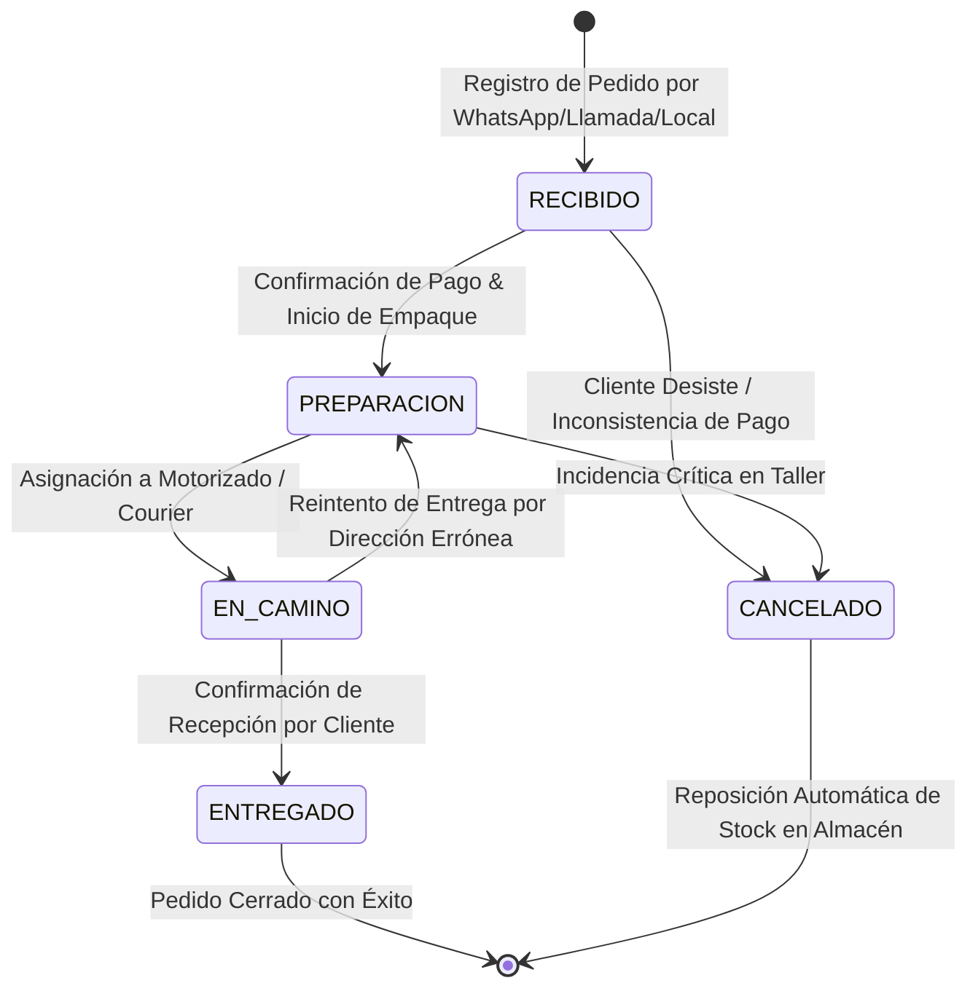
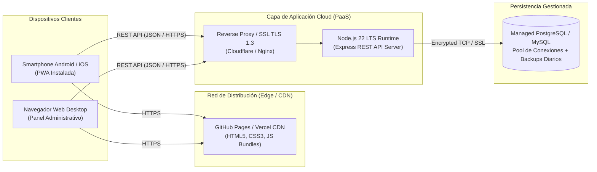
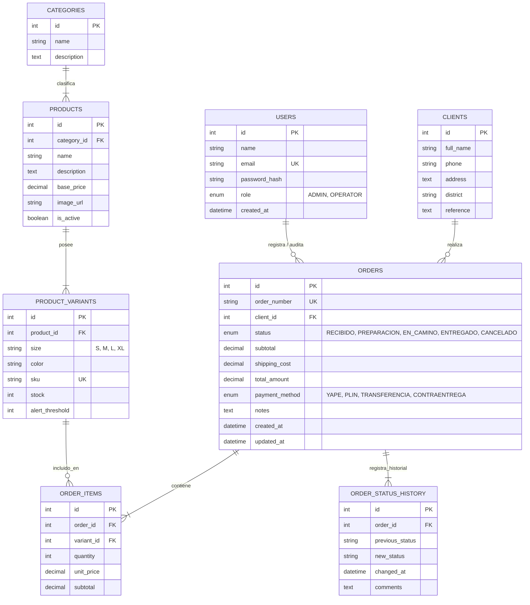

# Documento de Arquitectura de Software (SAD)
## Sistema de Gestión de Pedidos Multicanal & Control de Inventario
### Proyecto: Leofit Solutions

---

## 1. Identificación y Control del Documento

| Campo | Detalle |
|:---|:---|
| **Institución:** | Universidad Tecnológica del Perú (UTP) |
| **Facultad:** | Facultad de Ingeniería de Sistemas e Informática |
| **Curso:** | Integrador II: Software |
| **Proyecto:** | Sistema Web Progresivo (PWA) de Gestión de Pedidos & Control de Inventario en Tiempo Real |
| **Empresa Beneficiaria:** | **Leofit** (PYME textil deportiva - confección y comercialización) |
| **Dueño de la Empresa:** | Víctor Leandro Cárdenas Fernández |
| **Versión del Documento:** | 1.1.0 |
| **Fecha:** | Septiembre 2026 |

### Equipo de Desarrollo (Grupo 01):
1. **Cárdenas Fernández Víctor Leandro** — Back-End / Base de Datos
2. **Dávila Morales Jim Alessandro** — Calidad / DevOps / Despliegue
3. **Roman Delgado Harley Anthony** — UX / Front-End
4. **Loayza Rodriguez Lady Luz** — UX / Front-End / Coordinación General
5. **Rojas Sanchez Daniel Enrique** — Gestión / Análisis Funcional

---

## 2. Introducción y Objetivos Arquitectónicos

### 2.1. Propósito
El presente documento describe la arquitectura técnica integral, los patrones de diseño, las vistas estructurales (modelo 4+1) y las decisiones de ingeniería (ADR) adoptadas para la construcción del sistema de información de **Leofit**.

### 2.2. Contexto del Negocio y Problemática
Leofit gestionaba la recepción de pedidos a través de múltiples canales desarticulados (WhatsApp personal, llamadas telefónicas, mensajes directos de Instagram) registrando la información en cuadernos físicos o notas sueltas. Esta operativa generaba:
* Sobreventa de prendas sin stock real disponible en el taller o almacén.
* Retrasos y confusiones en el empaque y despacho de pedidos.
* Cero trazabilidad del estado del pedido (`Recibido` -> `Preparación` -> `En Camino` -> `Entregado`).
* Falta de métricas consolidadas sobre el flujo de caja e ingresos diarios.

### 2.3. Objetivos Arquitectónicos
1. **Desacoplamiento Estricto:** Separación total entre la capa de interfaz de usuario (Frontend PWA) y la lógica de negocio/persistencia (API REST + Base de Datos).
2. **Alta Eficiencia & Baja Latencia:** Respuestas de consulta en menos de 500 ms y compilación ultrarrápida del cliente.
3. **Portabilidad y Soporte Mobile-First:** Experiencia ergonómica optimizada para smartphones con capacidad de instalación como Progressive Web App (PWA).
4. **Atomicidad e Integridad de Inventario:** Garantía ACID estricta en la reserva y descuento de prendas por talla y color.
5. **Seguridad y Trazabilidad:** Control de acceso basado en roles (RBAC) y auditoría de cambios de estado.

---

## 3. Atributos de Calidad (Requerimientos No Funcionales)

| Atributo | Requerimiento / Métrica | Estrategia de Implementación |
|:---|:---|:---|
| **Rendimiento** | Tiempo de carga inicial < 1.5s; tiempo de respuesta API <= 500 ms. | Compilación con Vite, bundle modular, minificación con Rollup, índices en base de datos. |
| **Seguridad** | Autenticación stateless y cifrado robusto de credenciales. | Tokens JWT firmados, contraseñas hasheadas con `bcrypt` (10 rounds), validación de inputs con schemas, CORS estricto. |
| **Disponibilidad** | 99% de disponibilidad en horario comercial (08:00 - 22:00). | Despliegue en infraestructuras PaaS/Cloud de alta disponibilidad (GitHub Pages / Vercel + Render/Railway). |
| **Escalabilidad** | Capacidad de soportar picos de venta de temporada (campañas deportivas). | Arquitectura stateless en API REST que permite replicación horizontal de contenedores. |
| **Mantenibilidad** | Código limpio, tipado estático y pruebas automatizadas. | TypeScript estricto en frontend y backend, arquitectura en capas, pruebas con Vitest y CI/CD en GitHub Actions. |
| **Usabilidad (UX)** | Curva de aprendizaje < 15 minutos para operadores nuevos. | Enfoque mobile-first, diseño limpio con TailwindCSS, contraste accesible (WCAG AA) y retroalimentación visual inmediata. |

---

## 4. Vistas Arquitectónicas (Modelo 4+1 de Kruchten)

---

### 4.1. Vista Lógica: Arquitectura Multicapa y Flujo de Información

---

### 4.2. Vista de Procesos: Secuencia Transaccional Atómica de Creación de Pedido

---

### 4.3. Máquina de Estados del Ciclo de Vida del Pedido

---

### 4.4. Vista Física / Topología de Despliegue en Producción

---

### 4.5. Vista de Datos: Modelo Entidad-Relación (ERD)

---

## 5. Registro de Decisiones de Arquitectura (ADR)

### ADR-01: Adopción de Arquitectura Desacoplada (PWA + API REST)
* **Estado:** Aceptado.
* **Contexto:** Se requería una solución que permita atender pedidos desde el celular en el taller y desde computadoras en el punto de venta.
* **Decisión:** Implementar una Progressive Web App (PWA) construida con React 19 + TypeScript, consumiendo una API REST desacoplada.
* **Consecuencias Positivas:** Independencia de despliegue, experiencia nativa en móviles sin coste de tiendas de aplicaciones, reutilización de la API para futuras integraciones.

### ADR-02: Selección de Base de Datos Relacional (SQL)
* **Estado:** Aceptado.
* **Contexto:** Las transacciones de venta e inventario requieren estricta consistencia para no permitir sobreventas.
* **Decisión:** Utilizar un motor relacional (PostgreSQL / MySQL) con soporte de claves foráneas e índices B-Tree.
* **Consecuencias Positivas:** Cumplimiento total de propiedades ACID; integridad referencial garantizada; facilidad para reportes contables.

### ADR-03: Autenticación Stateless con JSON Web Tokens (JWT)
* **Estado:** Aceptado.
* **Contexto:** Se necesita un esquema de autenticación seguro, ligero y que no dependa de sesiones en memoria en el servidor.
* **Decisión:** Emisión de tokens JWT firmados con algoritmo HMAC-SHA256, con payload que incluye `userId` y `role`.
* **Consecuencias Positivas:** Escalabilidad horizontal sin replicación de sesiones; consumo seguro desde navegadores y dispositivos móviles.

### ADR-04: Enfoque de Pruebas Automatizadas con Vitest
* **Estado:** Aceptado.
* **Contexto:** Validación rápida de las reglas de cálculo (subtotales, descuentos, cálculo de riesgo de pedidos) en el flujo de CI.
* **Decisión:** Utilizar Vitest integrado de forma nativa con Vite.
* **Consecuencias Positivas:** Ejecución de pruebas unitarias en menos de 200 ms sin sobrecarga de configuración de Babel/Jest.

---

## 6. Estrategia de Seguridad y Gobernanza

1. **Gestión de Variables de Entorno:**
   - Cero secretos en código fuente. Parámetros sensibles (`JWT_SECRET`, `DB_URL`, credenciales) inyectados mediante archivos `.env` excluidos del control de versiones.
2. **Control de Acceso Basado en Roles (RBAC):**
   - **Rol Administrador (Dueño):** Acceso total a creación de pedidos, edición de precios, control de inventario y visualización de montos de facturación.
   - **Rol Operador:** Acceso restringido a cambio de estados operativos y visualización de datos de entrega, con ocultamiento de métricas financieras.
3. **Pipeline de Integración y Despliegue Continuo (CI/CD):**
   - Validación automática de linting, tipado estático, suite de pruebas unitarias y escaneo de vulnerabilidades (`security-scan.yml`) ante cada Pull Request hacia la rama `main`.
