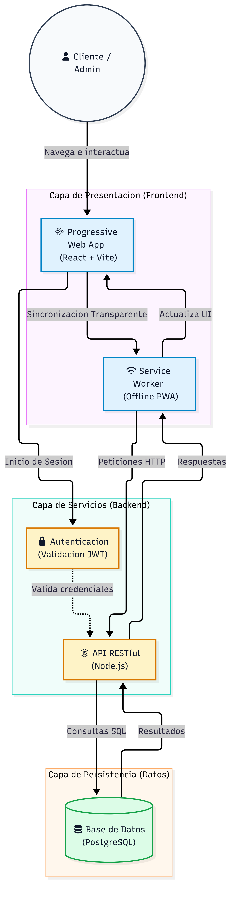
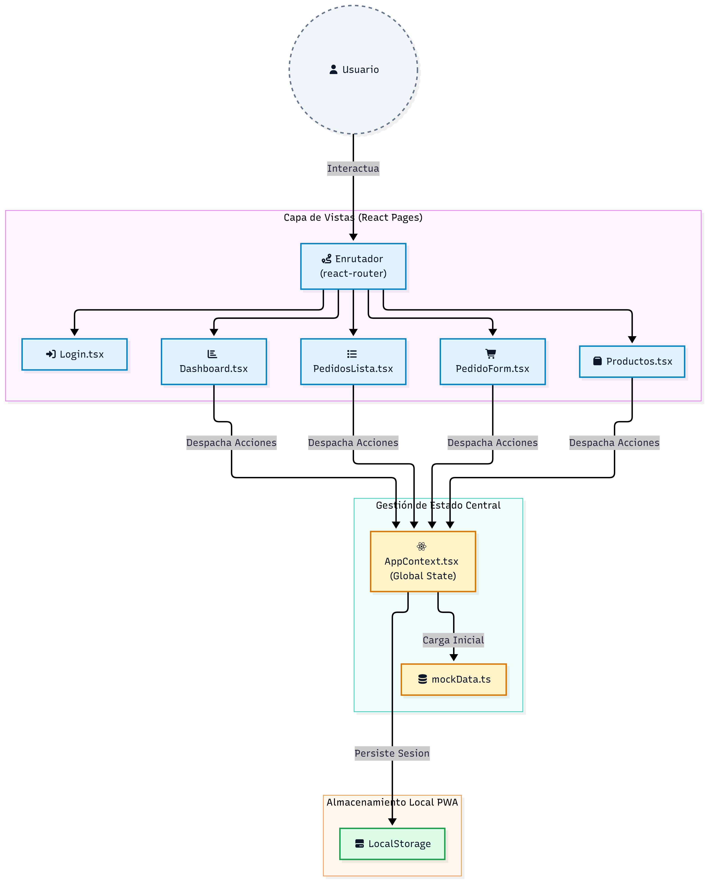
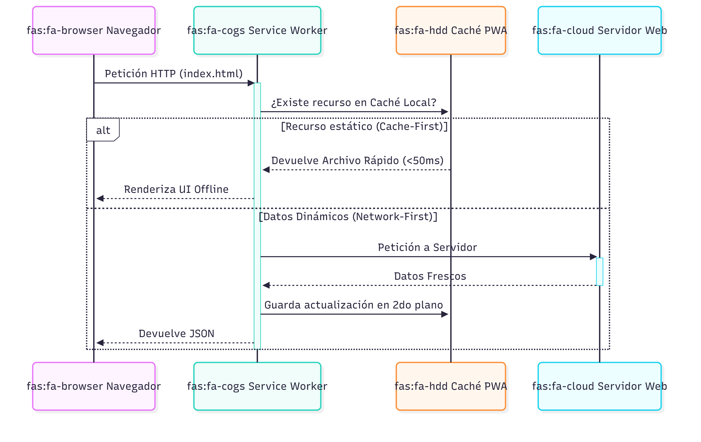
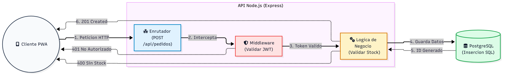

# UNIVERSIDAD TECNOLÓGICA DEL PERÚ
## FACULTAD DE INGENIERÍA DE SISTEMAS E INFORMÁTICA
### CURSO INTEGRADOR II: SOFTWARE (100000S12F)

---

# DOCUMENTO DE ARQUITECTURA DE SOFTWARE (SAD)
## MODELO DE VISTAS 4+1 DE KRUCHTEN Y ESTÁNDAR C4
### PROYECTO: SISTEMA WEB PWA DE GESTIÓN Y TOMA DE PEDIDOS MULTICANAL PARA LEOFIT

---

## 1. CONTROL DEL DOCUMENTO Y EQUIPO DE ARQUITECTURA

* **Institución:** Universidad Tecnológica del Perú (UTP)
* **Curso:** Curso Integrador II: Software (100000S12F)
* **Proyecto:** Progressive Web App (PWA) de Gestión de Pedidos & Inventario LeoFit
* **Equipo de Desarrollo (Grupo 01):**
  1. **Loayza Rodriguez, Lady Luz** - Scrum Master / UX-UI Lead
  2. **Cárdenas Fernández, Víctor Leandro** - Product Owner / Arquitecto Back-End y Base de Datos
  3. **Roman Delgado, Harley Anthony** - Front-End Lead / Especialista PWA y WPO
  4. **Dávila Morales, Jim Alessandro** - QA Engineer / Automatización de Pruebas
  5. **Rojas Sanchez, Daniel Enrique** - Analista Funcional / Modelado de Procesos
* **Versión del Documento:** 1.0.0

---

## 2. REPRESENTACIÓN ARQUITECTÓNICA (VISTA LÓGICA Y DESACOPLAMIENTO)

El sistema implementa una **Arquitectura Limpia (Clean Architecture)** organizada en capas concéntricas con flujo de dependencias unidireccional. A continuación se presentan los diagramas de cada capa del sistema.

### 2.1. Arquitectura General (Modelo C4)

---

## 3. VISTA DE DESARROLLO (CAPA FRONTEND Y SERVICE WORKER)

La arquitectura cliente-servidor se divide en el flujo de la aplicación React y el motor Offline administrado por el Service Worker.

### 3.1. Arquitectura de Frontend

### 3.2. Arquitectura de Service Worker (PWA)

---

## 4. VISTA DE PROCESOS (FLUJO TRANSACCIONAL Y BACKEND)

El backend procesa la lógica de negocio y autoriza las transacciones contra la base de datos PostgreSQL.

### 4.1. Arquitectura Backend y Datos

---

## 5. VISTA FÍSICA Y DE DESPLIEGUE (EDGE SERVERLESS CDN)

* **Proveedor de Infraestructura:** GitHub Pages / Vercel Serverless Edge Network.
* **Seguridad y Transporte:** Certificado SSL/TLS nativo (HTTPS forzado).
* **Distribución de Contenidos:** Red de Entrega de Contenidos (CDN) global con puntos de presencia de baja latencia.
* **Integración Continua:** GitHub Actions ejecutando pipelines automáticos de auditoría de seguridad y despliegue continuo ante cada confirmación a la rama `main`.
