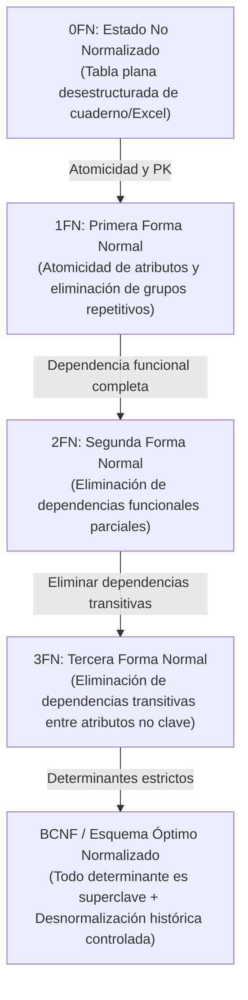
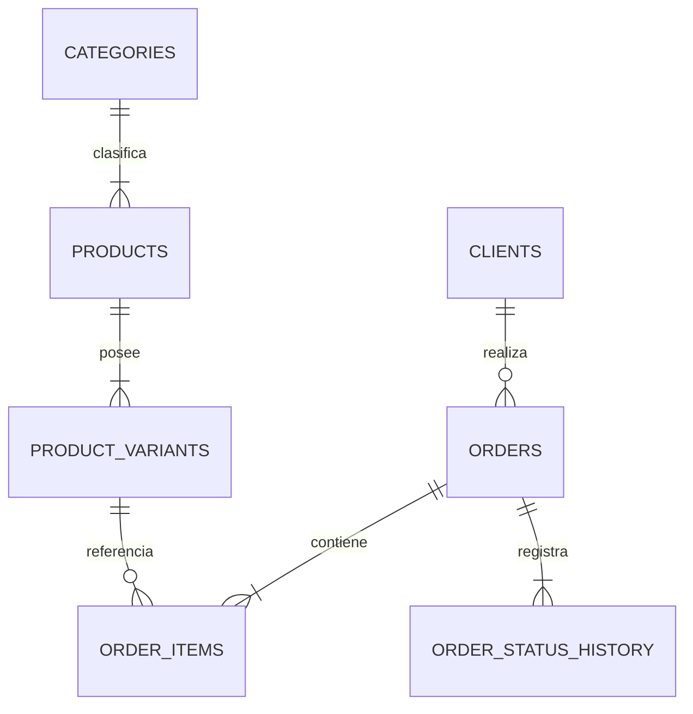

# Proceso Formal de Normalización de Base de Datos
## Sistema de Gestión de Pedidos Multicanal & Control de Inventario
### Proyecto: Leofit Solutions

---

## 1. Identificación y Control del Documento

| Campo | Detalle |
|:---|:---|
| **Institución:** | Universidad Tecnológica del Perú (UTP) |
| **Facultad:** | Facultad de Ingeniería de Sistemas e Informática |
| **Curso:** | Integrador II: Software |
| **Documento:** | Informe Técnico de Normalización de Base de Datos Relacional |
| **Empresa Beneficiaria:** | **Leofit** (PYME Textil Deportiva) |
| **Versión:** | 1.0.0 |
| **Fecha:** | Septiembre 2026 |

### Equipo de Desarrollo (Grupo 01):
1. **Cárdenas Fernández Víctor Leandro** — Back-End / Base de Datos
2. **Dávila Morales Jim Alessandro** — Calidad / DevOps / Despliegue
3. **Roman Delgado Harley Anthony** — UX / Front-End
4. **Loayza Rodriguez Lady Luz** — UX / Front-End / Coordinación General
5. **Rojas Sanchez Daniel Enrique** — Gestión / Análisis Funcional

---

## 2. Introducción y Justificación Teórica

El diseño de la base de datos para el **Sistema de Gestión de Pedidos de Leofit** ha sido sometido a un proceso formal y metodológico de **Normalización Relacional**, basado en la teoría de dependencias funcionales formulada por Edgar F. Codd.

### 2.1. Objetivos del Proceso de Normalización
1. **Eliminación de Redundancia de Datos:** Minimizar la duplicidad innecesaria de información para optimizar el almacenamiento y el uso de memoria RAM del motor SQL.
2. **Prevención de Anomalías Operativas:**
   - **Anomalía de Inserción:** Imposibilidad de registrar una nueva prenda o cliente sin que exista una orden de compra previa.
   - **Anomalía de Modificación:** Inconsistencias derivadas de actualizar el número telefónico o dirección de un cliente en un pedido pero omitirlo en otros.
   - **Anomalía de Eliminación:** Pérdida no intencionada del historial de un cliente o catálogo de productos al eliminar un pedido cancelado.
3. **Garantía de Integridad Referencial:** Establecer restricciones estrictas de claves foráneas (*Foreign Keys*) para evitar registros huérfanos.

---

## 3. Evolución Paso a Paso del Proceso de Normalización

---

### 3.1. Estado Inicial: Forma No Normalizada (0FN)

En el proceso manual previo de Leofit, la información de pedidos se registraba en un único cuaderno o en una hoja de cálculo no estructurada:

**Tabla Plana Inicial (0FN):**
`PEDIDO_UNIFICADO (NroPedido, Fecha, ClienteNombre, ClienteTelefono, ClienteDireccion, ClienteDistrito, ItemsPrendas, MetodoPago, Total, Estado)`

#### Vulnerabilidades y Defectos de 0FN:
* **Falta de Atomicidad:** El campo `ItemsPrendas` contenía cadenas de texto agrupadas (ej. *"2 Camisetas Oversized Negra M S/60, 1 Jogger Gris L S/70"*).
* **Grupos Repetitivos:** Imposible filtrar, ordenar o cuantificar ventas por talla o color específico mediante consultas SQL indexadas.
* **Redundancia Severa:** Los datos del cliente (`ClienteNombre`, `ClienteTelefono`, `ClienteDireccion`) se duplicaban en cada orden registrada.

---

### 3.2. Primera Forma Normal (1FN)

#### Definición Teórica:
Una relación está en **1FN** si y solo si todos los atributos contienen valores atómicos (indivisibles) y no existen grupos repetitivos ni arrays dentro de una misma columna. Se debe definir una Clave Primaria inequívoca.

#### Acciones Aplicadas:
1. Descomposición del atributo multivaluado `ItemsPrendas` en registros atómicos individuales.
2. Separación de atributos compuestos (Dirección, Distrito, Referencia).
3. Definición de la clave primaria compuesta temporal: `(NroPedido, CodigoPrenda, Talla, Color)`.

**Esquema en 1FN:**
* `PEDIDO_DETALLADO (`**`NroPedido`**`, `**`CodigoPrenda`**`, `**`Talla`**`, `**`Color`**`, Fecha, ClienteNombre, ClienteTelefono, ClienteDireccion, ClienteDistrito, PrendaNombre, PrendaCategoria, Cantidad, PrecioUnitario, MetodoPago, Estado)`

---

### 3.3. Segunda Forma Normal (2FN)

#### Definición Teórica:
Una relación está en **2FN** si está en 1FN y todo atributo que no forma parte de la clave primaria depende funcionalmente de manera **completa** de la clave primaria, eliminando dependencias parciales.

#### Análisis de Dependencias Funcionales Parciales en 1FN:
* Clave Primaria Compuesta: `{NroPedido, CodigoPrenda, Talla, Color}`
* Dependencias Parciales Detectadas:
  * `{CodigoPrenda} -> {PrendaNombre, PrendaCategoria}` (Depende únicamente de la prenda, no del número de pedido).
  * `{NroPedido} -> {Fecha, ClienteNombre, ClienteTelefono, ClienteDireccion, ClienteDistrito, MetodoPago, Estado}` (Depende únicamente de la orden).
  * `{CodigoPrenda, Talla, Color} -> {Stock, SKU}` (Depende de la variante específica).

#### Descomposición en 2FN:
Se separan las entidades para que cada atributo no clave dependa de la totalidad de su identificador:

1. `CABECERA_PEDIDO (`**`id_pedido`**`, order_number, fecha, client_id, status, subtotal, shipping_cost, total_amount, payment_method)`
2. `CATALOGO_PRENDAS (`**`id_producto`**`, category_id, name, description, base_price, image_url, is_active)`
3. `VARIANTES_INVENTARIO (`**`id_variante`**`, product_id, size, color, sku, stock, alert_threshold)`
4. `ITEMS_PEDIDO (`**`id_item`**`, order_id, variant_id, quantity, unit_price, subtotal)`

---

### 3.4. Tercera Forma Normal (3FN)

#### Definición Teórica:
Una relación está en **3FN** si está en 2FN y ningún atributo no clave depende transitivamente de la clave primaria (es decir, no existen dependencias de la forma $X \to Y \to Z$ donde $Y$ no sea clave candidata).

#### Análisis de Dependencias Transitivas Detectadas en 2FN:
1. En `CABECERA_PEDIDO`:
   - `id_pedido -> client_id -> {full_name, phone, address, district, reference}`
   - El nombre y teléfono del cliente dependen de `client_id`, no directamente de `id_pedido`.
2. En `CATALOGO_PRENDAS`:
   - `id_producto -> category_id -> {category_name, category_description}`
   - La descripción de la categoría depende del identificador de categoría, no de la prenda.

#### Descomposición en 3FN:
Se extraen las entidades independientes para eliminar toda transitividad:

1. **`clients`** (`id_cliente PK`, `full_name`, `phone`, `address`, `district`, `reference`)
2. **`categories`** (`id_categoria PK`, `name`, `description`)
3. **`products`** (`id_producto PK`, `category_id FK`, `name`, `description`, `base_price`, `image_url`, `is_active`)
4. **`product_variants`** (`id_variante PK`, `product_id FK`, `size`, `color`, `sku UK`, `stock`, `alert_threshold`)
5. **`orders`** (`id_pedido PK`, `order_number UK`, `client_id FK`, `status`, `subtotal`, `shipping_cost`, `total_amount`, `payment_method`, `notes`, `created_at`, `updated_at`)
6. **`order_items`** (`id_item PK`, `order_id FK`, `variant_id FK`, `quantity`, `unit_price`, `subtotal`)
7. **`order_status_history`** (`id_historial PK`, `order_id FK`, `previous_status`, `new_status`, `changed_at`, `comments`)
8. **`users`** (`id_usuario PK`, `name`, `email UK`, `password_hash`, `role`, `created_at`)

---

### 3.5. Forma Normal de Boyce-Codd (BCNF)

#### Evaluación BCNF:
Una relación está en **BCNF** si está en 3FN y para cada dependencia funcional no trivial $X \to Y$, $X$ es una **superclave**.

* En la tabla `product_variants`: El atributo `sku` es único por variante (`sku UK`), por lo que `{id}` y `{sku}` son superclaves equivalentes.
* En la tabla `orders`: El atributo `order_number` es único por pedido (`order_number UK`), siendo superclave alternativa de `{id}`.
* En la tabla `users`: El atributo `email` es único por usuario (`email UK`), siendo superclave alternativa de `{id}`.

**Conclusión:** Todas las relaciones satisfacen estrictamente la **Forma Normal de Boyce-Codd (BCNF)**.

---

## 4. Criterio de Desnormalización Controlada (Decisión de Ingeniería)

Aunque el esquema cumple BCNF, en ingeniería de software de comercio electrónico se aplican decisiones conscientes de **desnormalización controlada** por dos razones técnicas fundamentales:

### 4.1. Preservación del Valor Histórico Contable (`order_items.unit_price`)
* **Problema si no se desnormaliza:** Si solo se leyera el precio desde `products.base_price`, en el momento en que Leofit actualice el precio de una camiseta de S/ 45.00 a S/ 55.00, todos los pedidos de meses anteriores cambiarían retroactivamente de monto total, corrompiendo los reportes contables e inventarios fiscales.
* **Solución Técnica:** Se replica `unit_price` en `order_items` capturando una instantánea inmutable (*snapshot*) del precio pactado en el instante exacto de la compra.

### 4.2. Agilidad de Consultas en Tableros de Control (`orders.total_amount`)
* **Problema:** Calcular `SUM(quantity * unit_price) + shipping_cost` mediante agregaciones SQL en cada renderizado del Dashboard ralentizaría los tiempos de respuesta ante miles de órdenes.
* **Solución Técnica:** Se almacena `total_amount` en la cabecera `orders` con un índice B-Tree, asegurando consultas de métricas e ingresos en tiempo constante $O(1)$.

---

## 5. Matriz de Validación de Formas Normales

| Tabla del Esquema | 1FN (Atomicidad) | 2FN (Sin Dep. Parcial) | 3FN (Sin Dep. Transitiva) | BCNF (Superclaves) | Justificación de Diseño |
|:---|:---:|:---:|:---:|:---:|:---|
| **`users`** | Cumple | Cumple | Cumple | Cumple | Autenticación RBAC con email único y credencial encriptada. |
| **`categories`** | Cumple | Cumple | Cumple | Cumple | Catálogo maestro de líneas textiles sin redundancias. |
| **`products`** | Cumple | Cumple | Cumple | Cumple | Prenda deportiva ligada a categoría por clave foránea estricta. |
| **`product_variants`** | Cumple | Cumple | Cumple | Cumple | Control de existencias por SKU atómico (talla + color). |
| **`clients`** | Cumple | Cumple | Cumple | Cumple | Directorio de clientes desacoplado de las órdenes de compra. |
| **`orders`** | Cumple | Cumple | Cumple | Cumple | Cabecera de compra con control de estados y auditoría temporal. |
| **`order_items`** | Cumple | Cumple | Cumple | Cumple | Detalle de compra con persistencia de precio histórico inmutable. |
| **`order_status_history`** | Cumple | Cumple | Cumple | Cumple | Trazabilidad inmutable de cambios de estado operativo. |

---

## 6. Conclusión y Beneficios Técnicos

El esquema relacional resultante alcanza el nivel **3FN / BCNF con desnormalización controlada**, logrando:
1. **Consistencia de Inventario:** Descuentos y reposiciones atómicas libres de colisiones o datos corruptos.
2. **Consultas de Alta Velocidad:** Lecturas de pedidos y filtros de catálogo optimizados mediante índices estructurados en claves primarias y foráneas.
3. **Inmutabilidad Financiera:** Auditoría fiscal fidedigna de compras pasadas sin alteración por variaciones futuras en la lista de precios.
