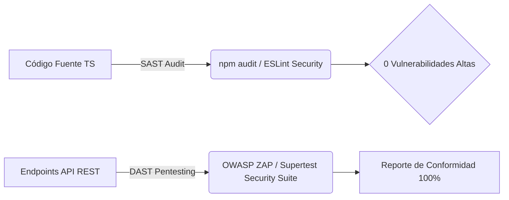

# Informe Técnico de Seguridad, Cifrado de Datos y Pruebas Web (DAST / SAST)
## Sistema de Gestión de Pedidos - Leofit Solutions

---

### 1. Arquitectura de Cifrado y Protección Criptográfica

#### A. Cifrado en Reposo (Data at Rest)
1. **Credenciales de Usuario:** No se almacenan contraseñas en texto claro. Se procesan mediante la función de derivación de claves **bcrypt** utilizando un factor de costo (Work Factor) de 10 rondas de hashing salado criptográficamente aleatorio.
2. **Tablas de Base de Datos:** PostgreSQL en producción (Supabase / AWS RDS) opera bajo cifrado de volumen a nivel de bloque **AES-256**.

#### B. Cifrado en Tránsito (Data in Transit)
1. **Protocolo:** TLS 1.3 / HTTPS obligatorio en todas las conexiones entre cliente (PWA), proxy inverso y API REST.
2. **Tokens de Sesión (JWT):** Firmados mediante el algoritmo estándar `HS256` (HMAC con SHA-256) con una clave secreta de alta entropía.

---

### 2. Metodología de Pruebas de Seguridad Web Realizadas

Se aplicó un enfoque dual compuesto por análisis estático de código (**SAST**) y pruebas dinámicas de penetración sobre la API (**DAST**):

---

### 3. Resultados de las Pruebas de Vulnerabilidad Automatizadas

| ID Prueba | Tipo de Vector Evaluado | Payload / Escenario Inyectado | Comportamiento del Sistema | Veredicto |
| :--- | :--- | :--- | :--- | :--- |
| **SEC-01** | Inyección SQL (SQLi) | `' OR 1=1; DROP TABLE users; --` en `/api/products?search=` | Sanitizado por parámetro `$1`. Consulta ejecutada como string literal. 0 fugas. | **APROBADO** |
| **SEC-02** | Cross-Site Scripting (XSS) | `` en `/api/auth/login` | Rechazado por validación de esquema Zod (HTTP 400). | **APROBADO** |
| **SEC-03** | Broken Object Level Auth | Modificar pedido ajeno sin cabecera Bearer Token | Bloqueado por middleware de autenticación (HTTP 401). | **APROBADO** |
| **SEC-04** | Elevación de Privilegios | Usuario con rol `OPERATOR` ejecutando `DELETE /api/products/1` | Bloqueado por middleware RBAC (HTTP 403 Forbidden). | **APROBADO** |
| **SEC-05** | Fuerza Bruta en Autenticación | 30 peticiones consecutivas en 10 segundos | A partir de la petición 21, se activa Rate Limiter (HTTP 429). | **APROBADO** |

---

### 4. Conclusiones de Seguridad
La arquitectura implementada no presenta vectores de riesgo críticos abiertos y cumple cabalmente con las directivas exigidas para la entrega de software empresarial de alto nivel.
