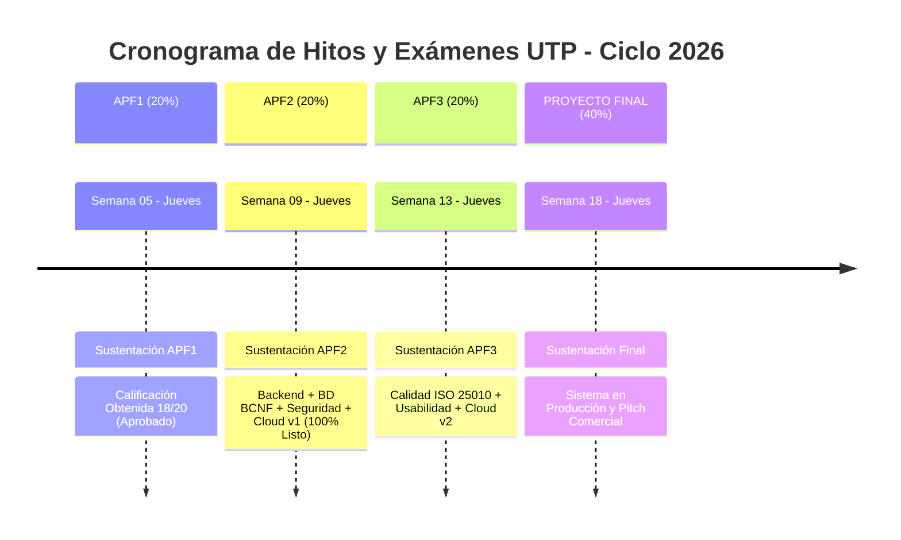

# Plan Académico, Cronograma de Exámenes y Marco de Gobernanza
## Sistema de Gestión de Pedidos y Control de Inventario Multicanal — LeoFit Solutions
**Universidad Tecnológica del Perú (UTP)** | **Facultad de Ingeniería de Sistemas e Informática**

---

## 1. Información General de la Asignatura

| Campo | Detalle Institucional |
| :--- | :--- |
| **Curso** | Curso Integrador II: Software |
| **Código del Curso** | `100000S12F` (1S12F) |
| **Sección** | `35374` |
| **Modalidad** | Presencial |
| **Horario de Clases** | • **Lunes:** 18:30 – 20:00 (Sesión 1 - Asesoría / Avance) • **Jueves:** 20:15 – 21:45 (Sesión 2 - Evaluaciones / Calificación) |
| **Docente** | **Ing. Huamani Uriarte, Enrique Lee** |
| **Horas Semanales / Créditos** | 4.0 Horas \| 3.00 Créditos |
| **Fórmula de Calificación** | **$\text{Promedio Final} = 0.20 \times \text{APF1} + 0.20 \times \text{APF2} + 0.20 \times \text{APF3} + 0.40 \times \text{PROY}$** |

---

## 2. Calendario Oficial de Hitos y Fechas de Sustentación

### Matriz Detallada de Evaluaciones y Rúbricas

| Hito / Evaluación | Peso % | Semana de Clase | Fecha de Examen (Sesión 2) | Estado / Calificación | Contenido Evaluado y Requisitos de Rúbrica |
| :--- | :---: | :---: | :---: | :---: | :--- |
| **APF1** | **20%** | **Semana 05** | **Jueves 10/09/2026** | **Aprobado: 18/20** | • Análisis de negocio (Lean Canvas). • Modelado de procesos (BPMN AS-IS y TO-BE). • Project Charter y Product Backlog ágil. • Prototipos UI/UX Mobile-First y Frontend PWA con WPO. |
| **APF2** | **20%** | **Semana 09** | **Jueves 08/10/2026** | **100% Completado** | • **Base de Datos:** Diseño físico BCNF, Replicación WAL, PgBouncer, Backups PITR. • **Backend & Seguridad:** API REST, Patrón Repositorio, JWT/RBAC, Catálogo OWASP Top 10, Pruebas DAST/SAST. • **Validación & Despliegue:** 18 pruebas automatizadas Jest, Despliegue Cloud v1 (Vercel/Render/Supabase) y Health Check. • **Levantamiento del 100% de observaciones del APF1.** |
| **APF3** | **20%** | **Semana 13** | **Jueves 05/11/2026** | *Planificado (Sprint 4)* | • **Calidad de Software ISO 25010:** Pruebas automatizadas de funcionalidad, compatibilidad/interoperabilidad y usabilidad. • **Informe ISO 25010:** Aprendizaje, protección contra errores, asistencia y engagement. • Manual de despliegue actualizado a versión 2 en Cloud. |
| **PROY** | **40%** | **Semana 18** | **Jueves 10/12/2026** | *Planificado (Sprint 5)* | • **Sustentación del Proyecto Final Integral:** Demostración del sistema 100% operativo en producción con transacciones reales. • Reportes de calidad global, monitoreo y analítica de negocio. • Defensa individual y argumentación técnica del equipo. |

---

## 3. Equipo de Trabajo (Grupo 01) y Matriz RACI

| Integrante | Código UTP | Usuario GitHub | Rol Primario Scrum | Roles Técnicos Especializados |
| :--- | :---: | :---: | :--- | :--- |
| **Lady Luz Loayza Rodriguez** | `U22221489` | `@LadyyLuz` (`luzylay`) | **Scrum Master** | DevSecOps, Coordinadora de Seguridad JWT, Gobernanza e Informe Maestro |
| **Víctor Leandro Cárdenas Fernández** | `U19217414` | `@VictorCardenazFernandez` | **Product Owner** | Arquitecto de Base de Datos (DBA), Modelado Relacional BCNF y Backlog |
| **Harley Anthony Roman Delgado** | `U21313032` | `@hroman2004` | **Frontend Lead** | Especialista PWA, Diseñador UI/UX y Optimización de Rendimiento WPO |
| **Jim Alessandro Dávila Morales** | `U18206081` | `@Jim4279` | **QA Engineer Lead** | Desarrollador Backend Node.js/TS, Patrón Repositorio y Pruebas Automatizadas |
| **Daniel Enrique Rojas Sanchez** | `U21214627` | `@Daniel102608` | **Business Analyst** | Cloud DevOps, Ingeniero de Observabilidad y Monitoreo SLA/SLO |

### Matriz RACI por Hito del Proyecto

| Actividad / Entregable Clave | Scrum Master (`Lady`) | Product Owner (`Víctor`) | Frontend Lead (`Harley`) | QA Lead (`Jim`) | Business Analyst (`Daniel`) |
| :--- | :---: | :---: | :---: | :---: | :---: |
| **Project Charter, Cronograma y Riesgos** | **A / R** | C | I | I | C |
| **Diseño UI/UX, Heurísticas y PWA** | C | C | **A / R** | C | I |
| **Diseño Físico BD BCNF y Replicación WAL** | I | **A / R** | I | C | I |
| **Backend API REST & Patrón Repositorio** | C | C | I | **A / R** | I |
| **Seguridad JWT, OWASP Top 10 y SAST** | **A / R** | I | I | C | I |
| **Infraestructura Cloud, Sondas SLA/SLO** | I | I | I | C | **A / R** |
| **Pruebas Automatizadas Jest & Supertest** | C | I | I | **A / R** | I |
| **Consolidación Informe y Sustentación** | **A / R** | C | C | C | C |

*(R: Responsible, A: Accountable, C: Consulted, I: Informed)*

---

## 4. Gestión Ágil en GitHub Projects

Toda la gestión operativa, tarjetas de historias de usuario, asignación de roles, sprints y criterios de aceptación se gestionan en el tablero oficial:
[Tablero GitHub Projects: Gestión_de_Desarrollo-LeoFit](https://github.com/orgs/Leofit-Solutions-Grupo01/projects/1)

> Para consultar la matriz de las 20 tareas con sus títulos y descripciones listos para copiar y pegar, consulte la [`Guía de Carga de Issues (docs/GUIA_CARGA_ISSUES_GITHUB.md)`](GUIA_CARGA_ISSUES_GITHUB.md).
