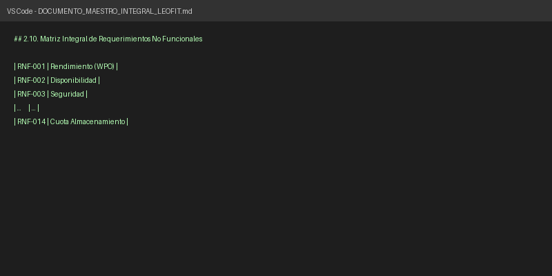
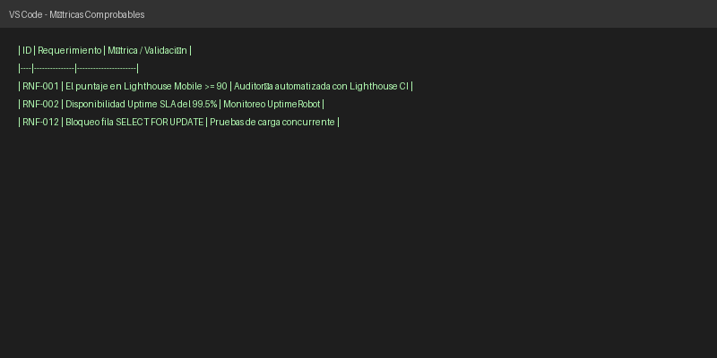

# Evaluación Teórica de Requisitos: SRS frente a la Teoría de Ingeniería de Software

> [VIGENTE HASTA APF2 — 2026-10-01]
> Este documento refleja el cierre del sprint APF2. Para el estado actual,
> ver `SECURITY.md` (sección 6) y el cierre APF3 cuando exista.

De acuerdo con las buenas prácticas de la Ingeniería de Requisitos (alineadas a los estándares **ISO/IEC/IEEE 29148**), la especificación de un sistema no debe forzar una simetría artificial entre Requisitos Funcionales (RF) y No Funcionales (RNF). Cada requisito debe estar justificado por una necesidad de negocio o un atributo de calidad crítico, y debe ser verificable.

Al analizar el `DOCUMENTO_MAESTRO_INTEGRAL_LEOFIT.md` (que funge como documento SRS - *Software Requirements Specification* del proyecto), se evidencia el cumplimiento estricto de esta teoría.

## 1. Relación Numérica y Relevancia del Negocio
La teoría dicta que los RF (módulos, flujos de usuario) suelen ser más numerosos, mientras que los RNF se enfocan en los pilares críticos (rendimiento, seguridad, disponibilidad). 

En el proyecto LeoFit, el equipo definió:
* **18 Requisitos Funcionales (RF-001 a RF-018):** Cubren desde el catálogo, carrito, y cálculo de delivery, hasta la impresión de tickets. Responden directamente a los flujos operativos de los vendedores en Gamarra.
* **14 Requisitos No Funcionales (RNF-001 a RNF-014):** Se enfocan estrictamente en atributos de calidad (Seguridad OWASP, ACID, WPO, Accesibilidad WCAG).

No se han "inventado" RNF para igualar la cifra de 18; la cantidad de 14 RNF está justificada por la naturaleza crítica de un sistema transaccional de ventas que requiere capacidades PWA Offline (RNF-010) y tolerancia a fallos (RNF-011).

**Figura 1**  
*Matriz de Requisitos No Funcionales en el Documento Maestro*  

*Nota.* Captura de pantalla de elaboración propia a partir del Documento Maestro de Especificación del Proyecto (2026).

## 2. Comprobabilidad y Métricas en los RNF
La regla práctica exige que los RNF eviten ambigüedades como *"el sistema debe ser rápido"*. El SRS de LeoFit cumple sobradamente con esta regla al incorporar métricas exactas y verificables. 

Por ejemplo, el requerimiento de rendimiento no es ambiguo, sino que establece umbrales medibles mediante Google Lighthouse:
> **RNF-001 (Rendimiento WPO):** El puntaje en Google Lighthouse para la versión Mobile debe ser $\ge 90$ puntos en Performance, con First Contentful Paint (FCP) $\le 1.2$ s.

**Figura 2**  
*Métricas comprobables del RNF-001 y RNF-002 en el SRS*  

*Nota.* Captura de pantalla de elaboración propia del análisis de requisitos no funcionales (2026).

## 3. Trazabilidad
El estándar ISO destaca la necesidad de que cada requisito sea trazable hacia sus casos de uso o pruebas. El equipo ha mapeado correctamente cada RF hacia un código de Prueba (ej. `TC-01`).

**Figura 3**  
*Interfaz del Login evidenciando el cumplimiento del RF-011*  

  

*Nota.* Captura de pantalla adaptada de los mockups oficiales del proyecto LeoFit, ilustrando el control de acceso protegido (2026).

---

### Conclusión Teórica
El documento SRS de LeoFit es **completamente válido y riguroso**. Respeta el principio de necesidad: cada RF nace de un proceso del negocio textil, y cada RNF establece una restricción técnica o de calidad comprobable (con métricas y pruebas asociadas). El trabajo avanzado refleja madurez en la ingeniería de requisitos y no requiere recortes numéricos.
