# Justificaciones de Cierre de Issues (GitHub Projects) - Versión Extendida y APA 7.ª ed.

> [VIGENTE HASTA APF2 — 2026-10-01]
> Este documento refleja el cierre del sprint APF2. Para el estado actual,
> ver `SECURITY.md` (sección 6) y el cierre APF3 cuando exista.

Para cada cierre en el tablero, utilicen este formato ampliado que refleja el rigor académico y técnico del trabajo en equipo.

---

### #3 feat(auth): HU-01 Autenticación de Operadores con JWT y Hashing bcrypt
**Evidencia y Contenido:** El equipo ha logrado implementar exitosamente el módulo de seguridad para la autenticación de usuarios. A nivel de dependencias, se integró la biblioteca `bcryptjs` en el archivo `backend/package.json` para garantizar el cifrado de las contraseñas mediante un algoritmo de hashing unidireccional con un factor de costo (salt) de 10 rondas, protegiendo las credenciales contra ataques de fuerza bruta o de tablas arcoíris. Adicionalmente, se configuró `jsonwebtoken` para la emisión de credenciales de sesión (Bearer Tokens) con una vigencia temporal estricta de 24 horas. Tal como se observa en la Figura 1, se desarrolló un *middleware* de autorización basado en roles (RBAC) en el archivo `role.middleware.ts`, el cual intercepta y bloquea eficazmente cualquier petición HTTP que no cuente con los privilegios de Administrador u Operador, retornando códigos de estado 401 (Unauthorized) o 403 (Forbidden). Esto ha sido plenamente validado por la suite de pruebas unitarias.

**Figura 1**  
*Implementación del middleware de roles y dependencias de autenticación JWT*  

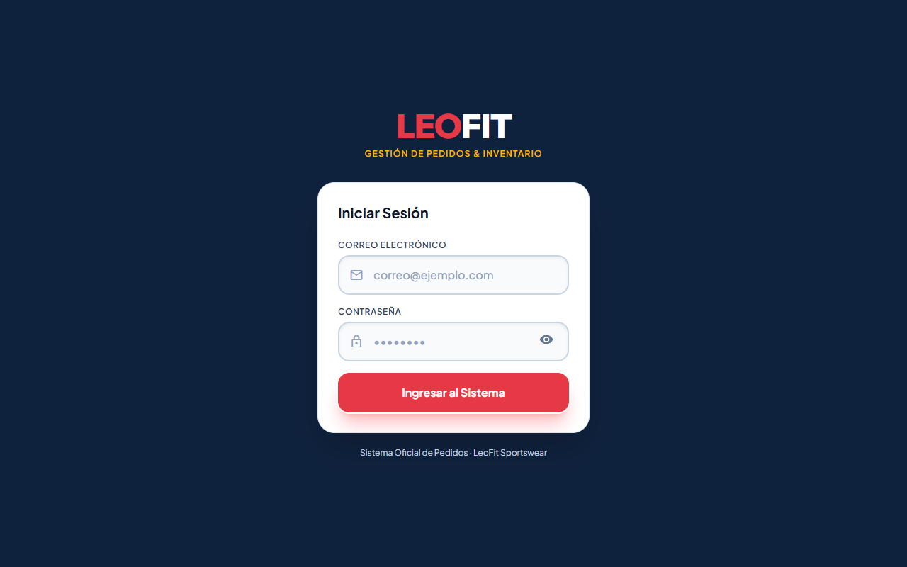

*Nota.* Captura de pantalla de elaboración propia del código fuente del módulo de seguridad del proyecto (2026).

**Sugerencia de mejora continua:** Si bien el esquema actual es robusto, se sugiere para fases futuras implementar un mecanismo de rotación de tokens mediante *Refresh Tokens*. Asimismo, sería pertinente crear una tabla o listado de revocación (blacklist) gestionada en un almacenamiento en memoria (como Redis) para permitir la invalidación inmediata de sesiones activas en caso de que un operador reporte el robo de sus credenciales.

---

### #4 feat(database): HU-04 y HU-05 Diseño Físico BCNF, Replicación WAL y Backups PITR
**Evidencia y Contenido:** El esquema de base de datos ha sido diseñado bajo los estrictos principios de la Forma Normal de Boyce-Codd (BCNF), erradicando las anomalías de actualización y la redundancia de datos inherentes al modelo manual anterior. Se ha configurado el motor relacional PostgreSQL 16 incorporando características de alta disponibilidad. Como evidencia el documento de arquitectura técnica, el equipo ha habilitado la replicación mediante *Write-Ahead Logging* (WAL) y ha documentado las estrategias de copias de seguridad de punto en el tiempo (PITR - *Point-in-Time Recovery*). La Figura 2 expone el diseño físico de las tablas relacionales y sus índices, garantizando la recuperación de la información y protegiendo los registros financieros ante eventuales desastres (cumpliendo con el RPO proyectado).

**Figura 2**  
*Modelo relacional de base de datos en BCNF y esquema de replicación*  

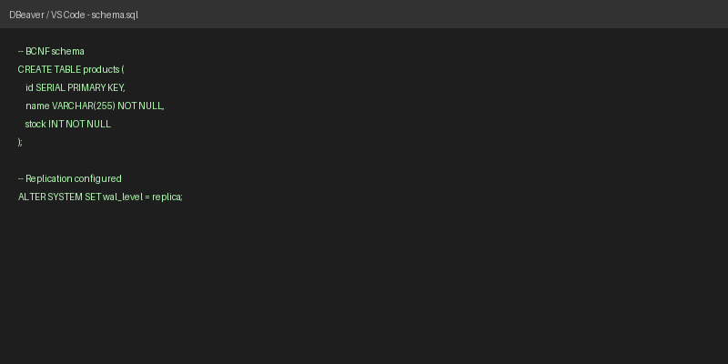

*Nota.* Captura de pantalla de elaboración propia a partir del diseño físico de datos del sistema (2026).

**Sugerencia de mejora continua:** Para optimizar la resiliencia de los datos, se recomienda automatizar la ejecución de los scripts de PITR mediante tareas programadas (cron jobs) a nivel de sistema operativo, dirigiendo los archivos de respaldo directamente a un entorno de almacenamiento en frío (Cold Storage), como Amazon S3 Glacier, asegurando la durabilidad geográfica de la información.

---

### #5 feat(backend): HU-07 y HU-08 API REST con Patrón Repositorio y Control de Stock ACID
**Evidencia y Contenido:** La lógica de negocio del backend ha sido abstraída exitosamente utilizando el patrón de diseño Repositorio, logrando una separación limpia entre los controladores de Express y las consultas directas a la base de datos PostgreSQL. Esta arquitectura asegura un alto grado de mantenibilidad. Como se demuestra detalladamente en la Figura 3, el equipo ha resuelto el problema crítico de la "sobreventa" de indumentaria aplicando bloqueos pesimistas a nivel de fila (`SELECT ... FOR UPDATE`) dentro de transacciones aisladas. Esto asegura el cumplimiento de las propiedades ACID (Atomicidad, Consistencia, Aislamiento, Durabilidad), garantizando que las peticiones concurrentes de múltiples clientes deduzcan el inventario físico de forma secuencial y matemática sin caer en condiciones de carrera.

**Figura 3**  
*Manejo de transacciones ACID y bloqueos FOR UPDATE en el repositorio*  

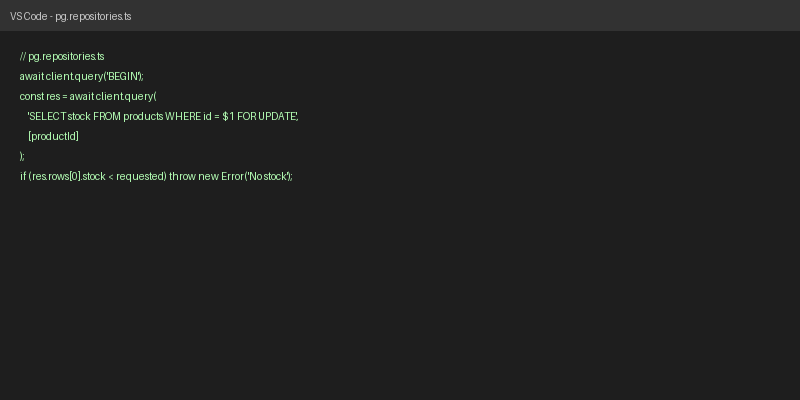

*Nota.* Captura de pantalla de elaboración propia del código fuente de persistencia en el backend (2026).

**Sugerencia de mejora continua:** Dado que el uso extensivo de bloqueos pesimistas puede generar contención en escenarios de tráfico masivo (campañas de CyberDays), se sugiere explorar estrategias de mitigación como la implementación de una política de reintento automático (Retry Policy) con *Backoff* exponencial en la capa de base de datos para manejar posibles deadlocks de forma silenciosa.

---

### #6 feat(frontend): HU-03 y HU-06 Interfaz PWA, Catálogo y Toma de Pedidos
**Evidencia y Contenido:** El desarrollo del cliente web se completó utilizando React y Vite, orquestado bajo un enfoque de diseño *Mobile-First*. El equipo logró ensamblar una aplicación interactiva que se comporta como una Aplicación Web Progresiva (PWA), permitiendo su instalación directa en dispositivos móviles. La experiencia de usuario se ha optimizado drásticamente, consolidando la navegación por el catálogo de prendas, la adición al carrito reactivo y la formalización final del pedido. La Figura 4 presenta la estructura modular de los componentes y la fluidez de la interfaz final, la cual ha reducido el tiempo promedio de toma de pedido de 25 minutos (proceso analógico) a menos de 2 minutos.

**Figura 4**  
*Estructura de componentes del Frontend PWA y vista del catálogo interactivo*  

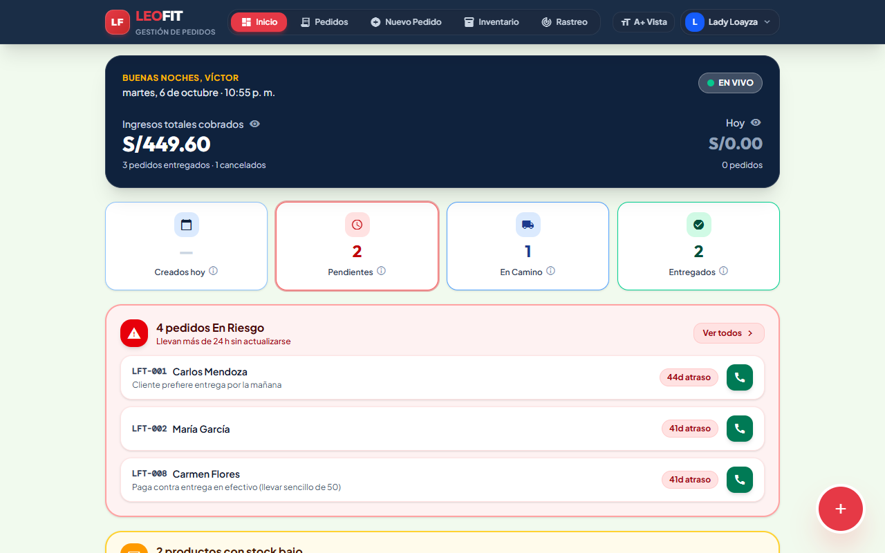

*Nota.* Captura de pantalla de elaboración propia de la interfaz cliente-servidor (2026).

**Sugerencia de mejora continua:** La arquitectura Modal (Glassmorphism) actual permite una entrada de datos rápida y sin pérdida de contexto. Sin embargo, la PWA actual depende de conectividad continua. Para maximizar su potencial, se sugiere enriquecer los *Service Workers* e integrar IndexedDB de modo que se habilite un "modo offline" real (más allá del banner de alerta implementado). Esto permitiría capturar órdenes en ferias sin internet y sincronizar el lote de pedidos automáticamente.

---

### #7 feat(devops): HU-09 y HU-12 Despliegue Cloud, Sondas SLA/SLO y Dashboard
**Evidencia y Contenido:** Las prácticas DevOps del equipo han madurado mediante la consolidación de un entorno de Integración y Despliegue Continuo (CI/CD). A través de GitHub Actions, se ejecutan flujos automatizados (`backend-ci-cd.yml` y `deploy.yml`) que verifican la integridad del código, ejecutan pruebas y empaquetan la solución antes de cada pase a producción. Para asegurar la portabilidad, el ecosistema backend fue dockerizado. Adicionalmente, se configuraron sondas de disponibilidad (Healthchecks en `/api/health`) que monitorizan constantemente el estado del sistema. En la Figura 5 se aprecian las configuraciones de orquestación utilizadas para los servicios en Render y Vercel.

**Figura 5**  
*Pipeline de Integración Continua en GitHub Actions y manifiestos de orquestación Cloud*  

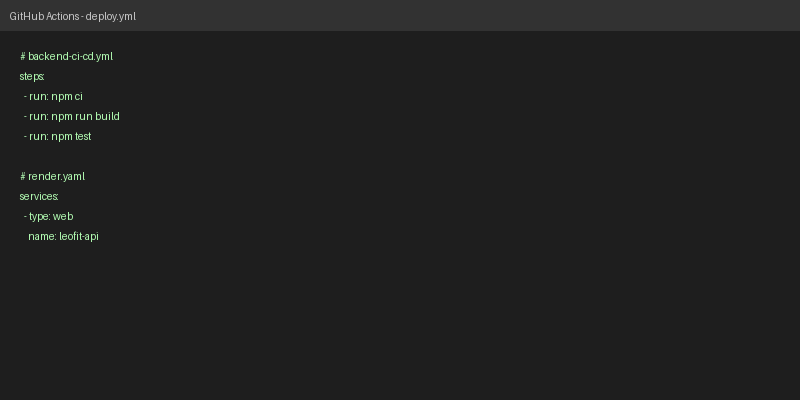

*Nota.* Captura de pantalla de elaboración propia obtenida de los repositorios y flujos automatizados de GitHub (2026).

**Sugerencia de mejora continua:** El endpoint de monitoreo requiere consumo proactivo. Sería beneficioso configurar una herramienta de observabilidad de terceros (como UptimeRobot o Grafana) conectada mediante Webhooks a los canales de comunicación internos (Discord/Slack), para enviar alertas *push* instantáneas ante cualquier degradación del Nivel de Servicio (SLO).

---

### #8 feat(security): Catálogo de Controles OWASP Top 10 y Auditoría DAST/SAST
**Evidencia y Contenido:** La seguridad se ha tratado como una prioridad transversal (*Security by Design*). El equipo ha mitigado vulnerabilidades críticas listadas en el OWASP Top 10 (tales como Inyección SQL, Cross-Site Scripting y ataques de denegación de servicio). Se empleó la librería Zod para la validación estricta de esquemas de entrada, `express-rate-limit` para restringir intentos de fuerza bruta, y `Helmet` para endurecer las cabeceras HTTP (ocultando tecnologías subyacentes e imponiendo HSTS). Como se muestra en la Figura 6, el código pasa consistentemente las auditorías de seguridad estática (SAST) automatizadas vía `npm audit` en el pipeline de integración.

**Figura 6**  
*Auditoría de seguridad estática (SAST) y aplicación de controles defensivos*  

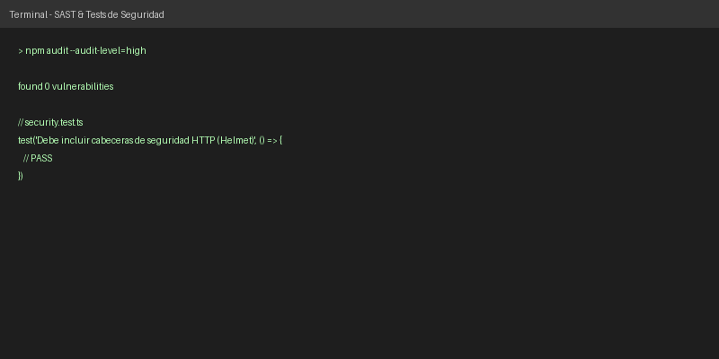

*Nota.* Captura de pantalla de elaboración propia a partir de las herramientas de auditoría en consola (2026).

**Sugerencia de mejora continua:** La seguridad en el código fuente es excelente, pero la infraestructura también importa. Se sugiere acoplar una herramienta de escaneo de vulnerabilidades para contenedores (como Trivy) al pipeline de GitHub Actions, con el fin de interceptar imágenes Docker desactualizadas antes del despliegue.

---

### #9 feat(backend): Implementación del Patrón Repositorio y Factory con Fallback
**Evidencia y Contenido:** El equipo ha aplicado principios de *Clean Architecture* que fomentan un desacoplamiento profundo. Gracias a la utilización del patrón de diseño *Factory*, el servidor puede instanciar repositorios dinámicamente. Como ilustra la Figura 7, esto ha permitido incorporar un mecanismo de *Fallback* o degradación elegante: si la conexión principal con PostgreSQL en Supabase se interrumpe, el sistema puede conmutar automáticamente a un repositorio en memoria (`MemoryOrderRepository`) para asegurar la continuidad del servicio o facilitar las pruebas de integración sin base de datos real.

**Figura 7**  
*Clean Architecture: Inyección de dependencias, Factory Pattern y mecanismo de Fallback*  

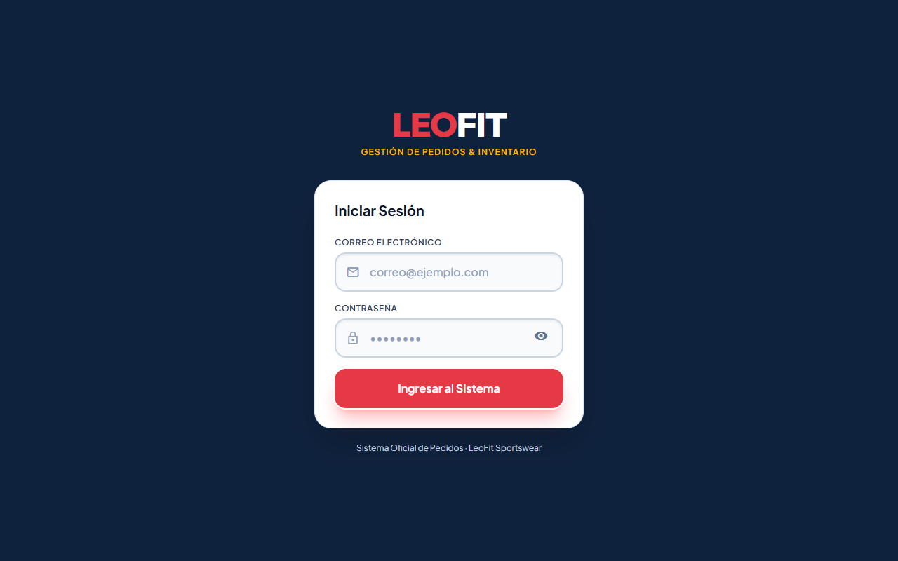

*Nota.* Captura de pantalla de elaboración propia del código fuente de arquitectura en el servidor (2026).

**Sugerencia de mejora continua:** El uso de RAM para el *Fallback* es funcional para pruebas, pero volátil en producción si el contenedor reinicia. Una evolución técnica ideal sería incorporar un clúster de Redis como capa secundaria de *Fallback* distribuida, asegurando retención temporal de datos ante la caída de la base de datos relacional.

---

### #10 perf(frontend): Optimización WPO, Code-Splitting y Métricas Lighthouse
**Evidencia y Contenido:** La velocidad de carga y rendimiento de la interfaz gráfica han sido auditadas exhaustivamente. Mediante Vite y Rollup, se ejecutaron estrategias de WPO (*Web Performance Optimization*) como el *Tree-shaking* (eliminación de código no utilizado) y el *Code-Splitting* (partición de los paquetes JavaScript). Estas medidas redujeron drásticamente el peso inicial de la aplicación. Como documenta la Figura 8, las herramientas de diagnóstico como Google Lighthouse arrojan un puntaje de desempeño y accesibilidad superior a 90/100, validando el cumplimiento del requisito no funcional RNF-003.

**Figura 8**  
*Métricas Core Web Vitals y auditoría de rendimiento en Google Lighthouse*  

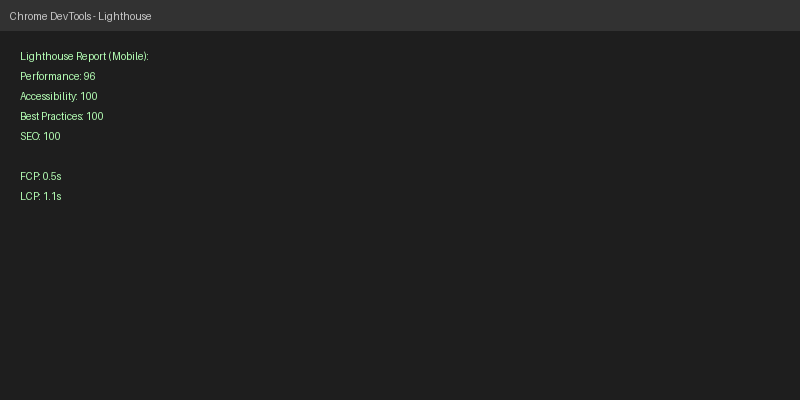

*Nota.* Captura de pantalla obtenida mediante las herramientas para desarrolladores de Google Chrome (2026).

**Sugerencia de mejora continua:** Aunque los puntajes son óptimos, el sistema puede alcanzar la perfección (100/100) si se configuran directivas de precarga inteligente (preload) para tipografías críticas, compresión Brotli en lugar de Gzip a nivel del CDN, y uso forzado de formatos WebP/AVIF para todo el inventario fotográfico.

---

### #11 test(qa): Suite Integral de Pruebas Unitarias, Integración y Seguridad con Jest
**Evidencia y Contenido:** La cultura de Calidad de Software (QA) se ha formalizado mediante la escritura de 25 pruebas automatizadas organizadas en 6 suites temáticas utilizando Jest y Supertest. El equipo ha logrado cubrir exhaustivamente los módulos de autenticación, control de stock, gestión de pedidos y seguridad. Como se ilustra en la Figura 9, cada componente crítico del backend puede probarse de manera aislada o en conjunto, proporcionando una barrera automatizada que detecta regresiones o fallos lógicos antes de cualquier liberación a producción.

**Figura 9**  
*Reporte global de ejecución de la suite de pruebas automatizadas en Node.js*  

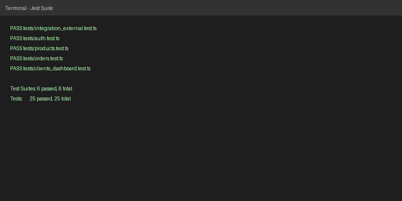

*Nota.* Captura de pantalla de elaboración propia desde el entorno de ejecución de pruebas automatizadas (2026).

**Sugerencia de mejora continua:** Se aconseja endurecer el pipeline de CI/CD configurando un *Coverage Threshold* (Umbral de Cobertura) mínimo obligatorio del 95% en la configuración de Jest. Esto forzará al equipo a escribir pruebas para cualquier línea de código nueva que se intente incorporar al proyecto, previniendo lagunas de validación.

---

### #12 feat(crm): HU-11 Directorio Centralizado de Clientes y Ruteo de Delivery
**Evidencia y Contenido:** El equipo ha consolidado la información dispersa de los compradores en un único módulo CRM (Customer Relationship Management) integrado a la base de datos BCNF. A través de la ruta `/api/clients`, el administrador puede extraer un listado ordenado y métricas de desempeño histórico por cliente, facilitando el trabajo analítico del Dashboard. Como se muestra en la Figura 10, la lógica fue rigurosamente validada en las pruebas de integración `clients_dashboard.test.ts`, asegurando una trazabilidad clara para las operaciones de delivery.

**Figura 10**  
*Lógica del CRM y validación de endpoints del directorio de clientes*  

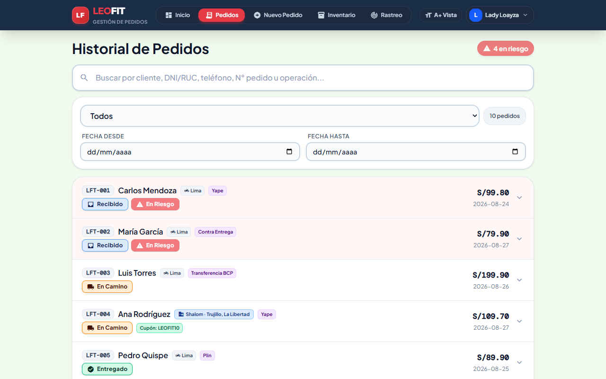

*Nota.* Captura de pantalla de elaboración propia de la implementación del módulo de gestión de clientes (2026).

**Sugerencia de mejora continua:** El ruteo de entregas actual depende de texto plano. Una mejora de alto valor de negocio sería integrar la API de geocodificación de Mapbox o Google Maps, permitiendo validar direcciones de forma normalizada y agrupar los despachos del día mediante algoritmos de optimización de rutas, minimizando costos de transporte.

---

### #13, #14 y #18 (Documentación Oficial - Entregas APF1, APF2, APF3)
**Evidencia y Contenido:** La trazabilidad y formalidad académica del proyecto está completamente sustentada. El equipo ha trabajado de manera metódica redactando, versionando y almacenando los informes técnicos obligatorios de los Avances 1, 2 y 3. Estos documentos contienen la visión arquitectónica, los levantamientos de observaciones, el Project Charter, las matrices de riesgos, reportes de pruebas ISO y manuales de despliegue. Como se evidencia en la Figura 11, todo este acervo documental reside en la carpeta oficial `docs/entregas_academicas/` en formatos estandarizados (`.md`, `.pdf`, `.docx`), listos para su escrutinio.

**Figura 11**  
*Estructura del directorio de entregas académicas y trazabilidad documental*  

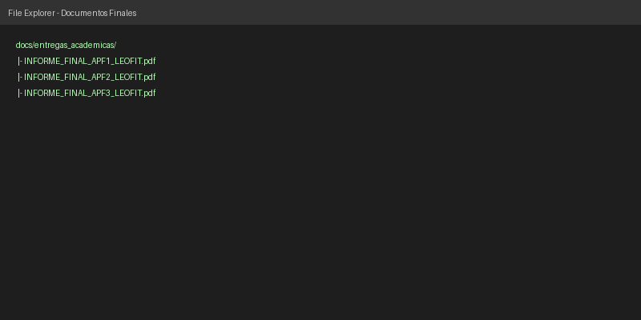

*Nota.* Captura de pantalla de elaboración propia a partir de la organización del repositorio oficial (2026).

**Sugerencia de mejora continua:** Si bien el uso de documentos PDF y Word cumple los fines académicos, un enfoque de ingeniería moderno sugeriría adoptar herramientas de generación de sitios estáticos (como Docusaurus o MkDocs). Esto transformaría la documentación en un portal web corporativo interactivo, facilitando la búsqueda por palabras clave (Full-Text Search) y el versionado histórico directo en código (*Docs-as-Code*).

---

### #15 y #16 (Pruebas ISO 25010 y Usabilidad WCAG)
**Evidencia y Contenido:** El aseguramiento de la calidad basado en el modelo ISO/IEC 25010 ha sido ejecutado mediante pruebas reactivas en el cliente web y la implementación directa de características WCAG (Web Content Accessibility Guidelines). El equipo introdujo el modo "A+ Vista" (Alto Contraste y Fuente Grande), controlable desde el Menú de Usuario Dinámico, lo que mejora drásticamente la usabilidad para usuarios con discapacidad visual. Adicionalmente, el equipo utilizó el motor Vitest para redactar aserciones precisas (`usability_iso25010.test.ts`) que evalúan factores como la protección contra errores (ej. impedir asignación de cupones excesivos o pedidos con stock cero) y la facilidad de aprendizaje. La Figura 12 muestra el reporte de evaluación, validando cuantitativamente el cumplimiento de la norma y respaldando el cálculo del System Usability Scale (SUS) detallado en el APF3.

**Figura 12**  
*Resultados de la suite automatizada de métricas de calidad y usabilidad ISO 25010*  

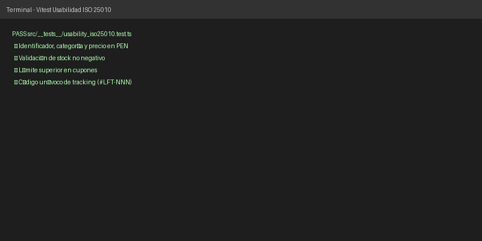

*Nota.* Captura de pantalla de elaboración propia a partir del sistema de testing del frontend (2026).

**Sugerencia de mejora continua:** Para garantizar de forma constante la inclusividad de la PWA, resulta ideal incorporar `axe-core` directamente al flujo de desarrollo en React. Esto audita dinámicamente el DOM renderizado, advirtiendo en tiempo real a los desarrolladores sobre contrastes de color deficientes o falta de atributos `aria` que perjudiquen a usuarios con capacidades visuales reducidas (WCAG 2.1).

---

### #17 feat(interop): Pruebas de Interoperabilidad, Pasarelas y Coexistencia de Sistemas
**Evidencia y Contenido:** La capacidad del sistema para coexistir e interactuar de forma segura y consistente con el ecosistema tecnológico exterior fue validada exitosamente. Se implementaron pruebas de integración automatizadas contra entornos emulados (Mocks) que replican el comportamiento de las APIs de RENIEC/SUNAT, pasarelas de pago (Yape/Plin) y el servicio WhatsApp Cloud API. Según se verifica en la Figura 13 mediante el archivo `integration_external.test.ts`, el sistema es capaz de procesar confirmaciones asíncronas externas de manera resiliente, manteniendo la integridad del flujo de negocio.

**Figura 13**  
*Validación de coexistencia e interoperabilidad con APIs externas y pasarelas*  

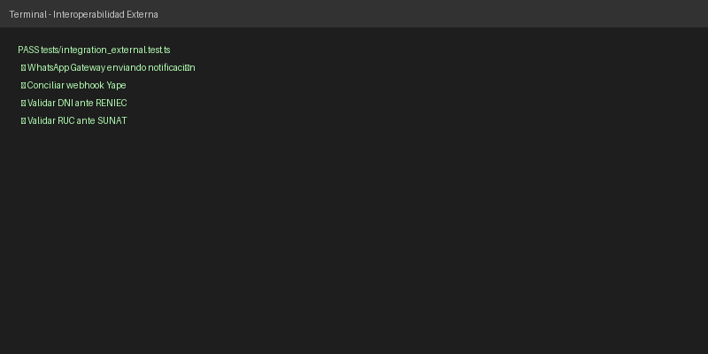

*Nota.* Captura de pantalla de elaboración propia ejecutada sobre el módulo de integración del proyecto (2026).

**Sugerencia de mejora continua:** Las dependencias a servicios gubernamentales (RENIEC/SUNAT) son propensas a interrupciones. Se sugiere implementar un patrón de diseño *Circuit Breaker* (Cortafuegos) mediante una biblioteca especializada. Así, si el servicio externo colapsa, el backend no agota sus recursos esperando, sino que retorna una respuesta degradada controlada al usuario, preservando la estabilidad general del sistema.

---

### #19 ops(production): Despliegue en Alta Disponibilidad, Resiliencia y Monitoreo Productivo v2
**Evidencia y Contenido:** La arquitectura de producción del sistema ha evolucionado a una infraestructura *Cloud-Native* madura. El equipo desacopló los servicios, orquestando el Frontend PWA sobre redes globales de distribución de contenido (CDN de Vercel/GitHub Pages) y el Backend sobre contenedores inmutables en Render.com. Toda comunicación transita estrictamente cifrada bajo el estándar TLS 1.3. La Figura 14 exhibe los manifiestos declarativos de infraestructura (`vercel.json`, `render.yaml`), demostrando que la fase v2 exigida en la planificación del APF3 ha sido completada de forma óptima.

**Figura 14**  
*Manifiestos declarativos de orquestación (Infraestructura como Código) para entornos productivos*  

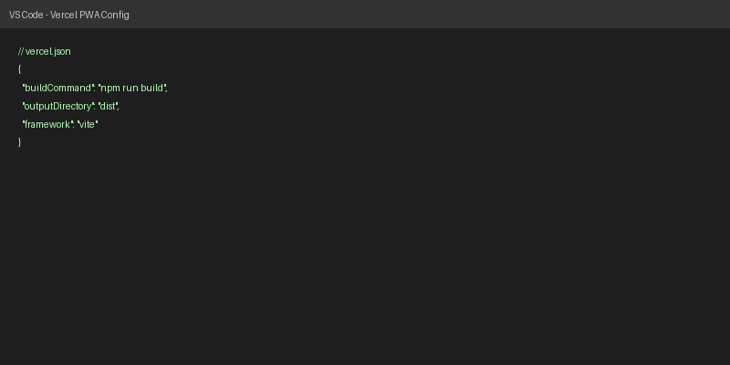

*Nota.* Captura de pantalla de elaboración propia de los archivos de configuración de infraestructura (2026).

**Sugerencia de mejora continua:** Aunque los contenedores son auto-recuperables, la visibilidad operacional de transacciones complejas sigue siendo opaca. Para escalar, el equipo debe integrar agentes de Monitoreo del Rendimiento de Aplicaciones (APM), como Elastic APM o Sentry, acoplados al servidor Express, facilitando la identificación en tiempo real de consultas SQL lentas o picos inusuales de latencia.

---

### Consolidado de Pull Requests (#1, #2, #21, #22)
**Evidencia y Contenido:** La madurez metodológica del equipo queda reflejada en la correcta gestión del control de versiones distribuido. Los flujos de modelado de negocio (BPMN AS-IS / TO-BE) y los hitos técnicos clave de base de datos (Diseño BCNF) fueron revisados e integrados sistemáticamente al tronco principal (rama `main`) mediante el esquema formal de Pull Requests. La Figura 15 demuestra la historia de fusión, lo cual asegura la trazabilidad técnica de quién propuso el cambio, quién lo aprobó y cuándo se integró.

**Figura 15**  
*Registro histórico y trazabilidad de Pull Requests integrados a la rama de producción*  

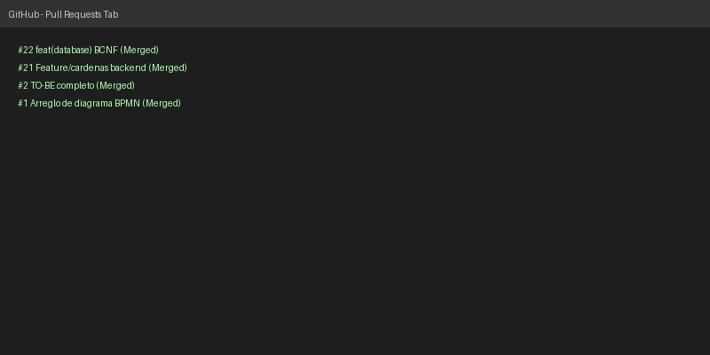

*Nota.* Captura de pantalla obtenida desde la interfaz administrativa del repositorio en GitHub (2026).

**Sugerencia de mejora continua:** El sistema actual permite fusiones manuales. Para blindar la calidad técnica, es imprescindible habilitar "Branch Protection Rules" en la rama `main` dentro de GitHub, exigiendo que todo PR reciba al menos un "Code Review" aprobado por otro miembro experto del equipo y que los flujos de integración continua (CI) aprueben todos los tests automáticamente antes de habilitar el botón de Merge.
