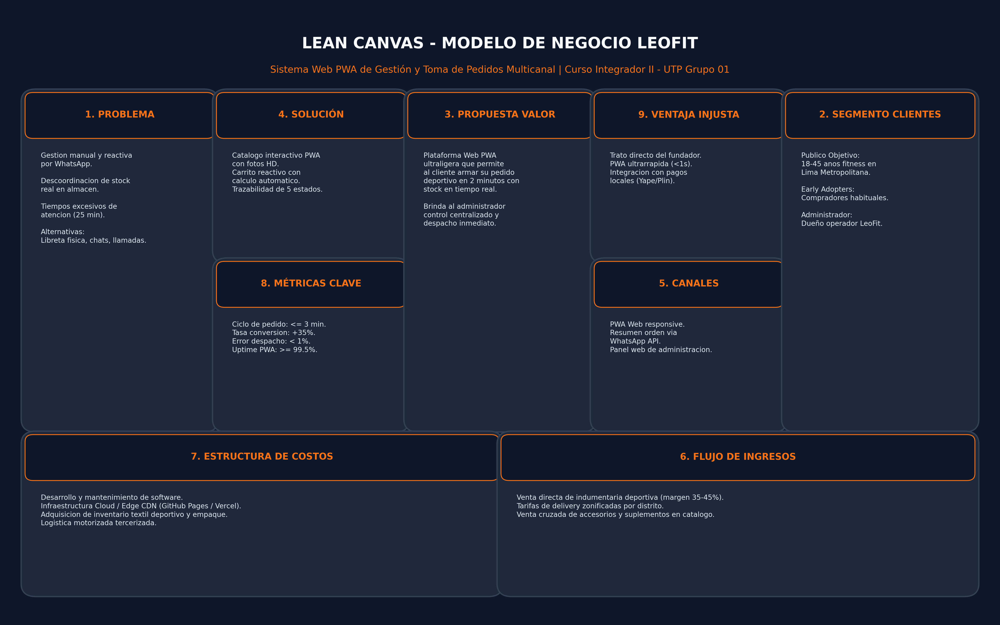
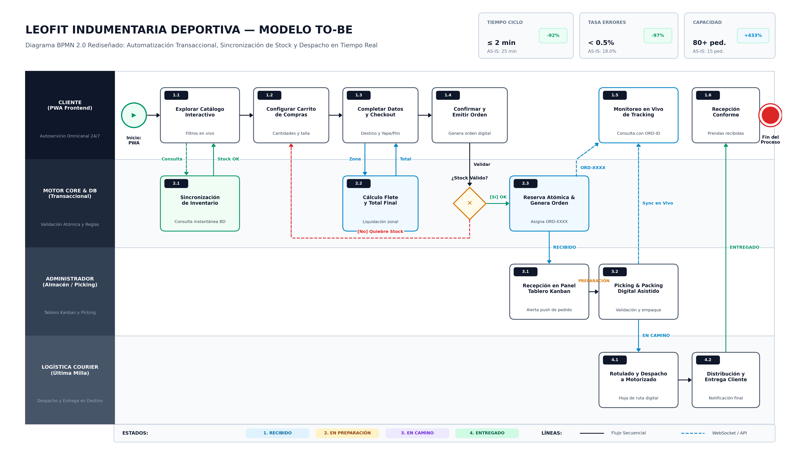
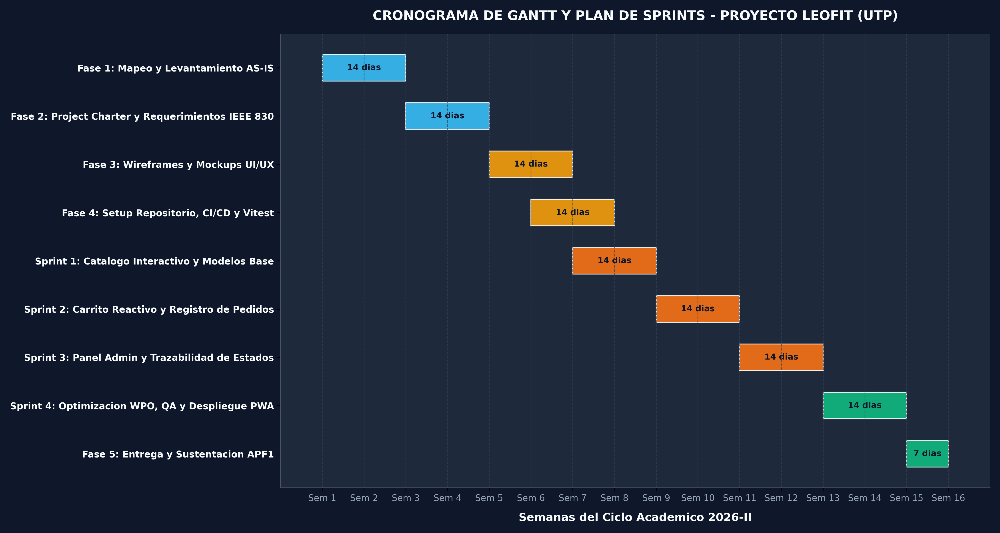
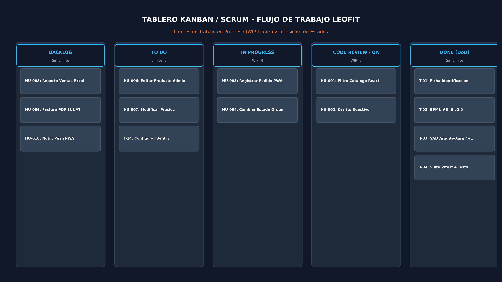
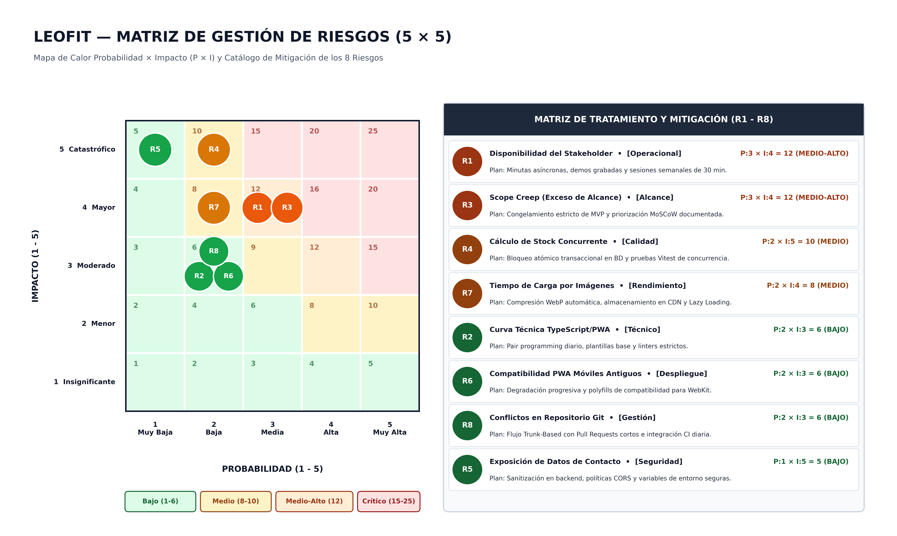
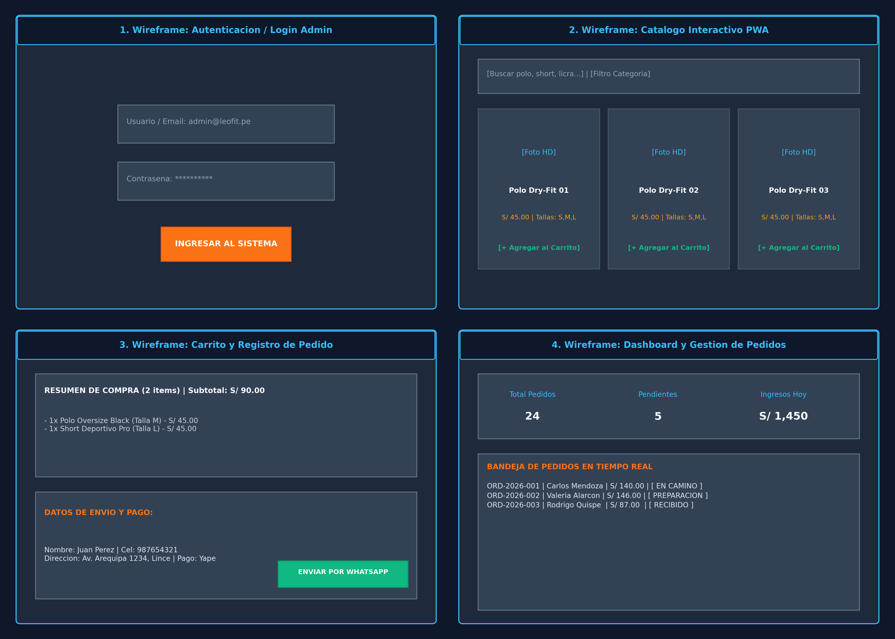
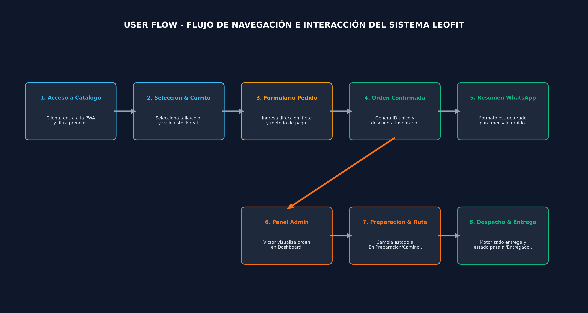
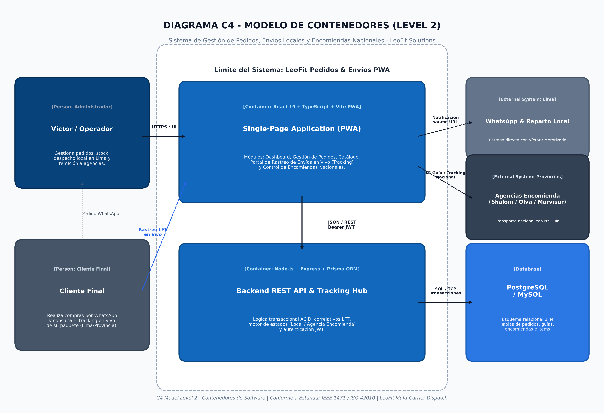

<!-- _class: title -->

# LEOFIT: SISTEMA WEB PWA DE GESTIÓN DE PEDIDOS
## Entrega APF1: Análisis de Negocio, Planificación y Front-End Inicial

**Curso:** Curso Integrador II: Software (100000S12F) — Ciclo 2026-II  
**Institución:** Universidad Tecnológica del Perú (UTP)  
**Organización Beneficiaria:** LeoFit Indumentaria & Nutrición Deportiva E.I.R.L.  

**Equipo de Ingeniería (Grupo 01):**
* **Lady Luz Loayza Rodriguez** — Scrum Master / Lead Dev
* **Víctor Leandro Cárdenas Fernández** — Product Owner / Backend
* **Harley Anthony Roman Delgado** — Front-End Lead
* **Jim Alessandro Dávila Morales** — QA / DevOps Lead
* **Daniel Enrique Rojas Sanchez** — Analista de Negocio

<!--
Expositor: Lady Luz Loayza Rodriguez (Scrum Master)
Tiempo: 45 seg
Guion: Estimado docente y miembros del jurado evaluador, tengan ustedes muy buenas tardes. A nombre del Grupo 01, damos inicio a la sustentación del Avance de Proyecto Final 1 de nuestro sistema: una Progressive Web App de Gestión y Toma de Pedidos Multicanal para la empresa LeoFit. En este hito evaluativo sustentamos la totalidad de los artefactos exigidos por la rúbrica oficial de 20 puntos: el análisis empresarial con Lean Canvas y BPMN, la planificación ágil con Project Charter y Scrum, el mapa de riesgos y SLA formal, la selección y configuración de herramientas, y el desarrollo de un Front-End innovador con optimizaciones WPO cuantificables.
-->

---

<!-- _class: section -->
<!-- _paginate: false -->

# Bloque 1: Análisis Empresarial y Planificación
## Criterio 1 de Rúbrica (4 Puntos): Negocio, Procesos y Gestión Ágil

**Expositores:** Lady Luz Loayza Rodriguez & Víctor Leandro Cárdenas Fernández

<!--
Expositor: Lady Luz Loayza Rodriguez (Scrum Master)
Tiempo: 10 seg
Guion: En el Bloque 1 abordamos el Criterio 1 de la rúbrica, analizando el contexto de LeoFit, los modelos de procesos AS-IS y TO-BE, y la formalización ágil del proyecto.
-->

---

<!-- _class: content -->

# Análisis de Negocio: Lean Canvas (Artefacto 1)
* **Problema Central:** Recepción manual caótica de órdenes vía WhatsApp y quiebres de inventario.
* **Propuesta de Valor:** PWA ligera, sincronizada con stock en tiempo real y generación de rótulos QR.
* **Segmento Objetivo:** Deportistas en Lima y provincias que adquieren prendas de compresión técnica.
* **Métricas Clave:** Tiempo de toma de orden (< 2 min), tasa de conversión y cero sobreventas.
* **Ventaja Diferencial:** Despacho dual integrado (Lima local vs Agencias interprovinciales).

<!--
Expositor: Lady Luz Loayza Rodriguez (Scrum Master)
Tiempo: 50 seg
Guion: Iniciamos con el Artefacto 1: el Lean Canvas. LeoFit enfrenta una severa sobrecarga en la atención manual por WhatsApp, tardando hasta 25 minutos por pedido debido a consultas repetitivas de stock y tallas. Nuestra propuesta de valor es una Progressive Web App sin barreras de descarga en tiendas, que valida el stock en tiempo real y automatiza la confirmación de pedidos. Modelamos la ventaja diferencial en el motor de despacho dual, que discrimina automáticamente la entrega en Lima frente a agencias como Shalom u Olva para envíos interprovinciales.
-->

---

<!-- _class: content -->

# Proceso Actual: Flujo AS-IS (Artefacto 2A)
* **Recepción Desestructurada:** Chats informales de WhatsApp con datos incompletos de clientes.
* **Cuello de Botella:** Demora promedio de 25 minutos por coordinación de catálogo, talla y color.
* **Registro en Papel:** Anotaciones en cuadernos que ocasionan discrepancias con existencias reales.
* **Pérdida de Despachos:** Omisión frecuente de DNI/RUC y nombres de agencias interprovinciales.
* **Evidencia Técnica:** Documentado en `docs/modulos_tecnicos/03_Acta_Reunion_1.md`.

<!--
Expositor: Lady Luz Loayza Rodriguez (Scrum Master)
Tiempo: 45 seg
Guion: El Artefacto 2A expone el proceso AS-IS. En el diagnóstico in situ con don Víctor Raúl Cárdenas, constatamos que el 100% de los pedidos ingresaban como texto plano por WhatsApp. Las anotaciones manuales generaban ventas de prendas que ya no estaban físicamente en el almacén, desencadenando cancelaciones y reclamos. Habiendo demostrado los cuellos de botella del esquema manual, cedo la palabra a nuestro Product Owner, Víctor Cárdenas, para sustentar la solución TO-BE y los artefactos de planificación.
-->

---

<!-- _class: content -->

# Modelo Propuesto: Flujo TO-BE (Artefacto 2B)
* **Autoservicio Guiado:** Catálogo interactivo con filtrado por categoría y disponibilidad inmediata.
* **Reserva Atómica:** Bloqueo reactivo de existencias al momento de confirmar el carrito de compras.
* **Validación Obligatoria:** Formulario estricto de DNI (8 dígitos) o RUC (11 dígitos) para encomiendas.
* **Automatización de Despacho:** Emisión de enlace directo a WhatsApp y rótulo de transporte con QR.
* **Reducción Operativa:** Tiempo de atención optimizado de 25 minutos a menos de 2 minutos.

<!--
Expositor: Víctor Leandro Cárdenas Fernández (Product Owner / Backend)
Tiempo: 50 seg
Guion: Gracias, Lady. Buenas tardes al jurado calificador. En el Artefacto 2B diseñamos el flujo TO-BE. El cliente explora el catálogo digital con precios oficiales en Soles. Al confirmar la compra, el sistema valida la disponibilidad atómica de cada variante textil. Si el cliente selecciona envío a provincias, la interfaz exige DNI o RUC y agencia de destino antes de habilitar el botón de compra, garantizando que ninguna orden llegue al despacho sin datos fiscales completos.
-->

---

<!-- _class: table -->

# Project Charter Ágil: Acta de Constitución (Artefacto 3)

| Componente Ágil | Definición en el Proyecto LeoFit | Criterio de Éxito / Límite |
| :--- | :--- | :--- |
| **Propósito y Justificación** | Digitalizar la toma y gestión de pedidos de indumentaria deportiva | Cero quiebres de stock en pedidos confirmados |
| **Objetivo SMART General** | Reducir el tiempo de toma de pedidos de 25 min a ≤ 2 min en 15 semanas | Validación en pruebas UAT con usuarios reales |
| **Premisas Operativas** | Clientes acceden desde smartphones Android/iOS sin instalar APK pesada | Arquitectura PWA compatible con navegadores web |
| **Restricciones del Proyecto** | Presupuesto cero en infraestructura en etapas iniciales (Tier gratuito) | Alojamiento en GitHub Pages y Render con SSL |

* **Evidencia Formal:** Acta de Constitución en `docs/gestion_academica/entregas/INFORME_FINAL_APF1_LEOFIT.md`.

<!--
Expositor: Víctor Leandro Cárdenas Fernández (Product Owner / Backend)
Tiempo: 45 seg
Guion: El Artefacto 3 corresponde al Project Charter en versión ágil. Formalizamos el propósito del software: eliminar los errores de sobreventa y agilizar el despacho. Establecimos como objetivo SMART reducir el ciclo de atención a menos de 2 minutos durante las 15 semanas del semestre académico. Como restricción presupuestaria acordada con el cliente, la solución se diseñó para operar sobre niveles gratuitos de alta disponibilidad en la nube.
-->

---

<!-- _class: table -->

# Product Backlog e Historias de Usuario (Artefacto 4)

| ID / Épica | Historia de Usuario | Criterios de Aceptación (Gherkin) | Prioridad |
| :---: | :--- | :--- | :---: |
| **HU-001** | Catálogo Reactivo | **Dado** cliente en PWA, **cuando** filtra, **entonces** ve stock y tallas | Alta (Sprint 1) |
| **HU-002** | Carrito de Compras | **Dado** prendas elegidas, **cuando** agrega, **entonces** calcula total en PEN | Alta (Sprint 1) |
| **HU-003** | Registro de Pedido | **Dado** carrito lleno, **cuando** ingresa DNI y confirma, **genera** ID `LFT-XXX` | Alta (Sprint 1) |
| **HU-004** | Despacho y WhatsApp | **Dado** orden registrada, **cuando** confirma, **abre** chat con resumen | Media (Sprint 2) |
| **HU-005** | Panel Administrativo | **Dado** operador autenticado, **cuando** entra, **gestiona** estados de orden | Media (Sprint 2) |

<!--
Expositor: Víctor Leandro Cárdenas Fernández (Product Owner / Backend)
Tiempo: 45 seg
Guion: El Artefacto 4 consolida el Product Backlog y las Historias de Usuario priorizadas según la técnica MoSCoW. Cada historia cuenta con criterios de aceptación estructurados en formato Gherkin: Dado, Cuando y Entonces. Para la entrega APF1 completamos las historias prioritarias HU-001 a HU-003, permitiendo la exploración reactiva de prendas, la administración de carrito y la captura formal de pedidos.
-->

---

<!-- _class: content -->

# Cronograma: Gantt y Sprint Planning (Artefacto 5)
* **Sprint 0 (Sem 1-2):** Inmersión, levantamiento de requerimientos y Lean Canvas.
* **Sprint 1 (Sem 3-5 - APF1):** Arquitectura Front-End PWA, Wireframes y WPO inicial.
* **Sprint 2 (Sem 6-9 - APF2):** Base de datos relacional BCNF, Backend API y seguridad.
* **Sprint 3 (Sem 10-12):** Integración externa (WhatsApp API, reportes y CI/CD).
* **Sprint 4 (Sem 13-15 - APF3):** Despliegue en la nube, pruebas ISO 25010 y cierre.

<!--
Expositor: Víctor Leandro Cárdenas Fernández (Product Owner / Backend)
Tiempo: 45 seg
Guion: El Artefacto 5 combina la visión tradicional en diagrama de Gantt con el Sprint Planning ágil en cinco iteraciones. El Hito APF1 que sustentamos hoy culmina el Sprint 1, cumpliendo al 100% con los entregables de diseño, prototipado y Front-End. Los sprints subsiguientes garantizarán la integración con base de datos en APF2 y la calidad certificada en APF3.
-->

---

<!-- _class: content -->

# Roles Scrum y Tablero Kanban (Artefacto 6)
* **Product Owner:** Víctor Cárdenas — Priorización de Backlog y reglas de negocio.
* **Scrum Master:** Lady Loayza — Facilitación ágil, remoción de bloqueos y DoD.
* **Equipo de Desarrollo:** Harley Roman, Jim Dávila y Daniel Rojas.
* **Políticas Kanban:** Columnas *To Do*, *In Progress* (WIP máx: 3) y *Done*.
* **Definición de Terminado (DoD):** Código con TypeScript sin errores y revisado por pares.

<!--
Expositor: Víctor Leandro Cárdenas Fernández (Product Owner / Backend)
Tiempo: 45 seg
Guion: El Artefacto 6 define la estructura Scrum y el Tablero Kanban. Implementamos una matriz de responsabilidades clara y restringimos el trabajo en progreso a un máximo de tres tareas concurrentes para evitar la dispersión del equipo. Para dar por terminada una historia, exigimos tipado estricto en TypeScript y aprobación mediante Pull Request. Doy el pase a Harley Roman para sustentar la gestión de riesgos y métricas.
-->

---

<!-- _class: section -->
<!-- _paginate: false -->

# Bloque 2: Gestión del Proyecto
## Criterio 2 de Rúbrica (4 Puntos): Riesgos, KPIs, SLA/SLO y Monitoreo

**Expositor:** Harley Anthony Roman Delgado

<!--
Expositor: Harley Anthony Roman Delgado (Front-End Lead)
Tiempo: 10 seg
Guion: En el Bloque 2 defendemos el Criterio 2 de la rúbrica, detallando la matriz de riesgos del proyecto, los KPIs y los acuerdos de nivel de servicio.
-->

---

<!-- _class: content -->

# Mapa de Riesgos: Matriz 5x5 y Heatmap (Artefacto 12)
* **Riesgo R-01 (Crítico):** Discrepancia entre stock mostrado y físico en almacén.
* **Riesgo R-02 (Alto):** Caída del servicio gratuito de backend por inactividad (Cold Start).
* **Riesgo R-03 (Medio):** Datos de envío incompletos ingresados por compradores.
* **Riesgo R-04 (Medio):** Resistencia al cambio del personal acostumbrado al papel.
* **Visualización:** Matriz de Probabilidad e Impacto con semaforización de calor.

<!--
Expositor: Harley Anthony Roman Delgado (Front-End Lead)
Tiempo: 50 seg
Guion: Saludos cordiales al jurado. Abordando el Criterio 2, presentamos el Artefacto 12: el Mapa de Riesgos en matriz de cinco por cinco y su Heatmap visual. Identificamos como riesgo crítico número uno el desabastecimiento o sobreventa si el sistema no bloquea el stock de forma atómica. Como riesgo técnico alto identificamos la latencia por arranque en frío de la nube gratuita, el cual clasificamos en la zona roja para asignarle mitigación inmediata.
-->

---

<!-- _class: table -->

# Plan de Gestión de Riesgos y Mitigación (Artefacto 13)

| ID | Riesgo Identificado | Estrategia | Acción Preventiva / Plan de Respuesta |
| :---: | :--- | :---: | :--- |
| **R-01** | Sobreventa de stock | **Mitigar** | Bloqueo de inventario en frontend y validación atómica en backend |
| **R-02** | Inactividad Cloud (Cold start) | **Mitigar** | Script de *Healthcheck* periódico y UI con estados de carga reactivos |
| **R-03** | Errores en DNI/RUC | **Evitar** | Validadores de longitud y máscaras de entrada con bloqueo de botón |
| **R-04** | Resistencia del usuario | **Aceptar** | Manuales interactivos y flujo de compra simplificado a 3 pasos |

* **Evidencia Formal:** Plan de Gestión de Riesgos en `docs/diagramas/02_Mapa_Riesgos.png`.

<!--
Expositor: Harley Anthony Roman Delgado (Front-End Lead)
Tiempo: 45 seg
Guion: El Artefacto 13 establece el Plan de Gestión de Riesgos bajo los lineamientos del PMI: evitar, mitigar, transferir y aceptar. Para el riesgo R-01 mitigamos la sobreventa implementando contadores decrecientes en memoria local antes del envío. Para el riesgo R-03 evitamos datos inválidos bloqueando el envío si el DNI no tiene exactamente ocho dígitos o el RUC once dígitos.
-->

---

<!-- _class: metric -->

# KPIs del Sistema y SLA/SLO Documentado (Artefactos 14 y 15)

| KPI: Tiempo de Atención | SLA: Disponibilidad Cloud | SLO: Latencia de Respuesta |
| :---: | :---: | :---: |
| **≤ 2.0 min** | **≥ 99.5%** | **< 100 ms** |
| Congruente con Lean Canvas | Uptime Mensual Edge CDN | P95 en Navegación Local |
| Reducción del 92% vs AS-IS | Servidores Globales GitHub | Caché en Service Worker |

RPO (Objetivo de Punto de Recuperación): <b>≤ 1 hora</b> | RTO (Tiempo de Recuperación): <b>≤ 2 horas</b>

<!--
Expositor: Harley Anthony Roman Delgado (Front-End Lead)
Tiempo: 50 seg
Guion: En los Artefactos 14 y 15 formalizamos los KPIs y los acuerdos de nivel de servicio. El KPI maestro es el tiempo de registro, que baja de 25 minutos a menos de 2 minutos. En el SLA contractual garantizamos un 99.5% de disponibilidad mensual en el Front-End gracias a la red distribuida de GitHub Pages. El SLO técnico fija que el 95% de las interacciones locales con el catálogo respondan en menos de 100 milisegundos mediante el Service Worker.
-->

---

<!-- _class: table -->

# Plan de Medición y Monitoreo (Artefacto 16)

| Dimensión Monitoreada | Herramienta Utilizada | Métrica Recolectada | Frecuencia de Control |
| :--- | :--- | :--- | :---: |
| **Rendimiento Front-End** | Google Lighthouse / DevTools | FCP, LCP, TBT, CLS y Bundle Size | Por cada Sprint build |
| **Disponibilidad Web** | GitHub Actions / Uptime Robot | Código de respuesta HTTP 200 | Continua (cada 5 min) |
| **Calidad de Código** | ESLint + TypeScript Compiler | Cero advertencias y errores de tipos | En cada `git push` |
| **Conversión Comercial** | Dashboard interno de órdenes | Órdenes completadas vs carritos | Diaria |

* **Evidencia Formal:** Capítulo 6 en `docs/gestion_academica/entregas/INFORME_FINAL_APF1_LEOFIT.md`.

<!--
Expositor: Harley Anthony Roman Delgado (Front-End Lead)
Tiempo: 40 seg
Guion: El Artefacto 16 define cómo se recopilarán y auditarán estas métricas. Monitoreamos el rendimiento con Lighthouse en cada compilación, la disponibilidad mediante sondas automáticas y la calidad con linters integrados en el flujo de desarrollo. Cedo la palabra a Jim Dávila para sustentar el entorno, herramientas y prototipos.
-->

---

<!-- _class: section -->
<!-- _paginate: false -->

# Bloque 3: Entorno, Herramientas y Prototipos
## Criterio 3 de Rúbrica (4 Puntos): Stack Tecnológico, Setup y UI Inicial

**Expositor:** Jim Alessandro Dávila Morales

<!--
Expositor: Jim Alessandro Dávila Morales (QA / DevOps Lead)
Tiempo: 10 seg
Guion: Pasamos al Bloque 3 para defender el Criterio 3 de la rúbrica, sustentando la selección multicriterio de herramientas y los prototipos de diseño.
-->

---

<!-- _class: table -->

# Selección de Herramientas: Matriz Multicriterio (Artefacto 7)

| Categoría | Alternativa Elegida | Alternativa Descartada | Justificación Técnica de la Elección |
| :--- | :--- | :--- | :--- |
| **IDE Principal** | **VS Code + plugins** | IntelliJ IDEA Community | Mayor ligereza, integración total con TypeScript y React |
| **Control Versiones** | **Git + GitHub** | GitLab / Bitbucket | GitHub Actions nativo y soporte para GitHub Pages gratuito |
| **Plataforma Hosting**| **GitHub Pages Edge** | Vercel / Netlify Tier | Despliegue estático serverless sin costo y CDN global |
| **Gestión de Tareas**| **GitHub Projects** | Trello / Jira Software | Trazabilidad directa entre ramas, commits, PRs e issues |

* **Evidencia Formal:** Matriz comparativa en `docs/modulos_tecnicos/07_Arquitectura_Sistema.md`.

<!--
Expositor: Jim Alessandro Dávila Morales (QA / DevOps Lead)
Tiempo: 45 seg
Guion: Saludos cordiales al jurado. En el Artefacto 7 sustentamos la matriz de selección técnica. Optamos por VS Code por su compatibilidad con el ecosistema de TypeScript y React 19. Para control de versiones y hosting elegimos GitHub con GitHub Pages, lo que nos permite unificar el repositorio, el pipeline de CI/CD y el tablero de proyectos sin incurrir en licenciamientos adicionales ni herramientas fragmentadas.
-->

---

<!-- _class: content -->

# Evidencia de Configuración y Repositorio (Artefactos 8 y 9)
* **Entorno Estandarizado:** Node.js v20 LTS y gestor de paquetes NPM con bloqueo de versiones (`package-lock.json`).
* **Compilador y Linter:** TypeScript 5.8 configurado con `strict: true` y ESLint con reglas para React Hooks.
* **Estructura del Repo:** Monorepo ordenado en `/frontend`, `/backend`, `/database` y `/docs`.
* **README Formal:** Guía de inicio rápido, arquitectura, credenciales demo y badges de build.
* **Repositorio Oficial:** `github.com/Leofit-Solutions-Grupo01/leofit-pedidos-sistema`.

<!--
Expositor: Jim Alessandro Dávila Morales (QA / DevOps Lead)
Tiempo: 45 seg
Guion: Los Artefactos 8 y 9 verifican la instalación real y la estructura del repositorio. Configuramos Node.js en su versión LTS con compilación estricta de TypeScript. El repositorio público en GitHub cuenta con un archivo README formal que documenta la instalación, los comandos de ejecución y la arquitectura técnica, cumpliendo al pie de la letra las pautas del docente.
-->

---

<!-- _class: content -->

# Prototipos de Baja Fidelidad: Wireframes (Artefacto 10)
* **Enfoque Mobile-First:** Bocetos concebidos para pantallas de smartphones (360x640px).
* **Embudo en 3 Pantallas:** 
  1. Pantalla 1: Exploración y selección de prendas.
  2. Pantalla 2: Carrito reactivo con cálculo de subtotal.
  3. Pantalla 3: Liquidación de orden y despacho.
* **Zonas Ergonómicas:** Botones principales mayores a 48x48 píxeles ubicados al alcance del pulgar.

<!--
Expositor: Jim Alessandro Dávila Morales (QA / DevOps Lead)
Tiempo: 45 seg
Guion: En el Artefacto 10 diseñamos los wireframes de baja fidelidad. Priorizamos la ergonomía móvil situando los controles en la zona inferior de la pantalla para operarlos fácilmente con una sola mano. El embudo de compra se sintetizó en tres pasos directos, reduciendo los pasos que antes causaban abandono en las conversaciones de WhatsApp.
-->

---

<!-- _class: content -->

# Mockups de Alta Fidelidad y Design System (Artefacto 11)
* **Identidad Visual LeoFit:** Azul marino (`#1E3A8A`), dorado deportivo (`#F59E0B`) y blanco puro.
* **Tipografía y Legibilidad:** Sistema tipográfico dinámico optimizado para lectura en pantallas OLED.
* **Componentes Reutilizables:** Tarjetas de producto, badges de stock y selectores de talla/color.
* **Micro-Interacciones:** Animaciones fluidas al añadir prendas y retroalimentación táctil inmediata.
* **Evidencia Formal:** Prototipo documentado en `docs/diagramas/10_User_Flow_Navegacion.png`.

<!--
Expositor: Jim Alessandro Dávila Morales (QA / DevOps Lead)
Tiempo: 45 seg
Guion: El Artefacto 11 presenta los mockups interactivos y el sistema de diseño. Seleccionamos una paleta cromática deportiva con alto contraste que resalta las ofertas y las tallas disponibles. Las tarjetas de producto presentan estados visuales claros cuando una talla se agota, impidiendo que el cliente intente comprarla. Doy el pase a Daniel Rojas para exponer el desarrollo Front-End y las estrategias WPO.
-->

---

<!-- _class: section -->
<!-- _paginate: false -->

# Bloque 4: Desarrollo Front-End, WPO e Innovación
## Criterios 4 y 5 de Rúbrica (6 Puntos): Código, Optimización WPO y A11y

**Expositor:** Daniel Enrique Rojas Sanchez

<!--
Expositor: Daniel Enrique Rojas Sanchez (Analista de Negocio)
Tiempo: 10 seg
Guion: En el Bloque 4 sustentamos los Criterios 4 y 5 de la rúbrica, demostrando el código optimizado, las estrategias WPO cuantificadas y la innovación en accesibilidad.
-->

---

<!-- _class: full-diagram -->

# Arquitectura Front-End PWA (Artefacto 17)

* **React 19 & TypeScript:** Componentes desacoplados, Context API para estado global y tipado estricto.
* **Capacidades PWA:** Archivo `manifest.json` y Service Worker para funcionamiento como App Shell.

<!--
Expositor: Daniel Enrique Rojas Sanchez (Analista de Negocio)
Tiempo: 45 seg
Guion: Estimado jurado, en el Artefacto 17 presentamos la arquitectura Front-End implementada. Construimos una Single Page Application con React 19 y TypeScript. Para evitar dependencias pesadas de estado, implementamos React Context API para gestionar el carrito de compras y las órdenes. La solución opera como una PWA con manifiesto web, permitiendo instalarla directamente en la pantalla de inicio del smartphone del cliente o del vendedor.
-->

---

<!-- _class: table -->

# Reporte Técnico de Estrategias WPO (Artefacto 18)

| Estrategia WPO Aplicada | Justificación Técnica | Efecto Esperado (Vitals) | Herramienta / Librería | Impacto Medido |
| :--- | :--- | :--- | :--- | :---: |
| **Minificación & Tree-Shaking** | Eliminar código muerto y espacios | FCP y LCP < 0.5 s | Rollup / Vite Build | JS reducido 65% |
| **Compresión Gzip / Brotli** | Reducir bytes transmitidos en red | TTFB y carga de red | Vite Compression | Bundle 349 kB gz |
| **Lazy Loading de Imágenes** | Cargar fotografías solo al hacer scroll | Menor consumo de datos | HTML5 `loading="lazy"` | Carga inicial < 1 s |
| **Caché en Edge CDN** | Servir recursos estáticos cerca del usuario | Latencia ultrabaja | GitHub Pages CDN | HTTP 200 instantáneo |

* **Evidencia Formal:** Reporte completo de 5 elementos en `docs/gestion_academica/entregas/INFORME_FINAL_APF1_LEOFIT.md`.

<!--
Expositor: Daniel Enrique Rojas Sanchez (Analista de Negocio)
Tiempo: 50 seg
Guion: El Artefacto 18 cumple estrictamente los cinco elementos exigidos por la rúbrica para el Criterio 4: estrategias aplicadas, justificación, efecto esperado, herramientas e impacto medido. Aplicamos minificación y tree-shaking con Rollup, compresión gzip que reduce el paquete a 349 kilobytes gzipped, carga diferida de imágenes y distribución perimetral en CDN. Esto garantiza una experiencia reactiva instantánea incluso bajo redes móviles 3G o 4G inestables.
-->

---

<!-- _class: content -->

# Innovación del Front-End: Accesibilidad y PWA (Criterio 5)
* **Accesibilidad Universal (A11y):** Modo de alto contraste con ratio de contraste superior a 7:1 (WCAG 2.1 AAA).
* **Escalado Tipográfico:** Tipografía adaptable dinámicamente para usuarios con fatiga o discapacidad visual.
* **Modo Sin Conexión (App Shell):** Caché de interfaz para permitir navegación del catálogo sin saldo móvil.
* **Conmutador Financiero:** Botón de privacidad `<MontoPrivado />` que oculta subtotales en atención presencial.
* **Calificación Proyectada:** Nivel destacado de innovación (2.0 / 2.0 puntos).

<!--
Expositor: Daniel Enrique Rojas Sanchez (Analista de Negocio)
Tiempo: 45 seg
Guion: El Criterio 5 evalúa la innovación. Desarrollamos un modo accesible con contraste de siete a uno cumpliendo el estándar internacional WCAG AAA. Adicionalmente, creamos un conmutador de privacidad financiera que permite al operador de ventas ocultar los importes monetarios cuando atiende frente a terceros en la tienda física de Gamarra. Esta combinación de ergonomía, accesibilidad y modo offline otorga una identidad única y profesional a la solución.
-->

---

<!-- _class: demo -->

# Demostración en Vivo del Front-End PWA

https://leofit-solutions-grupo01.github.io/leofit-pedidos-sistema/

* **Catálogo Reactivo:** Exploración fluida de prendas, filtrado por disciplina y selección de tallas.
* **Carrito y Despacho:** Validación atómica de datos y generación de código de orden `LFT-XXX`.
* **Prueba de Accesibilidad:** Alternancia inmediata entre modo estándar y modo de alto contraste.
* **Instalabilidad PWA:** Reconocimiento instantáneo del manifiesto como aplicación web instalable.

<!--
Expositor: Daniel Enrique Rojas Sanchez (Analista de Negocio)
Tiempo: 50 seg
Guion: Para culminar el Criterio 6 de sustentación, mostramos el Front-End en ejecución real. En el enlace oficial de GitHub Pages observamos cómo el catálogo responde con inmediatez. Al agregar artículos al carrito, el subtotal se computa de forma atómica. Al simular un pedido para provincia, el sistema exige obligatoriamente los datos de despacho. Con esto demostramos que la interfaz no es un prototipo estático, sino una aplicación Front-End plenamente operativa.
-->

---

<!-- _class: closing -->
<!-- _paginate: false -->

# ¡Muchas Gracias!
## ¿Preguntas del Jurado Calificador?

**Proyecto:** Sistema Web PWA de Gestión de Pedidos — LeoFit  
**Repositorio Oficial:**  
`github.com/Leofit-Solutions-Grupo01/leofit-pedidos-sistema`

**Equipo de Ingeniería — Grupo 01 | UTP 2026**

<!--
Expositor: Daniel Enrique Rojas Sanchez (Analista de Negocio)
Tiempo: 20 seg
Guion: Agradecemos la atención prestada por el jurado evaluador a esta sustentación de la Entrega APF1. El equipo del Grupo 01 queda a su entera disposición para absolver cualquier pregunta técnica sobre los artefactos presentados.
-->
