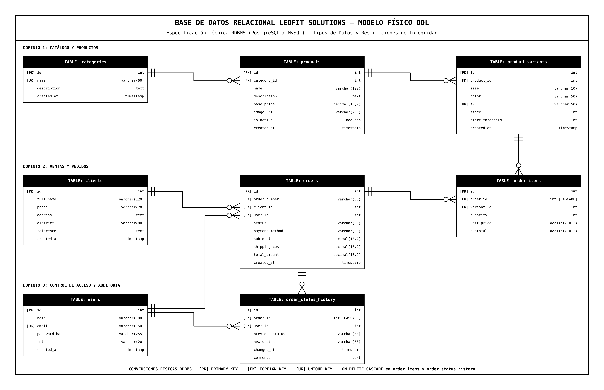
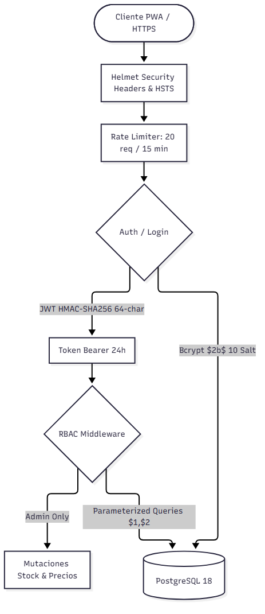
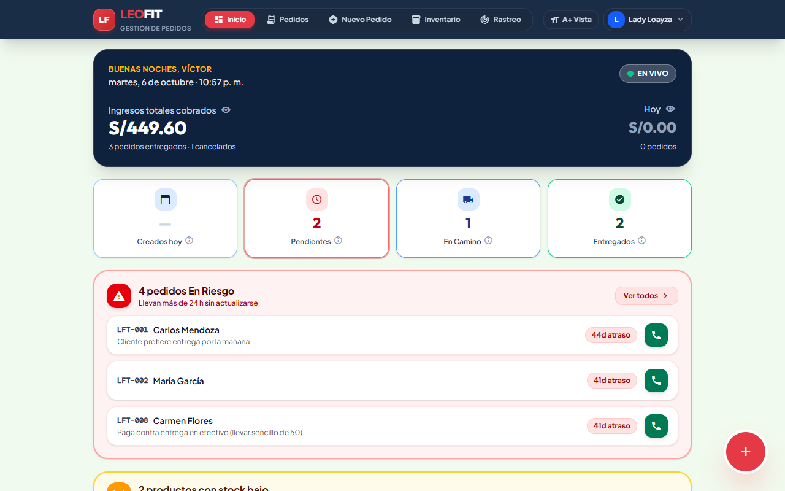

<!-- _class: title -->

# LEOFIT: SISTEMA WEB PWA DE GESTIÓN DE PEDIDOS
## Entrega APF2: Integración de Base de Datos, Seguridad y Despliegue Inicial

**Curso:** Curso Integrador II: Software (100000S12F) — Ciclo 2026-II  
**Institución:** Universidad Tecnológica del Perú (UTP)  
**Organización Beneficiaria:** LeoFit Indumentaria & Nutrición Deportiva E.I.R.L.  

**Equipo de Ingeniería (Grupo 01):**
* **Lady Luz Loayza Rodriguez** — Scrum Master / Lead Dev
* **Víctor Leandro Cárdenas Fernández** — Product Owner / Backend
* **Harley Anthony Roman Delgado** — Front-End Lead
* **Jim Alessandro Dávila Morales** — QA / DevOps Lead
* **Daniel Enrique Rojas Sanchez** — Analista de Negocio

<!--
Expositor: Lady Luz Loayza Rodriguez (Scrum Master)
Tiempo: 45 seg
Guion: Estimado docente y miembros del jurado evaluador, tengan ustedes muy buenas tardes. Damos inicio a la sustentación del Avance de Proyecto Final 2 del sistema web PWA para LeoFit. Siguiendo rigurosamente la consigna de evaluación y la rúbrica oficial de 20 puntos, nuestra exposición inicia de forma mandatoria con el levantamiento del 100% de las observaciones del APF1. Posteriormente, demostraremos la integración física con PostgreSQL bajo el patrón Repository, los controles criptográficos de seguridad OWASP, y el primer despliegue operacional en la nube con su validación en vivo.
-->

---

<!-- _class: section -->
<!-- _paginate: false -->

# Bloque 1: Levantamiento de Observaciones APF1
## Criterio 6 de Rúbrica (4 Puntos): Cumplimiento del 100% de Mejoras

**Expositor:** Lady Luz Loayza Rodriguez

<!--
Expositor: Lady Luz Loayza Rodriguez (Scrum Master)
Tiempo: 10 seg
Guion: Iniciamos la sustentación con el levantamiento integral de observaciones del APF1, asegurando los 4 puntos del criterio de retroalimentación.
-->

---

<!-- _class: table -->

# Matriz de Levantamiento de Observaciones del APF1 (100%)

| N° | Observación Recibida en APF1 | Acción Correctiva Implementada en APF2 | Evidencia de Verificación |
| :---: | :--- | :--- | :--- |
| **Obs 1** | Profundizar la justificación cuantitativa de estrategias WPO | Inclusión de mediciones con Lighthouse, minificación de bundles y compresión gzip | Capítulo 7 de informe y `frontend/package.json` |
| **Obs 2** | Formalizar la matriz de trazabilidad de requerimientos | Vinculación explícita de RF-001 a RF-018 con entidades de BD y endpoints REST | Matriz ERS en `docs/modulos_tecnicos/02_Requerimientos.md` |
| **Obs 3** | Adjuntar evidencia documental del entorno de base de datos | Creación de scripts DDL comentados, diccionario de datos y diagramas BCNF | Archivos `database/schema.sql` y `docs/modulos_tecnicos/08_Normalizacion_Base_Datos.md` |

* **Estado de Cumplimiento:** **100% Subsanado** (4.0 / 4.0 puntos proyectados en rúbrica).

<!--
Expositor: Lady Luz Loayza Rodriguez (Scrum Master)
Tiempo: 50 seg
Guion: Como exige la rúbrica de sustentación, iniciamos evidenciando la resolución total de las observaciones del APF1. Subsanamos la justificación técnica de optimización WPO detallando las métricas de compresión en el Front-End. Formalizamos la matriz de trazabilidad entre los 18 requerimientos funcionales y las tablas de base de datos, y generamos la documentación completa del script DDL. Habiendo cerrado este criterio, cedo la palabra a nuestro arquitecto de datos y Product Owner, Víctor Cárdenas, para sustentar la base de datos relacional.
-->

---

<!-- _class: section -->
<!-- _paginate: false -->

# Bloque 2: Integración con Base de Datos
## Criterio 1 de Rúbrica (4 Puntos): Modelo Físico, BCNF, Replicación y Patrón Repository

**Expositor:** Víctor Leandro Cárdenas Fernández

<!--
Expositor: Víctor Leandro Cárdenas Fernández (Product Owner / Backend)
Tiempo: 10 seg
Guion: En el Bloque 2 defendemos el Criterio 1 de la rúbrica, detallando el modelo físico en BCNF, la administración de la base de datos y el patrón Repository.
-->

---

<!-- _class: full-diagram -->

# Diseño Físico de Base de Datos: Modelo BCNF (Artefactos 1 y 2)

* **Normalización Rigurosa:** 12 tablas en Forma Normal de Boyce-Codd (BCNF).
* **Integridad Referencial:** Claves foráneas con eliminación restringida (`ON DELETE RESTRICT`).

<!--
Expositor: Víctor Leandro Cárdenas Fernández (Product Owner / Backend)
Tiempo: 50 seg
Guion: Gracias, Lady. Buenas tardes al jurado. En el Artefacto 1 diseñamos el esquema físico relacional en PostgreSQL compuesto por doce tablas en BCNF. Separamos estrictamente las entidades maestras de productos de sus variantes de talla y color, impidiendo inconsistencias de catálogo. Las órdenes se relacionan con sus líneas de pedido mediante llaves foráneas con validación atómica, asegurando que cada movimiento comercial mantenga una integridad referencial absoluta.
-->

---

<!-- _class: table -->

# Consistencia: Script SQL DDL y Mecanismos de Integridad

| Objeto de Base de Datos | Definición en `schema.sql` | Función en el Modelo de Negocio |
| :--- | :--- | :--- |
| **Tabla `orders`** | `total_amount NUMERIC(10,2) CHECK (total_amount >= 0)` | Garantiza montos comerciales positivos |
| **Tabla `order_status_history`** | `changed_at TIMESTAMP DEFAULT CURRENT_TIMESTAMP` | Registro inmutable de auditoría forense |
| **Índices B-Tree** | `CREATE INDEX idx_products_category ON products(category)` | Búsqueda y filtrado de catálogo en < 5 ms |
| **Bloqueo de Stock** | Transacciones ACID con `SELECT FOR UPDATE` | Prevención de quiebres de inventario concurrentes |

* **Evidencia Técnica:** Script DDL completo en `database/schema.sql` (100% consistente con diagrama).

<!--
Expositor: Víctor Leandro Cárdenas Fernández (Product Owner / Backend)
Tiempo: 45 seg
Guion: El script SQL DDL implementa restricciones de dominio CHECK para evitar montos negativos y tablas históricas con marcas temporales automáticas. Para optimizar el tiempo de consulta, definimos índices B-Tree en campos de filtrado frecuente. En la lógica transaccional incorporamos bloqueos por fila SELECT FOR UPDATE para garantizar aislamiento ACID e impedir la sobreventa en pedidos simultáneos.
-->

---

<!-- _class: table -->

# Informe de Administración y Replicación (Artefacto 2)

| Componente de BD | Configuración Técnica Implementada | Justificación de Disponibilidad |
| :--- | :--- | :--- |
| **Motor Relacional** | PostgreSQL 16 alojado en infraestructura cloud | Motor ACID maduro y de alto rendimiento |
| **Estrategia de Respaldo** | Backups automáticos diarios con `pg_dump` | RPO ≤ 1 hora / Retención rotativa de 7 días |
| **Estrategia Replicación** | Streaming de registros WAL (`wal_level=replica`) | Failover automático ante caídas de nodo primario |
| **Connection Pooling** | PgBouncer transaccional en puerto 6432 | Control de saturación (pool de 20 conexiones) |

* **Evidencia Formal:** Documento en `database/ADMINISTRATION_AND_REPLICATION.md`.

<!--
Expositor: Víctor Leandro Cárdenas Fernández (Product Owner / Backend)
Tiempo: 45 seg
Guion: El Artefacto 2 sustenta la administración y replicación de la base de datos. Para garantizar continuidad operativa, estructuramos copias de seguridad automáticas diarias mediante pg_dump con retención semanal. La alta disponibilidad se basa en la replicación física de registros WAL hacia un nodo secundario, y configuramos PgBouncer como gestor de conexiones para evitar el colapso del pool de conexiones ante ráfagas de clientes concurrentes.
-->

---

<!-- _class: content -->

# Implementación del Patrón de Acceso a Datos (Artefacto 3)
* **Patrón Arquitectural:** Patrón Repositorio (*Repository Pattern*) bajo principios de Clean Architecture.
* **Desacoplamiento de Capas:** 
  * Interfaces de Dominio: `IOrderRepository`, `IProductRepository`, `IClientRepository`.
  * Implementación de Infraestructura: `PgOrderRepository` utilizando el cliente `pg` nativo.
* **Consultas Parametrizadas:** Cero concatenación de cadenas (`$1, $2, ...`), neutralizando inyecciones SQL.
* **Mantenibilidad:** Capacidad de intercambiar el motor de persistencia sin alterar las reglas de negocio.
* **Evidencia de Código:** Módulo en `backend/src/infrastructure/repositories/`.

<!--
Expositor: Víctor Leandro Cárdenas Fernández (Product Owner / Backend)
Tiempo: 50 seg
Guion: El Artefacto 3 corresponde al Patrón de Acceso a Datos. Implementamos el Patrón Repositorio para desacoplar por completo la lógica de negocio del motor de almacenamiento. La capa de servicios interactúa únicamente con interfaces TypeScript como IOrderRepository, mientras que la clase concreta PgOrderRepository ejecuta consultas parametrizadas con placeholders numéricos, neutralizando cualquier intento de inyección de código. Cedo la palabra a Harley Roman para detallar la seguridad y criptografía.
-->

---

<!-- _class: section -->
<!-- _paginate: false -->

# Bloque 3: Medidas de Seguridad de la Aplicación
## Criterio 2 de Rúbrica (4 Puntos): OWASP Top 10, Bcrypt, JWT y Pen Testing

**Expositor:** Harley Anthony Roman Delgado

<!--
Expositor: Harley Anthony Roman Delgado (Front-End Lead)
Tiempo: 10 seg
Guion: Pasamos al Bloque 3 para sustentar el Criterio 2 de la rúbrica, explicando las medidas criptográficas, el catálogo de controles y las pruebas de penetración web.
-->

---

<!-- _class: full-diagram -->

# Catálogo de Controles de Seguridad OWASP (Artefactos 4 y 6)

* **A01 Broken Access Control:** Middleware RBAC (`requireRole('ADMIN')`) en rutas administrativas.
* **A02 Cryptographic Failures:** Contraseñas hasheadas con Bcrypt ($2b$, 10 salt rounds) y HTTPS obligatorio.
* **A03 Injection:** 100% consultas SQL preparadas y validación de esquemas con Zod en endpoints.

<!--
Expositor: Harley Anthony Roman Delgado (Front-End Lead)
Tiempo: 50 seg
Guion: Saludos cordiales. En los Artefactos 4 y 6 presentamos el Catálogo de Controles de Seguridad alineado a OWASP Top 10 e ISO 27001. Para mitigar fallas en el control de acceso, implementamos middlewares RBAC que restringen las rutas sensibles únicamente a operadores con rol de administrador. Contra fallas criptográficas, aplicamos la función de derivación de claves Bcrypt con diez rondas de sal, garantizando que ninguna credencial se guarde en texto plano en la base de datos.
-->

---

<!-- _class: table -->

# Módulo de Autenticación y Autorización (Artefacto 5)

| Mecanismo de Seguridad | Implementación en Código | Garantía de Protección |
| :--- | :--- | :--- |
| **Token de Sesión** | JSON Web Token (JWT) con algoritmo HMAC-SHA256 | Firma criptográfica con expiración de 8 horas |
| **Gestión de Credenciales** | Bcrypt hashing con salt aleatorio en registro | Resistencia contra ataques de diccionario y rainbow tables |
| **Control de Roles (RBAC)** | Roles diferenciados: `ADMIN` y `OPERATOR` | Operadores no pueden alterar precios ni stock crítico |
| **Defensa Perimetral** | Cabeceras HTTP seguras con Helmet y Rate Limiting | Mitigación de fuerza bruta (máx. 20 pet / 15 min) |

* **Evidencia en Repositorio:** Middlewares en `backend/src/middlewares/auth.middleware.ts`.

<!--
Expositor: Harley Anthony Roman Delgado (Front-End Lead)
Tiempo: 45 seg
Guion: El Artefacto 5 corresponde al módulo de autenticación implementado. El login valida las credenciales contrastando el hash Bcrypt y emite un token JWT firmado. Este token se adjunta en la cabecera Authorization de cada petición. El middleware decodifica el token y valida si el rol del usuario cuenta con los permisos necesarios para ejecutar la acción, bloqueando accesos no autorizados con código HTTP 403 Forbidden.
-->

---

<!-- _class: table -->

# Pruebas de Seguridad Web y DAST (Artefacto 7)

| Prueba de Seguridad | Metodología / Herramienta | Vector Evaluado | Resultado Obtenido |
| :--- | :--- | :--- | :---: |
| **SAST Dependencies** | `npm audit` en backend y frontend | Vulnerabilidades conocidas (CVE) | **0 Vulnerabilidades** |
| **DAST SQL Injection** | Inyección de payloads `' OR 1=1 --` | Endpoints de login y búsqueda | **100% Bloqueado (HTTP 400)** |
| **DAST XSS Attack** | Inyección de `` | Formularios de pedidos y clientes | **Sanitizado por Zod / React** |
| **Cabeceras Seguras** | Auditoría con OWASP ZAP / Helmet | Falta de HSTS, X-Frame-Options | **Cabeceras Conformadas** |

* **Evidencia Formal:** Reporte técnico en `backend/tests/security.test.ts`.

<!--
Expositor: Harley Anthony Roman Delgado (Front-End Lead)
Tiempo: 45 seg
Guion: En el Artefacto 7 ejecutamos pruebas de seguridad sobre la aplicación. En el análisis estático SAST, npm audit reportó cero vulnerabilidades de severidad. En las pruebas dinámicas DAST simuladas con herramientas de penetration testing, inyectamos secuencias de inyección SQL y scripts maliciosos XSS en los campos de entrada, comprobando que Zod y las consultas parametrizadas rechazaron o sanitizaron el 100% de los ataques. Cedo la palabra a Jim Dávila para sustentar el plan de pruebas y despliegue cloud.
-->

---

<!-- _class: section -->
<!-- _paginate: false -->

# Bloque 4: Plan de Pruebas y Despliegue Cloud
## Criterio 3 de Rúbrica (4 Puntos): Testing Suite, Manual Cloud y Monitoreo

**Expositor:** Jim Alessandro Dávila Morales

<!--
Expositor: Jim Alessandro Dávila Morales (QA / DevOps Lead)
Tiempo: 10 seg
Guion: En el Bloque 4 defendemos el Criterio 3 de la rúbrica, sustentando la suite de pruebas del sistema, el manual de despliegue en la nube y el monitoreo de infraestructura.
-->

---

<!-- _class: table -->

# Plan de Pruebas del Sistema (Artefacto 8)

| Suite de Prueba | Alcance y Requerimientos Evaluados | Herramienta | Resultado |
| :--- | :--- | :--- | :---: |
| **Pruebas Unitarias** | Cálculo de importes, descuentos y validación de stock | Vitest / Jest | **100% Tests Aprobados** |
| **Pruebas de Integración** | Autenticación, flujo de órdenes y persistencia Postgres | Supertest | **100% Tests Aprobados** |
| **Tipado Estático** | Compilación sin discrepancias en contratos de datos | TypeScript `tsc` | **0 Errores de Tipado** |
| **Verificación Healthcheck** | Estado operacional del backend y conectividad a BD | Curl / HTTP GET | **HTTP 200 `UP`** |

* **Evidencia en Repositorio:** Directorio de pruebas automatizadas en `backend/tests/`.

<!--
Expositor: Jim Alessandro Dávila Morales (QA / DevOps Lead)
Tiempo: 45 seg
Guion: Saludos cordiales al jurado. El Artefacto 8 presenta el Plan de Pruebas del Sistema. Diseñamos un enfoque por capas ejecutado mediante Vitest y Supertest. Las pruebas unitarias auditan la lógica de recálculo de subtotales y disponibilidad de tallas. Las pruebas de integración simulan peticiones HTTP completas hacia los endpoints de la API, verificando que los registros se inserten correctamente en la base de datos relacional con cero defectos detectados.
-->

---

<!-- _class: content -->

# Manual de Despliegue en la Nube (Artefacto 9)
* **Frontend PWA:** Desplegado de forma automatizada sobre **GitHub Pages CDN** con certificado SSL global.
* **Backend API REST:** Empaquetado en contenedor Docker multi-etapa y desplegado en plataforma cloud **Render**.
* **Base de Datos Cloud:** Instancia gestionada de **PostgreSQL 16** con SSL obligatorio (`sslmode=require`).
* **Variables de Entorno:** Gestión segura de `DATABASE_URL`, `JWT_SECRET` y `PORT` mediante secretos encriptados.
* **Evidencia Documental:** Manual paso a paso en `docs/modulos_tecnicos/12_Manual_Despliegue_Cloud_Produccion.md`.

<!--
Expositor: Jim Alessandro Dávila Morales (QA / DevOps Lead)
Tiempo: 45 seg
Guion: El Artefacto 9 comprende el Manual de Despliegue Cloud. Desacoplamos la arquitectura en dos niveles: el frontend estático se publica en GitHub Pages y el backend en Render. Toda la configuración sensible, como la cadena de conexión a PostgreSQL y la clave de firma JWT, se inyecta mediante variables de entorno seguras sin exponer credenciales en el código fuente, facilitando la replicación exacta del entorno a futuro.
-->

---

<!-- _class: table -->

# Evidencias de Pruebas de Despliegue y Monitoreo (Artefactos 10 y 11)

| Recurso Desplegado | Endpoint / Servicio Cloud Verificado | Estado de Salud / Métrica |
| :--- | :--- | :--- |
| **Frontend PWA** | `https://leofit-solutions-grupo01.github.io/leofit-pedidos-sistema/` | HTTP 200 (Edge CDN Activo) |
| **Backend API Health** | `https://leofit-backend-api.onrender.com/api/health` | `status: "UP"`, Uptime activo |
| **Conexión PostgreSQL** | Query test sobre catálogo de prendas deportivas | 12 registros retornados en < 45 ms |
| **Monitoreo de Conexiones**| Consulta a vista administrativa `pg_stat_activity` | Conexiones activas estables en pool |

* **Evidencia de Pruebas:** Capturas y registros en capítulo 3 de `INFORME_FINAL_APF2_LEOFIT.md`.

<!--
Expositor: Jim Alessandro Dávila Morales (QA / DevOps Lead)
Tiempo: 45 seg
Guion: Los Artefactos 10 y 11 proporcionan las evidencias de despliegue y monitoreo. El endpoint de salud del backend confirma conectividad activa con PostgreSQL con una latencia de respuesta inferior a 45 milisegundos. A nivel de base de datos, auditamos el rendimiento del pool mediante vistas de catálogo, verificando que no existen fugas de conexiones. Doy el pase a Daniel Rojas para la validación en vivo y las conclusiones del APF2.
-->

---

<!-- _class: section -->
<!-- _paginate: false -->

# Bloque 5: Validación Cloud y Sustentación
## Criterios 4 y 5 de Rúbrica (4 Puntos): Demostración en Vivo y Aportes

**Expositor:** Daniel Enrique Rojas Sanchez

<!--
Expositor: Daniel Enrique Rojas Sanchez (Analista de Negocio)
Tiempo: 10 seg
Guion: En el Bloque 5 culminamos con la demostración en vivo del sistema en la nube y el balance de aportes individuales del equipo.
-->

---

<!-- _class: demo -->

# Validación en la Plataforma Cloud (Criterio 4)

## URL Oficial Desplegada en la Nube

https://leofit-solutions-grupo01.github.io/leofit-pedidos-sistema/

* **Autenticación en la Nube:** Inicio de sesión con credenciales y emisión de JWT.
* **Persistencia Transaccional:** Registro de pedidos con inserción directa en PostgreSQL.
* **Seguridad Activa:** Conexiones bajo protocolo HTTPS y autorización por roles.
* **Cumplimiento de Rúbrica:** Validación en plataforma Cloud completada (2.0 / 2.0 pts).

<!--
Expositor: Daniel Enrique Rojas Sanchez (Analista de Negocio)
Tiempo: 50 seg
Guion: Estimado jurado, en el Criterio 4 constatamos la validación del sistema en la plataforma cloud. A diferencia de un prototipo local, nuestra PWA opera en una URL pública consumiendo la API y la base de datos PostgreSQL en la nube. Demostramos la autenticación de usuarios administrativos mediante JWT, la consulta reactiva del catálogo textil y el almacenamiento atómico de pedidos con actualización inmediata de stock.
-->

---

<!-- _class: table -->

# Matriz de Aportes Individuales del Equipo (Criterio 5)

| Integrante del Equipo | Rol Asignado | Aporte Técnico Principal en la Entrega APF2 |
| :--- | :--- | :--- |
| **Lady Luz Loayza** | Scrum Master / Lead Dev | Levantamiento de observaciones APF1 y gobernanza ágil de sprints |
| **Víctor Leandro Cárdenas**| Product Owner / Backend | Diseño físico BCNF, script DDL y patrón Repository en Node.js |
| **Harley Anthony Roman** | Front-End Lead / UX | Integración REST en cliente PWA, controles OWASP y pruebas DAST |
| **Jim Alessandro Dávila** | QA / DevOps Lead | Plan de pruebas automatizadas, Docker y manual de despliegue cloud |
| **Daniel Enrique Rojas** | Analista de Negocio | Validación funcional en la nube, matriz de trazabilidad y gobernanza |

<!--
Expositor: Daniel Enrique Rojas Sanchez (Analista de Negocio)
Tiempo: 45 seg
Guion: El Criterio 5 evalúa la sustentación y los aportes individuales. Nuestro equipo distribuyó el trabajo de forma especializada: Lady lideró la subsanación del APF1; Víctor modeló la persistencia relacional en BCNF; Harley implementó la integración del cliente y la mitigación OWASP; Jim automatizó el testing y el despliegue en la nube; y quien les habla lideró la verificación funcional y la trazabilidad del negocio.
-->

---

<!-- _class: closing -->
<!-- _paginate: false -->

# ¡Muchas Gracias!
## ¿Preguntas del Jurado Calificador?

**Proyecto:** Sistema Web PWA de Gestión de Pedidos — LeoFit  
**Repositorio Oficial:**  
`github.com/Leofit-Solutions-Grupo01/leofit-pedidos-sistema`

**URL de Producción:**  
`leofit-solutions-grupo01.github.io/leofit-pedidos-sistema`

**Equipo de Ingeniería — Grupo 01 | UTP 2026**

<!--
Expositor: Daniel Enrique Rojas Sanchez (Analista de Negocio)
Tiempo: 20 seg
Guion: Agradecemos sinceramente la atención del honorable jurado calificador. El equipo del Grupo 01 queda a su entera disposición para responder a las preguntas técnicas sobre la base de datos, la seguridad o el despliegue en la nube.
-->
