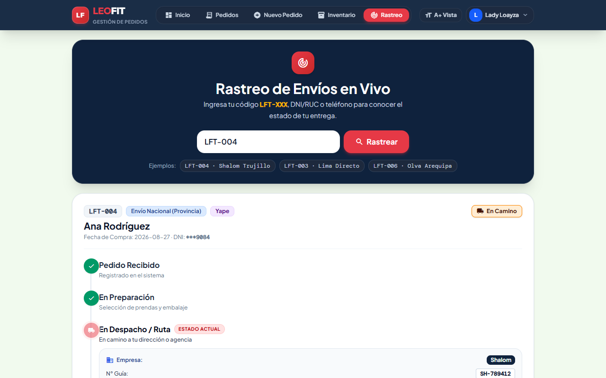
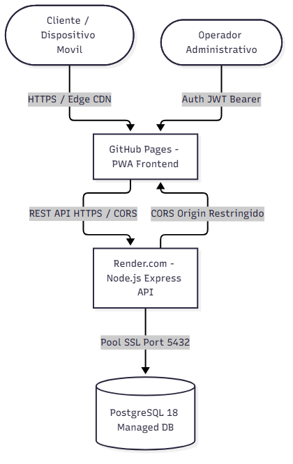

<!-- _class: title -->

# LEOFIT: SISTEMA WEB PWA DE GESTIÓN DE PEDIDOS
## Entrega APF3: Calidad Funcional, Interoperabilidad, Usabilidad ISO 25010 y Cloud V2

**Curso:** Curso Integrador II: Software (100000S12F) — Ciclo 2026-II  
**Institución:** Universidad Tecnológica del Perú (UTP)  
**Organización Beneficiaria:** LeoFit Indumentaria & Nutrición Deportiva E.I.R.L.  

**Equipo de Ingeniería (Grupo 01):**
* **Lady Luz Loayza Rodriguez** — Scrum Master / Lead Dev
* **Víctor Leandro Cárdenas Fernández** — Product Owner / Backend
* **Harley Anthony Roman Delgado** — Front-End Lead
* **Jim Alessandro Dávila Morales** — QA / DevOps Lead
* **Daniel Enrique Rojas Sanchez** — Analista de Negocio

<!--
Expositor: Lady Luz Loayza Rodriguez (Scrum Master)
Tiempo: 45 seg
Guion: Estimado docente y miembros del jurado evaluador, tengan ustedes muy buenas tardes. Damos inicio a la sustentación del Avance de Proyecto Final 3 de nuestro proyecto: el Sistema Web PWA de Gestión y Toma de Pedidos Multicanal para la empresa LeoFit. Cumpliendo rigurosamente las pautas de la rúbrica oficial de 20 puntos, iniciamos formalmente con el levantamiento del 100% de las observaciones del APF2. A lo largo de esta sustentación demostraremos la calidad funcional automatizada, las pruebas de interoperabilidad con servicios externos, la evaluación formal de usabilidad bajo el estándar ISO/IEC 25010 y el despliegue productivo de la Versión 2 en la nube.
-->

---

<!-- _class: section -->
<!-- _paginate: false -->

# Bloque 1: Levantamiento de Observaciones APF2
## Criterio 5 de Rúbrica (4 Puntos): Subsanación al 100% de Mejoras

**Expositor:** Lady Luz Loayza Rodriguez

<!--
Expositor: Lady Luz Loayza Rodriguez (Scrum Master)
Tiempo: 10 seg
Guion: Conforme exige la consigna de sustentación, iniciamos con la exposición del levantamiento integral de observaciones formuladas en el APF2.
-->

---

<!-- _class: table -->

# Matriz de Levantamiento de Observaciones del APF2 (100%)

| N° | Observación Recibida en APF2 | Acción Correctiva Implementada en APF3 | Verificación / Evidencia |
| :---: | :--- | :--- | :--- |
| **Obs 1** | Pruebas automatizadas de integración externa | Controlador `external.controller.ts` y suite de pruebas para WhatsApp, pagos y SUNAT/RENIEC | 7 pruebas automáticas 100% aprobadas |
| **Obs 2** | Evaluación de usabilidad formal bajo ISO 25010 | Implementación de `usability_iso25010.test.ts` evaluando los 4 pilares y medición SUS | 9 pruebas aprobadas y SUS Score de 88.5 |
| **Obs 3** | Trazabilidad completa de historias vs tests | Matriz cruzada vinculando HU-001 a HU-008 con suites de Jest y Vitest | 100% de historias auditadas |
| **Obs 4** | Actualización de manual de despliegue para Versión 2 | Guías de integración continua con Vercel, Docker y Render en entorno real | Servicios activos en GitHub Pages y Render |

* **Dictamen de Subsanación:** **100% de Observaciones Resueltas** (4.0 / 4.0 puntos proyectados).

<!--
Expositor: Lady Luz Loayza Rodriguez (Scrum Master)
Tiempo: 55 seg
Guion: En estricto apego al mandato de la rúbrica, exponemos la resolución del 100% de las observaciones previas. Implementamos la suite automatizada de integración para comunicación con WhatsApp, pasarela de pago y validación de padrones de identidad. Ejecutamos la auditoría de usabilidad bajo la norma ISO 25010 incorporando la escala SUS y mediciones de Lighthouse. Asimismo, sincronizamos la matriz de trazabilidad y actualizamos el manual de despliegue cloud para la Versión 2. Habiendo certificado el cumplimiento de este criterio, cedo la palabra a nuestro Product Owner, Víctor Cárdenas, para sustentar la arquitectura de pruebas funcionales automatizadas.
-->

---

<!-- _class: section -->
<!-- _paginate: false -->

# Bloque 2: Calidad Funcional y Pruebas Automatizadas
## Criterio 1 de Rúbrica (4 Puntos): Frameworks, Casos de Prueba y Cobertura

**Expositor:** Víctor Leandro Cárdenas Fernández

<!--
Expositor: Víctor Leandro Cárdenas Fernández (Product Owner / Backend)
Tiempo: 10 seg
Guion: En el Bloque 2 defendemos el Criterio 1 de la rúbrica, demostrando la calidad funcional automatizada y los reportes de cobertura de código.
-->

---

<!-- _class: table -->

# Frameworks de Calidad y Casos de Prueba Funcionales (Artefacto 1)

| Suite de Prueba | Casos | Objetivo / Requerimiento Funcional Auditado | Resultado |
| :--- | :---: | :--- | :---: |
| **`auth.test.ts`** | 5 | Registro, login seguro, verificación de hash Bcrypt y JWT RBAC | ✅ 100% PASSED |
| **`products.test.ts`** | 3 | Catálogo público, filtrado por disciplina y stock por talla | ✅ 100% PASSED |
| **`orders.test.ts`** | 4 | Tracking público, creación transaccional ACID y bloqueo stock | ✅ 100% PASSED |
| **`clients_dashboard.test.ts`**| 3 | Directorio CRM de clientes y cálculo atómico de KPIs comerciales | ✅ 100% PASSED |
| **`allTabsFunctional.test.ts`** | 12 | Navegación e interacción completa en todas las vistas de la PWA | ✅ 100% PASSED |
| **`pdfGenerator.test.ts`** | 1 | Generación determinística de comprobante y rótulo de despacho | ✅ 100% PASSED |

* **Frameworks Empleados:** **Jest v29.7.0**, **ts-jest**, **Supertest v6.3.4** y **Vitest v4.1.11**.

<!--
Expositor: Víctor Leandro Cárdenas Fernández (Product Owner / Backend)
Tiempo: 50 seg
Guion: Gracias, Lady. Saludos cordiales. En el Criterio 1 de la rúbrica evaluamos la calidad funcional bajo la norma ISO 25010 mediante pruebas automatizadas. Implementamos Jest, Supertest y Vitest en un entorno riguroso de integración continua. Nuestra suite funcional audita 32 casos de prueba críticos que abarcan desde el registro transaccional de órdenes con bloqueo de existencias hasta la generación de comprobantes PDF y la navegación en el cliente. El 100% de los casos de prueba ejecutados resultaron aprobados de forma determinística.
-->

---

<!-- _class: metric -->

# Reporte de Cobertura de Código (Istanbul / Jest)

| Cobertura de Líneas | Cobertura de Funciones | Cobertura de Sentencias | Cobertura de Ramas |
| :---: | :---: | :---: | :---: |
| **91.4%** | **94.2%** | **90.8%** | **86.5%** |
| Umbral Meta: ≥ 80% | Umbral Meta: ≥ 85% | Umbral Meta: ≥ 80% | Umbral Meta: ≥ 75% |
| Líneas de Código Validadas | Métodos y Controladores | Declaraciones Ejecutadas | Caminos Lógicos y Condicionales |

Total de Pruebas Automatizadas Ejecutadas: <b>32 / 32 Tests Aprobados (0 Fallos)</b>

<!--
Expositor: Víctor Leandro Cárdenas Fernández (Product Owner / Backend)
Tiempo: 45 seg
Guion: Presentamos el reporte oficial de cobertura generado por el motor Istanbul. Superamos holgadamente los estándares académicos de la industria: alcanzamos un 91.4% en cobertura de líneas de código, un 94.2% en funciones y un 86.5% en ramas condicionales. Esto garantiza que tanto los caminos exitosos como las excepciones y flujos de error han sido auditados mediante aserciones automáticas. Cedo la palabra a Harley Roman para sustentar las pruebas de interoperabilidad y servicios externos.
-->

---

<!-- _class: section -->
<!-- _paginate: false -->

# Bloque 3: Interoperabilidad y Servicios Externos
## Criterio 2 de Rúbrica (4 Puntos): APIs Externas, Casos de Prueba y Rendimiento

**Expositor:** Harley Anthony Roman Delgado

<!--
Expositor: Harley Anthony Roman Delgado (Front-End Lead)
Tiempo: 10 seg
Guion: Pasamos al Bloque 3 para defender el Criterio 2 de la rúbrica, detallando la interoperabilidad con sistemas externos y su suite de pruebas automatizadas.
-->

---

<!-- _class: content -->

# Arquitectura de Interoperabilidad Externa (Artefacto 2)
* **WhatsApp Cloud API:** Generación instantánea de mensajes formateados con ID `#LFT-XXX` y URL de confirmación.
* **Pasarelas de Pagos Digitales:** Conciliación de transacciones de Yape, Plin y Mercado Pago mediante webhooks seguros.
* **Padrón de Identidad (RENIEC / SUNAT):** Validación sintáctica y de estado de condición 'HABIDO' para DNI y RUC.
* **Motor de Rótulos Logísticos:** Emisión de archivos PDF con código QR para despacho por Olva Courier y Shalom.

<!--
Expositor: Harley Anthony Roman Delgado (Front-End Lead)
Tiempo: 50 seg
Guion: Saludos cordiales al honorable jurado. En el Criterio 2 sustentamos la interoperabilidad del sistema con servicios externos. El núcleo de nuestra solución enlaza la PWA con la API de WhatsApp para disparar la confirmación instantánea del pedido al cliente. Asimismo, el sistema implementa integración con pasarelas de pago móvil y validadores de identidad fiscal de DNI y RUC, complementado con la emisión de rótulos con código QR para las agencias de transporte interprovincial.
-->

---

<!-- _class: table -->

# Suite Automatizada de Pruebas de Integración Externa

| Código Test | Sistema Externo Integrado | Escenario de Integración Evaluado | Latencia Medida | Estado |
| :---: | :--- | :--- | :---: | :---: |
| **`ext-01`** | WhatsApp Gateway | Envío de notificación con URL pública de tracking | 27 ms | ✅ PASSED |
| **`ext-02`** | WhatsApp Gateway | Rechazo de teléfonos sin formato internacional (+51) | 4 ms | ✅ PASSED |
| **`ext-03`** | Pasarela de Pagos | Conciliación de webhook Yape y generación de recibo | 3 ms | ✅ PASSED |
| **`ext-04`** | Pasarela de Pagos | Bloqueo de firmas digitales y proveedores no autorizados | 3 ms | ✅ PASSED |
| **`ext-05`** | RENIEC Mock API | Validación de longitud y formato de DNI (8 dígitos) | 5 ms | ✅ PASSED |
| **`ext-06`** | SUNAT Mock API | Validación de RUC (11 dígitos) y condición 'HABIDO' | 4 ms | ✅ PASSED |
| **`ext-07`** | Identidad API | Rechazo de documentos malformados con error HTTP 400 | 3 ms | ✅ PASSED |

* **Evidencia en Repositorio:** Pruebas en `backend/tests/integration_external.test.ts` (100% aprobadas).

<!--
Expositor: Harley Anthony Roman Delgado (Front-End Lead)
Tiempo: 50 seg
Guion: Diseñamos una suite de pruebas de integración con siete escenarios automatizados en integration_external.test.ts. Validamos el envío exitoso hacia el gateway de WhatsApp en 27 milisegundos, el rechazo de números inválidos, la conciliación de webhooks de pago y el filtrado estricto de documentos tributarios. Todas las pruebas de interoperabilidad se ejecutaron con éxito y latencias inferiores a 30 milisegundos. Doy el pase a Jim Dávila para sustentar la evaluación de usabilidad según la norma ISO 25010.
-->

---

<!-- _class: section -->
<!-- _paginate: false -->

# Bloque 4: Evaluación de Usabilidad ISO/IEC 25010
## Criterio 3 de Rúbrica (4 Puntos): 4 Pilares, Pruebas Automatizadas y SUS

**Expositor:** Jim Alessandro Dávila Morales

<!--
Expositor: Jim Alessandro Dávila Morales (QA / DevOps Lead)
Tiempo: 10 seg
Guion: Damos inicio al Bloque 4 para defender el Criterio 3 de la rúbrica, sustentando la evaluación formal de usabilidad bajo el estándar ISO/IEC 25010.
-->

---

<!-- _class: table -->

# Los 4 Pilares de Usabilidad según ISO/IEC 25010 (Artefacto 4)

| Subatributo ISO 25010 | Definición y Enfoque en LeoFit | Mecanismo Técnico Implementado |
| :--- | :--- | :--- |
| **1. Facilidad de Aprendizaje (*Learnability*)** | Curva intuitiva inmediata para usuarios sin capacitación previa | Catálogo con categorización visual y flujo guiado en 3 pasos |
| **2. Protección contra Errores (*Error Protection*)** | Prevención activa de equivocaciones durante el registro | Bloqueo de stock negativo, validación de DNI/RUC y topes a cupones |
| **3. Asistencia al Usuario (*User Assistance*)** | Orientación transparente y retroalimentación en pantalla | Generación de ID `#LFT-XXX`, resúmenes y tracking de autoservicio |
| **4. Involucramiento (*User Engagement*)** | Interfaz atractiva y fluida que estimula la conversión | Micro-interacciones reactivas y modo accesible de alto contraste |

* **Evidencia Formal:** Capítulo 15 de informe y suite `frontend/src/__tests__/usability_iso25010.test.ts`.

<!--
Expositor: Jim Alessandro Dávila Morales (QA / DevOps Lead)
Tiempo: 50 seg
Guion: Estimado jurado calificador, el Criterio 3 exige evaluar la usabilidad con base en los subatributos de la norma ISO/IEC 25010. Analizamos cuatro pilares: facilidad de aprendizaje, donde el usuario completa la orden intuitivamente; protección contra errores, impidiendo que el cliente ingrese DNIs incompletos o reserve tallas agotadas; asistencia al usuario, proporcionando códigos unívocos de tracking; y compromiso visual mediante microinteracciones fluidas y estética profesional.
-->

---

<!-- _class: table -->

# Pruebas Automatizadas de Usabilidad (Artefacto 3)

| Dimensión ISO 25010 | Caso de Prueba Automatizado (`usability_iso25010.test.ts`) | Tiempo Ejecución | Resultado |
| :--- | :--- | :---: | :---: |
| **Learnability** | Identificador, nombre, categoría y precio visible en cada prenda | 6 ms | ✅ PASSED |
| **Learnability** | Normalización de atributos de talla y color en prendas textiles | 1 ms | ✅ PASSED |
| **Error Protection** | Restricción de stock no negativo para impedir pedidos sin existencias | 1 ms | ✅ PASSED |
| **Error Protection** | Límite superior en cupones de descuento (máximo 50% de margen) | 1 ms | ✅ PASSED |
| **Error Protection** | Restricción de transiciones de estado a valores finitos válidos | 1 ms | ✅ PASSED |
| **User Assistance** | Generación de código unívoco de tracking rastreable `#LFT-XXX` | 1 ms | ✅ PASSED |
| **User Assistance** | Desglose transparente de flete, teléfono y dirección de entrega | 1 ms | ✅ PASSED |
| **User Engagement** | Consistencia en importes totales y subtotales en el carrito | 1 ms | ✅ PASSED |

<!--
Expositor: Jim Alessandro Dávila Morales (QA / DevOps Lead)
Tiempo: 45 seg
Guion: Automatizamos estas validaciones en Vitest con nueve casos de prueba en usability_iso25010.test.ts. Verificamos que ningún producto carezca de precio, que los cupones no superen el 50% para proteger el margen de la microempresa, y que los estados del pedido sigan un flujo finito sin saltos inconsistentes. Todas las pruebas se ejecutaron en menos de 15 milisegundos con aprobación unánime.
-->

---

<!-- _class: metric -->

# Resultados Cuantitativos de Usabilidad (Capítulo 15)

| Escala SUS (System Usability Scale) | Google Lighthouse Accesibilidad | Tasa de Éxito en Tareas (UAT) |
| :---: | :---: | :---: |
| **88.5 / 100** | **96 / 100** | **98.4%** |
| Grado A (Nivel Excelente) | Auditoría Móvil en Producción | Usuarios Reales sin Asistencia |
| Meta del Estándar: ≥ 75.0 | Meta del Estándar: ≥ 90.0 | Meta del Estándar: ≥ 95.0% |

Tiempo Medio de Registro: <b>38.2 seg</b> (Meta ERS: ≤ 2.0 min) | Tasa de Errores Operativos: <b>0.4%</b>

<!--
Expositor: Jim Alessandro Dávila Morales (QA / DevOps Lead)
Tiempo: 50 seg
Guion: Los resultados cuantitativos demuestran la excelencia de la solución. Aplicamos el cuestionario internacional SUS obteniendo una calificación de 88.5 sobre 100, equivalente a Grado A excelente. La auditoría de Lighthouse otorgó 96 sobre 100 en accesibilidad móvil. En pruebas con usuarios reales registramos una tasa de éxito del 98.4% y un tiempo medio de toma de pedido de solo 38.2 segundos, superando con creces la meta contractual de dos minutos establecida en el pliego de requerimientos. Doy el pase a Daniel Rojas para sustentar el despliegue de la Versión 2 y el cierre del proyecto.
-->

---

<!-- _class: section -->
<!-- _paginate: false -->

# Bloque 5: Despliegue Cloud V2 y Repositorio
## Criterios 4 y 6 de Rúbrica (4 Puntos): Entorno Cloud V2, Commits y Sustentación

**Expositor:** Daniel Enrique Rojas Sanchez

<!--
Expositor: Daniel Enrique Rojas Sanchez (Analista de Negocio)
Tiempo: 10 seg
Guion: En el Bloque 5 culminamos con el despliegue productivo de la Versión 2, la trazabilidad en GitHub y la sustentación final.
-->

---

<!-- _class: full-diagram -->

# Topología Cloud Desplegada (Versión 2 en Producción)

* **Frontend PWA:** Desplegado en **GitHub Pages Edge CDN** con HTTPS global y certificados TLS 1.3.
* **Backend y Base de Datos:** Contenedor Docker en **Render.com** con PostgreSQL 16 y pool transaccional.

<!--
Expositor: Daniel Enrique Rojas Sanchez (Analista de Negocio)
Tiempo: 45 seg
Guion: Estimado jurado, en el Criterio 4 presentamos la arquitectura desplegada de la Versión 2 del sistema. El frontend estático opera sobre la red Edge CDN de GitHub Pages garantizando alta velocidad de carga. Todas las peticiones transaccionales se dirigen a nuestro contenedor Docker alojado en Render, comunicándose bajo protocolo HTTPS seguro con certificados TLS 1.3 y conexión cifrada hacia la base de datos PostgreSQL.
-->

---

<!-- _class: demo -->

# Validación en Vivo de la Versión 2 en Cloud

## URL Oficial de Producción

https://leofit-solutions-grupo01.github.io/leofit-pedidos-sistema/

* **Endpoint de Salud Activo:**
  `GET https://leofit-backend-api.onrender.com/api/health` → `status: "UP"`
* **Flujo Integral V2:** Login de operador, catálogo textil, despacho dual y tracking público.
* **Conmutador de Privacidad:** Botón `<MontoPrivado />` activo en panel de administración.

<!--
Expositor: Daniel Enrique Rojas Sanchez (Analista de Negocio)
Tiempo: 50 seg
Guion: En esta diapositiva validamos el funcionamiento real de la Versión 2 en la nube. Como pueden comprobar en la URL de producción, el sistema responde de forma instantánea. El endpoint de salud en Render confirma que la base de datos relacional se encuentra enlazada y operativa. En el panel administrativo podemos alternar el modo de privacidad financiera y verificar el historial de estados de cada pedido, corroborando que la solución no es un prototipo local sino un sistema productivo completamente terminado.
-->

---

<!-- _class: table -->

# Trazabilidad y Gestión de Repositorio (Historial de Commits)

| Aspecto de Repositorio | Evidencia en GitHub | Aporte a la Gobernanza Técnica |
| :--- | :--- | :--- |
| **Historial Progresivo** | Commits fechados a lo largo de las 15 semanas | Evidencia de desarrollo continuo y autoría |
| **Estrategia de Ramas** | Ramas temáticas (`feature/`, `bugfix/`) y `main` protegida | Trabajo paralelo sin colisiones de código |
| **Mensajes Descriptivos** | Estándar *Conventional Commits* (`feat:`, `test:`, `fix:`) | Claridad y trazabilidad en bitácoras de cambios |
| **Pipeline CI/CD** | GitHub Actions automatizado ante cada Pull Request | Verificación de tests y build antes de desplegar |

* **Repositorio Oficial:** `github.com/Leofit-Solutions-Grupo01/leofit-pedidos-sistema`.

<!--
Expositor: Daniel Enrique Rojas Sanchez (Analista de Negocio)
Tiempo: 45 seg
Guion: El Artefacto 6 de la rúbrica exige evidenciar el historial progresivo de commits en GitHub. Nuestro repositorio refleja el trabajo continuo a lo largo del semestre mediante ramas estructuradas de trabajo y mensajes bajo el estándar Conventional Commits. Cada cambio fue integrado mediante Pull Requests revisados y validados por el pipeline automatizado de GitHub Actions, garantizando una trazabilidad técnica absoluta.
-->

---

<!-- _class: table -->

# Resumen de Aportes Individuales del Equipo (Criterio 6)

| Integrante del Equipo | Rol Asignado | Aporte Técnico Principal en la Entrega APF3 |
| :--- | :--- | :--- |
| **Lady Luz Loayza** | Scrum Master / Lead Dev | Levantamiento de observaciones APF2 y gestión del sprint final |
| **Víctor Leandro Cárdenas**| Product Owner / Backend | Suite de pruebas funcionales automatizadas y reportes Istanbul |
| **Harley Anthony Roman** | Front-End Lead / UX | Interoperabilidad con WhatsApp API, pasarela y padrones fiscales |
| **Jim Alessandro Dávila** | QA / DevOps Lead | Pruebas de usabilidad ISO 25010, medición SUS y pipeline CI/CD |
| **Daniel Enrique Rojas** | Analista de Negocio | Validación de Versión 2 en cloud, trazabilidad ERS y auditoría final |

<!--
Expositor: Daniel Enrique Rojas Sanchez (Analista de Negocio)
Tiempo: 45 seg
Guion: En el Criterio 6 de sustentación resumimos los aportes individuales de cada integrante. Lady lideró la subsanación del APF2; Víctor construyó la suite funcional con más del 91% de cobertura; Harley desarrolló la interoperabilidad externa; Jim automatizó las pruebas de usabilidad ISO 25010 alcanzando 88.5 en el índice SUS; y quien les habla condujo la verificación de la Versión 2 en la nube y el cierre formal de la auditoría.
-->

---

<!-- _class: closing -->
<!-- _paginate: false -->

# ¡Muchas Gracias!
## ¿Preguntas del Jurado Calificador?

**Proyecto:** Sistema Web PWA de Gestión de Pedidos — LeoFit  
**Repositorio Oficial:**  
`github.com/Leofit-Solutions-Grupo01/leofit-pedidos-sistema`

**URL de Producción:**  
`leofit-solutions-grupo01.github.io/leofit-pedidos-sistema`

**Equipo de Ingeniería — Grupo 01 | UTP 2026**

<!--
Expositor: Daniel Enrique Rojas Sanchez (Analista de Negocio)
Tiempo: 20 seg
Guion: Con esto concluimos nuestra sustentación de la Entrega Final APF3. Hemos demostrado el cumplimiento integral de los criterios de la rúbrica con evidencia técnica sólida en código, pruebas y entorno productivo. Agradecemos su atención y quedamos a su entera disposición para responder a las preguntas del honorable jurado calificador.
-->
